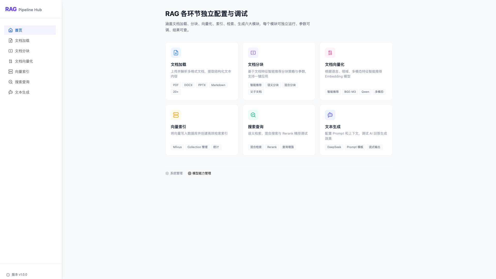

# RAG Pipeline Hub

[中文说明](README_CN.md)

An end-to-end RAG framework for real-world workflows, covering document ingestion, chunking, embedding, index management, hybrid retrieval, and answer generation. The repository includes a FastAPI backend, a Vue 3 frontend, and a module-oriented documentation system under `documents/` and `specs/`.



## Highlights

- Supports 20+ document formats including `PDF / DOCX / DOC / XLSX / XLS / PPTX / PPT / HTML / CSV / TXT / Markdown / JSON / XML / RST / LOG`
- `Docling Serve` as the primary high-quality parser with fallback loaders for resilience
- Multiple chunking strategies including character-based, paragraph, semantic, heading-based, hybrid, and parent-child chunking; built-in **smart recommendation engine** that analyzes document features (heading structure, code ratio, format, length, etc.) to automatically suggest the best strategy and parameters with confidence scores and reasoning
- Supports `bge-m3`, `qwen3-embedding-8b`, `qwen3-vl-embedding-8b` (multimodal) embedding models; built-in **model recommendation** that uses layered decision-making based on document language, domain, and multimodal features to suggest the most suitable model, with support for batch recommendation and outlier document detection
- Vector index and Collection management with search, persistence, recovery, and recommendation APIs
- Hybrid retrieval with dense recall, sparse recall, `RRF` ranking, `Reranker`, and query enhancement
- Text generation with sync and streaming responses, source citations, history management, retry, and safe Markdown rendering

## Tech Stack

**Backend**
- Python 3.11
- FastAPI
- SQLAlchemy
- SQLite
- LangChain
- OpenAI-compatible LLM and embedding APIs
- Milvus

**Frontend**
- Vue 3
- Vite
- Pinia
- Vue Router
- TDesign
- Tailwind CSS
- markdown-it + DOMPurify

## Pipeline Overview

```text
Upload documents
  -> Parse documents (Docling Serve + fallback)
  -> Chunk documents (character/paragraph/semantic/heading/hybrid/parent-child + smart recommendation)
  -> Generate embeddings (smart model recommendation + cache + progress)
  -> Manage vector indexes / collections
  -> Run hybrid retrieval
  -> Generate answers (SSE / sources / history)
```

## Modules

| Module | Current capabilities |
|--------|----------------------|
| Document Loading | Upload, parsing, async tasks, loader recommendation, result querying |
| Document Chunking | Multiple chunking strategies, **smart strategy & parameter recommendation** (based on document feature analysis), previews, parent-child chunk metadata |
| Vector Embedding | Document embedding, **smart model recommendation** (layered decision-making on language/domain/multimodal features), batch processing, caching, progress streaming, history |
| Vector Index | Index and Collection management, vector CRUD, statistics, persistence, recovery, recommendation |
| Search | Standard search, hybrid search, Collection listing, Reranker health check, history management |
| Generation | Non-streaming generation, SSE streaming, cancellation, source citation, history, clear-all history |

## Quick Start

### Requirements

- Python 3.11+
- Node.js 18+
- Docker or Colima for Milvus
- Access to an OpenAI-compatible LLM / embedding service

### 1. Clone the repository

```bash
git clone https://github.com/qingni/rag-pipeline-hub.git
cd rag-pipeline-hub
```

### 2. Configure environment variables

```bash
cp backend/.env.example backend/.env
cp frontend/.env.example frontend/.env
```

Start by configuring the variables below. In most cases, you can keep the other values from `.env.example` unchanged and tune them later if needed.

**Backend `backend/.env`**

| Key | Required | Description | Recommended local value |
|-----|----------|-------------|-------------------------|
| `DATABASE_URL` | No | Application database connection string; SQLite works out of the box for local development | `sqlite:///./app.db` |
| `MILVUS_HOST` | Yes | Milvus service host | `localhost` |
| `MILVUS_PORT` | Yes | Milvus service port | `19530` |
| `EMBEDDING_API_KEY` | Yes | API key for the embedding service | Your actual API key |
| `EMBEDDING_API_BASE_URL` | Yes | Base URL of your embedding service | Your OpenAI-compatible embedding endpoint |
| `EMBEDDING_DEFAULT_MODEL` | Recommended | Default embedding model | `qwen3-embedding-8b` |
| `RERANKER_API_KEY` | Optional | Required only if you enable reranker-based re-ranking | Leave empty if unused |
| `RERANKER_API_BASE_URL` | Optional | Base URL of the reranker service | Leave empty if unused |
| `RERANKER_MODEL` | Optional | Reranker model name | `qwen3-reranker-4b` |
| `DOCLING_SERVE_ENABLED` | Optional | Whether to enable high-quality Docling Serve parsing | Set to `false` if Docling is not used locally |
| `DOCLING_SERVE_URL` | Optional | Docling Serve endpoint | `http://localhost:5001` |
| `DOCLING_SERVE_API_KEY` | Optional | Docling Serve auth key | Leave empty if auth is disabled |
| `FRONTEND_ALLOWED_ORIGINS` | Recommended | Allowed frontend origins for backend CORS | `http://localhost:5173,http://localhost:4173` |

**Frontend `frontend/.env`**

| Key | Required | Description | Recommended local value |
|-----|----------|-------------|-------------------------|
| `VITE_API_BASE_URL` | Yes | Base URL used by the frontend to call backend APIs | `http://localhost:8000/api/v1` |
| `VITE_UPLOAD_MAX_SIZE` | No | Frontend upload size limit in bytes | `52428800` |
| `VITE_ENABLE_OLLAMA` | No | Frontend feature flag | Keep the default |
| `VITE_ENABLE_HUGGINGFACE` | No | Frontend feature flag | Keep the default |

If you only want to **get the project running locally for the first time**, make sure at least these 5 values are set correctly:

- `MILVUS_HOST`
- `MILVUS_PORT`
- `EMBEDDING_API_KEY`
- `EMBEDDING_API_BASE_URL`
- `VITE_API_BASE_URL`

If you want better parsing and retrieval quality, you can additionally configure:

- `RERANKER_API_KEY` / `RERANKER_API_BASE_URL`
- `DOCLING_SERVE_ENABLED` / `DOCLING_SERVE_URL`

### 3. Start Milvus

If you use Colima, the recommended way is to run the built-in helper script first:

```bash
./scripts/start_colima.sh
```

This script checks and starts Colima automatically, and is intended for local macOS development.

If you already manage Colima yourself, you can also run:

```bash
colima start
```

Then start Milvus:

```bash
./scripts/start_milvus.sh
```

### 4. Optionally start Docling Serve

If you want the high-quality document parsing path enabled:

```bash
./scripts/start_docling.sh
```

### 5. Start the backend

```bash
./scripts/start_backend.sh
```

Default backend endpoints:
- API: `http://localhost:8000`
- Swagger UI: `http://localhost:8000/docs`
- Health: `http://localhost:8000/api/v1/health`

### 6. Start the frontend

```bash
./scripts/start_frontend.sh
```

Default frontend URL:
- Web UI: `http://localhost:5173`

## API Overview

The current API surface mainly uses two prefixes:

- General business APIs: `/api/v1/*`
- Vector index APIs: `/api/vector-index/*`

Common endpoints:

| Module | Endpoint |
|--------|----------|
| Health | `GET /api/v1/health` |
| Document loading | `POST /api/v1/processing/load` |
| Chunking | `POST /api/v1/chunking/chunk` |
| Embedding | `POST /api/v1/embedding/from-document` |
| Search | `POST /api/v1/search/hybrid` |
| Generation | `POST /api/v1/generation/generate` |
| Streaming generation | `POST /api/v1/generation/stream` |
| Vector index creation | `POST /api/vector-index/indexes` |

For the full API reference, check `http://localhost:8000/docs` or the module documents under `documents/`.

## Frontend Routes

The current frontend includes these main pages:

- `/documents/load`
- `/documents/chunk`
- `/documents/embed`
- `/index`
- `/search`
- `/generation`

## Repository Structure

```text
rag-pipeline-hub/
├── backend/                 # FastAPI backend
│   ├── src/
│   │   ├── api/             # Route layer
│   │   ├── services/        # Core business logic
│   │   ├── providers/       # Integrations for LLMs, Docling, etc.
│   │   ├── models/          # ORM models
│   │   ├── schemas/         # Pydantic schemas
│   │   └── config/          # Settings and configuration
│   ├── results/             # Generated result files
│   └── tests/               # Backend tests
├── frontend/                # Vue 3 frontend
│   ├── src/
│   │   ├── views/           # Page views
│   │   ├── components/      # UI and feature components
│   │   ├── stores/          # Pinia stores
│   │   └── services/        # API clients
│   └── package.json
├── documents/               # Implementation-oriented module docs
├── specs/                   # Specifications and evolution notes
├── scripts/                 # Start/stop scripts
├── docker/                  # Deployment files such as Milvus
├── migrations/              # Database migrations
└── uploads/                 # Uploaded files
```

## Documentation

- [Document Loading](documents/load/README.md)
- [Document Chunking](documents/chunk/README.md)
- [Vector Embedding](documents/embedding/README.md)
- [Vector Index](documents/vector-index/README.md)
- [Search Overview](documents/search-query/01-%E6%A3%80%E7%B4%A2%E6%9F%A5%E8%AF%A2%E5%8A%9F%E8%83%BD%E6%A6%82%E8%BF%B0.md)
- [Text Generation](documents/generation/README.md)

If you want the formal feature specs and implementation planning materials, check the `specs/` directory.

## Development

Run backend tests:

```bash
cd backend
pytest
```

Build the frontend:

```bash
cd frontend
npm run build
```

Stop local services:

```bash
./scripts/stop_backend.sh
./scripts/stop_frontend.sh
./scripts/stop_milvus.sh
./scripts/stop_docling.sh
```

## License

[Apache License 2.0](LICENSE)
# RAG Pipeline Hub

[English README](README_EN.md)

一个面向真实业务流程的端到端 RAG 框架，覆盖文档加载、分块、向量化、索引管理、混合检索和答案生成全链路。项目包含 FastAPI 后端、Vue 3 前端，以及按模块拆分的 `documents/` 与 `specs/` 文档体系，适合做产品原型、内部知识库、RAG 技术验证与二次开发。


## 项目亮点

- 支持 `PDF / DOCX / DOC / XLSX / XLS / PPTX / PPT / HTML / CSV / TXT / Markdown / JSON / XML / RST / LOG` 等 20+ 种文档格式解析，默认以 `Docling Serve` 为高质量主解析器，并提供降级加载策略
- 支持按字数、按段落、语义、按标题、混合、父子文档等分块方式；内置**智能推荐引擎**，根据文档特征（标题结构、代码占比、格式、长度等）自动推荐最优分块策略与参数，附带置信度与推荐理由，支持一键应用
- 支持 `bge-m3`、`qwen3-embedding-8b`、`qwen3-vl-embedding-8b`（多模态）等 Embedding 模型；内置**模型智能推荐**，基于文档语言、领域、多模态特征进行分层决策，自动推荐最匹配的模型，支持批量推荐与异常文档检测
- 支持向量索引创建、Collection 管理、向量写入、检索、统计、恢复与推荐能力
- 支持混合检索链路：稠密召回 + 稀疏召回 + `RRF` 粗排 + `Reranker` 精排，并具备查询增强能力
- 支持文本生成的同步/流式输出、引用来源、历史记录、重试和 Markdown 安全渲染

## 技术栈

**后端**
- Python 3.11
- FastAPI
- SQLAlchemy
- SQLite
- LangChain
- OpenAI-compatible LLM / Embedding API
- Milvus

**前端**
- Vue 3
- Vite
- Pinia
- Vue Router
- TDesign
- Tailwind CSS
- markdown-it + DOMPurify

## 典型链路

```text
上传文档
  -> 文档解析（Docling Serve + fallback）
  -> 文档分块（字数/段落/语义/标题/混合/父子文档 + 智能推荐）
  -> 向量化（Embedding + 模型智能推荐 + cache + progress）
  -> 向量索引 / Collection 管理
  -> 混合检索（dense + sparse + RRF + reranker）
  -> 文本生成（SSE / sources / history）
```

## 功能模块

| 模块 | 当前实现 |
|------|----------|
| 文档加载 | 文档上传、解析、异步任务、加载器推荐、结果查询 |
| 文档分块 | 多策略分块、**智能策略与参数推荐**（基于文档特征分析）、结果预览、父子块信息 |
| 文档向量化 | 文档向量化、**Embedding 模型智能推荐**（基于语言/领域/多模态分层决策）、批量处理、缓存、进度流、历史记录 |
| 向量索引 | Index / Collection 管理、向量 CRUD、统计、持久化、恢复、推荐 |
| 搜索查询 | 普通搜索、混合搜索、Collection 列表、Reranker 健康检查、历史管理 |
| 文本生成 | 非流式生成、SSE 流式生成、取消生成、来源引用、历史记录、清空历史 |

## 快速开始

### 环境要求

- Python 3.11+
- Node.js 18+
- Docker 或 Colima（用于 Milvus）
- 可用的 OpenAI-compatible LLM / Embedding 服务

### 1. 克隆仓库

```bash
git clone https://github.com/qingni/rag-pipeline-hub.git
cd rag-pipeline-hub
```

### 2. 配置环境变量

```bash
cp backend/.env.example backend/.env
cp frontend/.env.example frontend/.env
```

建议优先配置下面这些环境变量；其余参数通常可以先沿用 `.env.example` 默认值，等需要调优时再修改。

**后端 `backend/.env`**

| Key | 是否必配 | 说明 | 本地开发建议 |
|-----|----------|------|--------------|
| `DATABASE_URL` | 否 | 应用数据库连接串；默认使用 SQLite，本地可直接启动 | `sqlite:///./app.db` |
| `MILVUS_HOST` | 是 | Milvus 服务地址 | `localhost` |
| `MILVUS_PORT` | 是 | Milvus 服务端口 | `19530` |
| `EMBEDDING_API_KEY` | 是 | Embedding 服务 API Key | 填你的实际 Key |
| `EMBEDDING_API_BASE_URL` | 是 | Embedding 服务 Base URL | 指向你的 OpenAI-compatible Embedding 服务 |
| `EMBEDDING_DEFAULT_MODEL` | 建议 | 默认 Embedding 模型 | `qwen3-embedding-8b` |
| `RERANKER_API_KEY` | 按需 | 启用 Reranker 精排时需要 | 不使用可暂空 |
| `RERANKER_API_BASE_URL` | 按需 | Reranker 服务 Base URL | 不使用可暂空 |
| `RERANKER_MODEL` | 按需 | Reranker 模型名 | `qwen3-reranker-4b` |
| `DOCLING_SERVE_ENABLED` | 按需 | 是否启用 Docling Serve 高质量解析 | 本地无 Docling 可设为 `false` |
| `DOCLING_SERVE_URL` | 按需 | Docling Serve 地址 | `http://localhost:5001` |
| `DOCLING_SERVE_API_KEY` | 按需 | Docling Serve 认证 Key | 无认证可留空 |
| `FRONTEND_ALLOWED_ORIGINS` | 建议 | 允许访问后端的前端地址列表（CORS） | `http://localhost:5173,http://localhost:4173` |

**前端 `frontend/.env`**

| Key | 是否必配 | 说明 | 本地开发建议 |
|-----|----------|------|--------------|
| `VITE_API_BASE_URL` | 是 | 前端请求后端 API 的基础地址 | `http://localhost:8000/api/v1` |
| `VITE_UPLOAD_MAX_SIZE` | 否 | 前端上传大小限制（字节） | `52428800` |
| `VITE_ENABLE_OLLAMA` | 否 | 前端功能开关 | 保持默认 |
| `VITE_ENABLE_HUGGINGFACE` | 否 | 前端功能开关 | 保持默认 |

如果你只是**第一次本地跑通项目**，至少要确认这 5 个关键项：

- `MILVUS_HOST`
- `MILVUS_PORT`
- `EMBEDDING_API_KEY`
- `EMBEDDING_API_BASE_URL`
- `VITE_API_BASE_URL`

如果你还希望获得更好的解析与检索效果，再继续配置：

- `RERANKER_API_KEY` / `RERANKER_API_BASE_URL`
- `DOCLING_SERVE_ENABLED` / `DOCLING_SERVE_URL`

### 3. 启动 Milvus

如果你使用 Colima，推荐先执行项目内置脚本：

```bash
./scripts/start_colima.sh
```

该脚本会自动检查并启动 Colima，适合 macOS 本地开发环境。

如果你已经自行安装并管理 Colima，也可以直接执行：

```bash
colima start
```

然后启动 Milvus：

```bash
./scripts/start_milvus.sh
```

### 4. 启动可选的 Docling Serve

如果你希望启用高质量文档解析链路，可单独启动 Docling 服务：

```bash
./scripts/start_docling.sh
```

### 5. 启动后端

```bash
./scripts/start_backend.sh
```

后端默认地址：
- API: `http://localhost:8000`
- Swagger: `http://localhost:8000/docs`
- Health: `http://localhost:8000/api/v1/health`

### 6. 启动前端

```bash
./scripts/start_frontend.sh
```

前端默认地址：
- Web UI: `http://localhost:5173`

## API 概览

项目当前的接口前缀以以下两组为主：

- 通用业务接口：`/api/v1/*`
- 向量索引接口：`/api/vector-index/*`

常用接口示例：

| 模块 | 接口 |
|------|------|
| 健康检查 | `GET /api/v1/health` |
| 文档加载 | `POST /api/v1/processing/load` |
| 文档分块 | `POST /api/v1/chunking/chunk` |
| 文档向量化 | `POST /api/v1/embedding/from-document` |
| 搜索查询 | `POST /api/v1/search/hybrid` |
| 文本生成 | `POST /api/v1/generation/generate` |
| 流式生成 | `POST /api/v1/generation/stream` |
| 向量索引创建 | `POST /api/vector-index/indexes` |

完整接口说明请查看 `http://localhost:8000/docs` 或 `documents/` 下各模块 API 文档。

## 前端页面

当前前端已实现的主要页面入口：

- `/documents/load`：文档加载
- `/documents/chunk`：文档分块
- `/documents/embed`：文档向量化
- `/index`：向量索引管理
- `/search`：搜索查询
- `/generation`：文本生成

## 项目结构

```text
rag-pipeline-hub/
├── backend/                 # FastAPI 后端
│   ├── src/
│   │   ├── api/             # 路由层
│   │   ├── services/        # 核心业务逻辑
│   │   ├── providers/       # 外部能力适配（LLM、Docling 等）
│   │   ├── models/          # ORM 模型
│   │   ├── schemas/         # Pydantic Schema
│   │   └── config/          # 配置与 settings
│   ├── results/             # 加载、分块、向量化等结果文件
│   └── tests/               # 后端测试
├── frontend/                # Vue 3 前端
│   ├── src/
│   │   ├── views/           # 页面视图
│   │   ├── components/      # 业务组件
│   │   ├── stores/          # Pinia store
│   │   └── services/        # API 封装
│   └── package.json
├── documents/               # 面向实现的模块文档
├── specs/                   # 功能规格与演进记录
├── scripts/                 # 启停脚本
├── docker/                  # Milvus 等部署文件
├── migrations/              # 数据库迁移
└── uploads/                 # 上传文件目录
```

## 文档导航

- [文档加载](documents/load/README.md)
- [文档分块](documents/chunk/README.md)
- [文档向量化](documents/embedding/README.md)
- [向量索引](documents/vector-index/README.md)
- [搜索查询概述](documents/search-query/01-%E6%A3%80%E7%B4%A2%E6%9F%A5%E8%AF%A2%E5%8A%9F%E8%83%BD%E6%A6%82%E8%BF%B0.md)
- [文本生成](documents/generation/README.md)

如果你更关注规格设计和实现演进，可以继续查看 `specs/` 目录。

## 开发与验证

后端测试：

```bash
cd backend
pytest
```

前端构建：

```bash
cd frontend
npm run build
```

停止本地服务：

```bash
./scripts/stop_backend.sh
./scripts/stop_frontend.sh
./scripts/stop_milvus.sh
./scripts/stop_docling.sh
```

## License

[Apache License 2.0](LICENSE)
