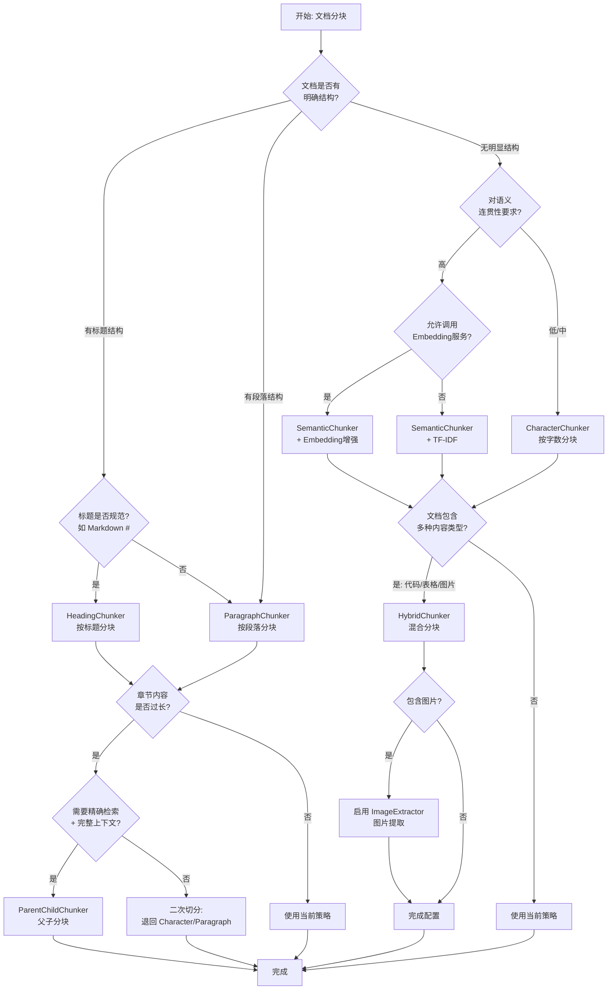

# 文档分块策略详解

**更新日期**: 2026-02-02  
**项目**: RAG Framework - 文档分块模块  

---

## 目录

1. [策略概览](#1-策略概览)
2. [策略选择指南](#2-策略选择指南)
3. [基础策略](#3-基础策略)
   - [按字数分块](#31-按字数分块-characterchunker)
   - [按段落分块](#32-按段落分块-paragraphchunker)
   - [按标题分块](#33-按标题分块-headingchunker)
4. [高级策略](#4-高级策略)
   - [按语义分块](#41-按语义分块-semanticchunker)
   - [父子分块](#42-父子分块-parentchildchunker)
   - [混合分块](#43-混合分块-hybridchunker)
   - [图片提取与分块](#44-图片提取与分块-imageextractor)
   - [语义分块增强](#45-语义分块增强-embedding-支持)

---

## 1. 策略概览

### 1.1 基础策略 vs 高级策略

- **基础策略**：`CharacterChunker` / `ParagraphChunker` / `HeadingChunker`
  - 特点：**稳定、易解释、低成本**，参数空间简单（主要是 `chunk_size` / `min_chunk_size` / `max_chunk_size` / `overlap`）。
  - 适用：多数纯文本/结构化文本的默认选择。

- **高级策略**：`SemanticChunker` / `ParentChildChunker` / `HybridChunker` / `ImageExtractor` / `Embedding 支持增强`
  - 特点：**更高召回与更好上下文**，但更依赖模型、解析器与工程配套（embedding、图片提取、结构识别）。
  - 适用：RAG 对答案质量敏感、文档结构复杂、多模态或长文档场景。

### 1.2 策略对比表

| 策略 | 优点 | 缺点 | 适用场景 | 性能 |
|------|------|------|---------|------|
| **按字数** | 简单快速、可预测 | 可能破坏语义 | 纯文本、字数限制严格 | ⭐⭐⭐⭐⭐ |
| **按段落** | 保持段落完整 | 块大小不均 | 有段落结构的文档 | ⭐⭐⭐⭐ |
| **按标题** | 保持文档结构 | 需要标题标记 | Markdown/结构化文档 | ⭐⭐⭐⭐ |
| **按语义** | 语义连贯性最佳 | 计算开销大 | 对语义要求高的场景 | ⭐⭐⭐ |
| **父子分块** | 精准命中 + 完整上下文 | 存储与索引增量 | 长文档、高质量RAG | ⭐⭐⭐ |
| **混合分块** | 多内容类型最优策略 | 实现复杂、依赖解析 | 技术文档/报告/教程 | ⭐⭐⭐ |
| **图片提取** | 支持多模态检索 | 依赖加载与编码 | 图表密集文档 | ⭐⭐⭐ |
| **语义分块增强** | 稳定性强、效果可控 | 需要embedding服务 | 生产RAG | ⭐⭐⭐ |

### 1.3 性能对比（用于工程选型）

| 策略 | 处理速度 | 内存占用 | CPU占用 | 适合文档大小 |
|------|---------|---------|---------|-------------|
| 按字数 | 极快 | 低 | 低 | 任意 |
| 按段落 | 快 | 低 | 低 | <50MB |
| 按标题 | 快 | 中 | 中 | <20MB |
| 按语义（TF-IDF） | 慢 | 高 | 高 | <10MB |
| 按语义（Embedding） | 较慢 | 高 | 高 | <10MB |
| 父子分块 | 较慢 | 中-高 | 中 | <50MB |
| 混合分块 | 较慢 | 中-高 | 中-高 | <50MB |

---

## 2. 策略选择指南

### 2.1 策略选择流程图



### 2.2 智能推荐规则

建议实现一个 **ChunkStrategyRecommender**（策略推荐器），输入文档与运行约束（成本、时延、是否多模态），输出：
- **推荐策略**（主策略）
- **增强开关**（是否启用 `Embedding`、是否启用 `ParentChild`、是否启用 `Hybrid`）
- **参数建议**（例如 `chunk_size`、`overlap`、阈值）

推荐器的核心是三类信号：

#### 2.2.1 文档结构信号（从解析结果得到）
- 是否存在 Markdown 标题（`#`/`##`）？
- 段落是否明显（双换行、多空行）？
- 是否包含大量代码块/表格/图片？

#### 2.2.2 内容语义信号（轻量统计 + 可选 embedding）
- 主题是否频繁切换（句子相似度波动大）？
- 是否长句密集、术语密集（学术/技术）？

#### 2.2.3 运行约束
- 是否允许调用 embedding 服务（成本/时延）？
- 是否有严格吞吐（批量导入、离线/在线）？

### 2.3 推荐优先级

| 优先级 | 条件 | 推荐策略 |
|--------|------|----------|
| 1 | 有规范标题 | `HeadingChunker` |
| 2 | 有明显段落 | `ParagraphChunker` |
| 3 | 多主题/高召回要求 | `SemanticChunker`（优先用 embedding 增强） |
| 4 | 长文档 + 需要"命中更准 + 返回更完整上下文" | `ParentChildChunker` |
| 5 | 代码/表格/图片多 | `HybridChunker + ImageExtractor` |
| 6 | 资源受限/实时 | `ParagraphChunker/CharacterChunker` + 合理 overlap |

### 2.4 参数自动推荐（经验公式）

#### 2.4.1 chunk_size（或 max_chunk_size）
与目标 LLM 上下文窗口和期望召回粒度有关：
- 默认建议：`500-1000`（中文偏小、英文偏大可略放宽）

#### 2.4.2 overlap
- 默认建议：`chunk_size` 的 `10%-20%`
- 若问题经常跨段引用（例如"上文定义/下文结论"）：提升到 `20%-30%`

#### 2.4.3 semantic threshold
- 使用 TF-IDF：`0.3` 起步
- 使用 embedding：`0.7` 起步（不同模型需标定）

### 2.5 线上质量闭环（增强项）

建议记录并用于持续调参：
- **命中率**：检索结果中真正被答案引用的 chunk 占比
- **覆盖率**：答案所需信息是否存在于召回 chunk 中
- **冗余率**：重复/无关 chunk 比例
- **平均 chunk token 数**：避免过大导致上下文挤占

---

## 3. 基础策略

> 本章覆盖：按字数 / 按段落 / 按标题。它们通常是默认首选，且在不依赖 embedding 的情况下也能得到稳定效果。

### 3.1 按字数分块 (CharacterChunker)

#### 3.1.1 基本原理

按固定字符数切分文本，支持块间重叠。

#### 3.1.2 参数配置

| 参数 | 类型 | 范围 | 默认值 | 说明 |
|------|------|------|--------|------|
| `chunk_size` | int | 100-5000 | 500 | 每块字符数 |
| `overlap` | int | 0-500 | 50 | 重叠字符数 |

#### 3.1.3 参数优化建议

- **`chunk_size`**：
  - 过小：召回碎片化，LLM 需要更多 chunk 才能回答
  - 过大：召回命中不精准，且挤占上下文
- **`overlap`**：
  - 用于缓解"切断句子/定义"的问题
  - 常见建议：`50-200` 或 `chunk_size * 0.1~0.2`

- **增强项**：
  - **句子边界对齐**：在接近 `end` 时向前/向后移动到最近的句号/换行，减少语义断裂
  - **标点密集语言优化**：中文以 `。！？；` 作为边界优先级

#### 3.1.4 算法实现

```python
def chunk(text: str, chunk_size: int, overlap: int):
    chunks = []
    start = 0
    index = 0
    
    while start < len(text):
        end = min(start + chunk_size, len(text))
        content = text[start:end]
        
        chunk = {
            "content": content,
            "metadata": {
                "start_position": start,
                "end_position": end,
                "char_count": len(content),
                "strategy": "character"
            }
        }
        chunks.append(chunk)
        
        start += (chunk_size - overlap)
        index += 1
    
    return chunks
```

#### 3.1.5 使用场景

✅ **适合**:
- 纯文本文档
- 对块大小有严格要求
- 需要快速处理
- 简单的内容检索

❌ **不适合**:
- 需要保持语义完整性
- 有明确段落结构
- 多语言混合文本

#### 3.1.6 参数推荐

| 场景 | chunk_size | overlap | 说明 |
|------|-----------|---------|------|
| 短文本 | 300-500 | 50 | 新闻、评论 |
| 中等文本 | 500-1000 | 100 | 博客、文章 |
| 长文本 | 1000-2000 | 200 | 书籍、报告 |

---

### 3.2 按段落分块 (ParagraphChunker)

#### 3.2.1 基本原理

按段落边界切分，合并小段落直到达到最小块大小。

#### 3.2.2 参数配置

| 参数 | 类型 | 范围 | 默认值 | 说明 |
|------|------|------|--------|------|
| `min_chunk_size` | int | 50-2000 | 300 | 最小块大小 |
| `max_chunk_size` | int | 500-10000 | 1200 | 最大块大小 |

#### 3.2.3 参数优化建议

- **`min_chunk_size` / `max_chunk_size`**：
  - 建议成对配置，避免大量过小块或超大块
  - `max_chunk_size` 可作为"上限保护"，段落过长时触发二次切分（可退回 `CharacterChunker`）

- **增强项**：
  - **短段落合并策略**：优先合并同一小节/同一标题下段落
  - **列表/表格保护**：检测到连续列表项时尽量不要跨列表边界切

#### 3.2.4 算法实现

```python
def chunk(text: str, min_size: int, max_size: int):
    # 1. 按双换行符分段落
    paragraphs = re.split(r'\n\n+', text)
    
    chunks = []
    current_paras = []
    current_length = 0
    
    for para in paragraphs:
        para_length = len(para)
        
        # 2. 累积段落直到达到限制
        if current_length + para_length <= max_size:
            current_paras.append(para)
            current_length += para_length
        else:
            # 3. 保存当前块
            if current_paras and current_length >= min_size:
                content = '\n\n'.join(current_paras)
                chunks.append(create_chunk(content))
            
            # 4. 开始新块
            current_paras = [para]
            current_length = para_length
    
    # 5. 保存最后一块
    if current_paras:
        content = '\n\n'.join(current_paras)
        chunks.append(create_chunk(content))
    
    return chunks
```

#### 3.2.5 使用场景

✅ **适合**:
- 有明确段落结构的文档
- 保持段落完整性重要
- 一般性文档处理

❌ **不适合**:
- 无段落结构的连续文本
- 对块大小要求严格
- 段落长度差异巨大

#### 3.2.6 参数推荐

| 场景 | min_chunk_size | max_chunk_size | 说明 |
|------|---------------|---------------|------|
| 短段落 | 200 | 1000 | 对话、聊天记录 |
| 中段落 | 500 | 2000 | 标准文章 |
| 长段落 | 1000 | 5000 | 学术论文 |

---

### 3.3 按标题分块 (HeadingChunker)

#### 3.3.1 基本原理

识别Markdown标题，按标题层级切分文档。

#### 3.3.2 参数配置

| 参数 | 类型 | 范围 | 默认值 | 说明 |
|------|------|------|--------|------|
| `min_heading_level` | int | 1-6 | 1 | 最小标题层级 |
| `max_heading_level` | int | 1-6 | 3 | 最大标题层级 |

#### 3.3.3 参数优化建议

- **`min_heading_level` / `max_heading_level`**：
  - `max_heading_level` 越大，chunk 越细，但可能引入大量碎块
  - 文档标题不规范时，建议降低对深层标题的依赖（例如 `max=3`）

- **增强项**：
  - **标题路径注入元数据**：在 chunk metadata 中记录 `h1 > h2 > h3` 路径，提升可解释性与检索质量
  - **标题下超长章节二次切分**：当章节内容超过 `max_chunk_size`，可在章节内用 `ParagraphChunker` 或 `SemanticChunker` 继续切

#### 3.3.4 算法实现

```python
def chunk(text: str, min_level: int, max_level: int):
    # 1. 识别所有标题
    lines = text.split('\n')
    sections = []
    current_section = []
    current_heading = None
    
    for line in lines:
        heading_match = re.match(r'^(#{1,6})\s+(.+)$', line)
        
        if heading_match:
            level = len(heading_match.group(1))
            
            # 2. 判断是否满足层级条件
            if min_level <= level <= max_level:
                # 保存前一节
                if current_section:
                    sections.append({
                        'heading': current_heading,
                        'content': '\n'.join(current_section)
                    })
                
                # 开始新节
                current_heading = line
                current_section = [line]
            else:
                current_section.append(line)
        else:
            current_section.append(line)
    
    # 3. 保存最后一节
    if current_section:
        sections.append({
            'heading': current_heading,
            'content': '\n'.join(current_section)
        })
    
    # 4. 转换为chunks
    chunks = []
    for i, section in enumerate(sections):
        chunks.append(create_chunk(
            content=section['content'],
            metadata={'heading': section['heading']}
        ))
    
    return chunks
```

#### 3.3.5 使用场景

✅ **适合**:
- Markdown文档
- 技术文档、书籍
- 有层次结构的内容
- 需要保持章节完整性

❌ **不适合**:
- 无标题结构的文本
- HTML/PDF等格式(需预处理)
- 标题不规范的文档

#### 3.3.6 参数推荐

| 场景 | min_level | max_level | 说明 |
|------|----------|----------|------|
| 粗粒度 | 1 | 2 | 章节级别 |
| 中粒度 | 2 | 4 | 小节级别 |
| 细粒度 | 3 | 6 | 段落级别 |

---

## 4. 高级策略

> 本章覆盖：按语义 / 父子分块 / 混合分块 / 图片提取 / 语义增强（Embedding）。它们更适合生产级 RAG 的质量提升。

### 4.1 按语义分块 (SemanticChunker)

#### 4.1.1 基本原理

基于TF-IDF或Embedding计算相邻句子的语义相似度，在相似度低于阈值处切分。

#### 4.1.2 参数配置

| 参数 | 类型 | 范围 | 默认值 | 说明 |
|------|------|------|--------|------|
| `similarity_threshold` | float | 0.1-0.9 | 0.3 | TF-IDF相似度阈值 |
| `embedding_similarity_threshold` | float | 0.5-0.95 | 0.7 | Embedding相似度阈值 |
| `min_chunk_size` | int | 100-2000 | 300 | 最小块大小 |
| `max_chunk_size` | int | 500-5000 | 1200 | 最大块大小 |

#### 4.1.3 参数优化建议

- **`similarity_threshold`**：
  - 越高：越倾向合并（块更大，主题更集中）
  - 越低：越倾向切分（块更小，但可能碎）
- **`min_chunk_size` / `max_chunk_size`**：
  - 语义分块一定要有上下限，否则容易出现过小/过大块

- **增强项**：
  - **Embedding 增强**：优先使用 embedding 相似度替代 TF-IDF
  - **主题漂移检测**：当相似度连续低于阈值时，强制切分并降低 `max_chunk_size`

#### 4.1.4 算法实现

```python
def semantic_chunk(text: str, threshold: float, min_size: int, max_size: int):
    # 1. 分句
    sentences = split_sentences(text)
    
    # 2. 计算TF-IDF向量
    vectors = calculate_tfidf(sentences)
    
    # 3. 按相似度分组
    chunks = []
    current_sentences = [sentences[0]]
    
    for i in range(1, len(sentences)):
        # 计算相似度
        similarity = cosine_similarity(vectors[i-1], vectors[i])
        
        current_length = sum(len(s) for s in current_sentences)
        next_length = current_length + len(sentences[i])
        
        # 决策逻辑
        should_merge = False
        
        if similarity >= threshold and next_length <= max_size:
            # 高相似度 + 不超长 → 合并
            should_merge = True
        elif current_length < min_size and next_length <= max_size * 1.5:
            # 当前块太小 → 强制合并
            should_merge = True
        
        if should_merge:
            current_sentences.append(sentences[i])
        else:
            # 保存当前块，开始新块
            content = ' '.join(current_sentences)
            chunks.append(create_chunk(content))
            current_sentences = [sentences[i]]
    
    # 4. 保存最后一块
    if current_sentences:
        content = ' '.join(current_sentences)
        chunks.append(create_chunk(content))
    
    return chunks
```

#### 4.1.5 核心方法

##### TF-IDF计算

```python
def calculate_tfidf(sentences):
    # 分词
    docs = [tokenize(s) for s in sentences]
    
    # 计算文档频率
    df = Counter()
    for doc in docs:
        df.update(set(doc))
    
    # 计算TF-IDF
    vectors = []
    for doc in docs:
        tf = Counter(doc)
        vector = {}
        for word, count in tf.items():
            tf_score = count / len(doc) if doc else 0
            idf_score = math.log(len(sentences) / (df[word] + 1))
            vector[word] = tf_score * idf_score
        vectors.append(vector)
    
    return vectors
```

##### 余弦相似度

```python
def cosine_similarity(vec1, vec2):
    # 计算点积
    common = set(vec1.keys()) & set(vec2.keys())
    dot_product = sum(vec1[w] * vec2[w] for w in common)
    
    # 计算模
    mag1 = math.sqrt(sum(v**2 for v in vec1.values()))
    mag2 = math.sqrt(sum(v**2 for v in vec2.values()))
    
    if mag1 == 0 or mag2 == 0:
        return 0.0
    
    return dot_product / (mag1 * mag2)
```

#### 4.1.6 降级策略

当语义分块失败时，自动降级为简单分句:

```python
def fallback_to_sentences(text, min_size):
    sentences = split_sentences(text)
    chunks = []
    current_chunk = []
    current_length = 0
    
    for sentence in sentences:
        if current_length + len(sentence) >= min_size and current_chunk:
            content = ' '.join(current_chunk)
            chunks.append(create_chunk(
                content,
                metadata={'fallback_strategy': 'sentence'}
            ))
            current_chunk = []
            current_length = 0
        
        current_chunk.append(sentence)
        current_length += len(sentence)
    
    if current_chunk:
        content = ' '.join(current_chunk)
        chunks.append(create_chunk(content))
    
    return chunks
```

#### 4.1.7 使用场景

✅ **适合**:
- 对语义连贯性要求高
- 学术论文、研究报告
- 多主题文档
- 需要保持上下文相关性

❌ **不适合**:
- 需要快速处理
- 句子数量少(<10)
- 资源受限环境
- 实时处理场景

#### 4.1.8 参数推荐

| 场景 | similarity_threshold | min_chunk_size | 说明 |
|------|---------------------|---------------|------|
| 严格语义 | 0.7-0.9 | 300 | 学术、专业文档 |
| 中等语义 | 0.5-0.7 | 500 | 一般文档 |
| 宽松语义 | 0.3-0.5 | 800 | 多主题文档 |

---

### 4.2 父子分块 (ParentChildChunker)

#### 4.2.1 基本原理

生成两层分块结构：父块包含完整上下文，子块用于精确检索。检索时使用子块匹配，返回父块内容给 LLM。

#### 4.2.2 参数配置

| 参数 | 类型 | 范围 | 默认值 | 说明 |
|------|------|------|--------|------|
| `parent_chunk_size` | int | 500-10000 | 2000 | 父块大小 |
| `child_chunk_size` | int | 100-2000 | 500 | 子块大小 |
| `child_overlap` | int | 0-500 | 50 | 子块重叠度 |
| `parent_overlap` | int | 0-1000 | 200 | 父块重叠度 |

#### 4.2.3 参数优化建议

- **`parent_chunk_size` / `parent_overlap`**：
  - 影响"返回给 LLM 的上下文完整度"。建议父块偏大（例如 `2000-4000`）
- **`child_chunk_size` / `child_overlap`**：
  - 影响"检索命中精度"。建议子块偏小（例如 `300-800`）

- **增强项**：
  - **子块继承标题路径**：将 `HeadingChunker` 的标题路径写入 child metadata，提升检索可解释性
  - **父块去重/合并**：多子块命中同一父块时合并去重，避免上下文浪费

#### 4.2.4 算法实现

```python
def chunk(text: str, params: Dict) -> Dict:
    # 1. 生成父块（大块，包含完整上下文）
    parent_chunks = []
    start = 0
    parent_id = 0
    
    while start < len(text):
        end = min(start + parent_chunk_size, len(text))
        parent_content = text[start:end]
        
        parent_chunk = {
            "chunk_id": f"parent_{parent_id}",
            "content": parent_content,
            "chunk_type": "parent",
            "metadata": {
                "sequence_number": parent_id,
                "start_position": start,
                "end_position": end,
                "child_count": 0,
                "child_ids": []
            }
        }
        
        # 2. 为每个父块生成子块（小块，用于检索）
        child_start = 0
        child_index = 0
        
        while child_start < len(parent_content):
            child_end = min(child_start + child_chunk_size, len(parent_content))
            child_content = parent_content[child_start:child_end]
            
            child_id = f"child_{parent_id}_{child_index}"
            child_chunk = {
                "chunk_id": child_id,
                "content": child_content,
                "chunk_type": "child",
                "parent_id": parent_chunk["chunk_id"],
                "metadata": {
                    "parent_sequence": parent_id,
                    "child_sequence": child_index,
                    "start_position": start + child_start,
                    "end_position": start + child_end
                }
            }
            
            parent_chunk["metadata"]["child_ids"].append(child_id)
            parent_chunk["metadata"]["child_count"] += 1
            
            child_start += (child_chunk_size - child_overlap)
            child_index += 1
        
        parent_chunks.append(parent_chunk)
        start += (parent_chunk_size - parent_overlap)
        parent_id += 1
    
    return {
        "parent_chunks": parent_chunks,
        "child_chunks": [c for p in parent_chunks for c in p["metadata"]["child_ids"]]
    }
```

#### 4.2.5 检索策略

```
1. 用户查询 → 向量化
   ↓
2. 检索子块（精确匹配）
   ↓
3. 获取命中子块的 parent_id
   ↓
4. 返回父块内容给 LLM（完整上下文）
   ↓
5. LLM 生成答案
```

#### 4.2.6 使用场景

✅ **适合**:
- 需要精确检索+完整上下文
- 长文档（技术文档、学术论文）
- 对生成质量要求高
- RAG 系统优化

❌ **不适合**:
- 短文档（<1000字符）
- 实时检索场景
- 存储空间受限

#### 4.2.7 参数推荐

| 场景 | parent_size | child_size | child_overlap | 说明 |
|------|------------|-----------|--------------|------|
| 技术文档 | 2000 | 500 | 50 | 标准配置 |
| 学术论文 | 3000 | 600 | 100 | 更大上下文 |
| 代码文档 | 1500 | 400 | 50 | 较小块 |

---

### 4.3 混合分块 (HybridChunker)

#### 4.3.1 基本原理

针对不同内容类型（正文、代码、表格、图片）应用最合适的分块策略，实现精细化处理。

#### 4.3.2 参数配置

| 参数 | 类型 | 默认值 | 说明 |
|------|------|--------|------|
| `text_strategy` | str | "semantic" | 正文策略: semantic/paragraph/character/heading/none |
| `text_chunk_size` | int | 500 | 文本块大小 |
| `text_overlap` | int | 50 | 文本块重叠度 |
| `embedding_model` | str | "bge-m3" | 语义分块的 Embedding 模型 |
| `use_embedding` | bool | True | 是否启用 Embedding |
| `code_strategy` | str | "lines" | 代码策略: lines/character/none |
| `code_chunk_lines` | int | 50 | 按行数分块时的行数 |
| `table_strategy` | str | "independent" | 表格策略: independent/merge_with_text |
| `min_table_rows` | int | 2 | 最小表格行数阈值 |
| `include_tables` | bool | True | 是否提取表格 |
| `include_images` | bool | True | 是否提取图片 |
| `include_code` | bool | True | 是否提取代码块 |
| `min_code_lines` | int | 3 | 最小代码行数阈值 |

#### 4.3.3 参数优化建议

- **`text_strategy`**：
  - 文本部分策略可以按文档类型自动选择（优先结构、其次语义）
- **`include_tables/include_images/include_code`**：
  - 影响召回覆盖面；技术文档建议全部开启
- **`min_code_lines` / `code_chunk_lines`**：
  - 代码块过短容易造成噪音；建议 `min_code_lines >= 3`

- **增强项**：
  - **表格语义化**：将表格同时保留 Markdown 原文 + 生成"键值对/自然语言摘要"两个版本用于检索
  - **代码结构化**：按函数/类边界切分优于按行数切分（需要语法解析器）

#### 4.3.4 内容类型识别

```python
def identify_content_types(text: str) -> Dict:
    """识别文档中的不同内容类型"""
    
    # 1. 识别表格（Markdown 格式）
    tables = re.findall(
        r'(\|[^\n]+\|(?:\n\|[-:| ]+\|)?(?:\n\|[^\n]+\|)*)',
        text,
        re.MULTILINE
    )
    
    # 2. 识别代码块
    code_blocks = re.findall(
        r'```(\w+)?\n([\s\S]*?)```',
        text,
        re.MULTILINE
    )
    
    # 3. 识别图片占位符
    images = re.findall(
        r'\[IMAGE_(\d+):\s*([^\]]*)\]',
        text
    )
    
    # 4. 剩余部分为正文
    return {
        "tables": tables,
        "code_blocks": code_blocks,
        "images": images,
        "text_regions": extract_text_regions(text, tables, code_blocks, images)
    }
```

#### 4.3.5 分块流程

```
1. 内容类型识别
   ├─> 表格区域
   ├─> 代码区域
   ├─> 图片位置
   └─> 正文区域

2. 分别处理各类型
   ├─> 表格: 独立分块（Markdown 格式）
   ├─> 代码: 按行数/字符分块
   ├─> 图片: 提取元数据（base64 + 上下文）
   └─> 正文: 应用指定策略（语义/段落/字符/标题）

3. 合并结果
   └─> 按原文顺序组织所有分块
```

#### 4.3.6 使用场景

✅ **适合**:
- 技术文档（含代码示例）
- 数据报告（含表格图表）
- 教程文档（多种内容混合）
- API 文档

❌ **不适合**:
- 纯文本文档
- 简单文档
- 需要极致性能

#### 4.3.7 配置示例

**技术文档配置**:
```python
{
    "text_strategy": "semantic",
    "text_chunk_size": 500,
    "embedding_model": "bge-m3",
    "code_strategy": "lines",
    "code_chunk_lines": 50,
    "table_strategy": "independent",
    "include_tables": True,
    "include_images": True,
    "include_code": True
}
```

**数据报告配置**:
```python
{
    "text_strategy": "paragraph",
    "text_chunk_size": 800,
    "code_strategy": "none",
    "table_strategy": "independent",
    "min_table_rows": 3,
    "include_tables": True,
    "include_images": True,
    "include_code": False
}
```

---

### 4.4 图片提取与分块 (ImageExtractor)

#### 4.4.1 基本原理

统一的图片提取模块，支持占位符格式、Markdown 格式、HTML 格式，确保所有分块策略的图片处理一致性。

#### 4.4.2 参数优化建议

- **图片上下文窗口**：建议 `context_before/context_after` 控制在 `100-300` 字符，避免携带过多噪音

- **增强项**：
  - **图片说明增强**：对缺少 `alt/caption` 的图片，使用周边文本自动生成描述（可选 LLM 生成，注意成本）
  - **多模态向量**：优先使用多模态 embedding；失败降级到"描述文本向量化"

#### 4.4.3 支持的图片格式

| 格式 | 示例 | 优先级 | 说明 |
|------|------|--------|------|
| 占位符 | `[IMAGE_0: 描述]` | 最高 | 文档加载阶段生成，包含完整元数据 |
| Markdown | `` | 中 | 标准 Markdown 图片 |
| HTML | `` | 低 | HTML 格式图片 |

#### 4.4.4 图片数据结构

```python
ImageChunk = {
    "chunk_type": "image",
    "chunk_id": str,
    "content": str,  # 占位符文本或描述
    "metadata": {
        "image_index": int,           # 图片索引
        "image_path": str,            # 图片文件路径（展示用）
        "image_base64": str,          # Base64 编码（嵌入用）
        "alt_text": str,              # 替代文本
        "caption": str,               # 图片标题
        "width": int,                 # 宽度
        "height": int,                # 高度
        "mime_type": str,             # MIME 类型
        "page_number": int,           # 所在页码
        "context_before": str,        # 图片前上下文
        "context_after": str,         # 图片后上下文
        "section_title": str          # 所属章节标题
    }
}
```

#### 4.4.5 占位符关联机制

```python
def extract_placeholder_images(text: str, images_data: List[Dict]) -> List[Dict]:
    """提取占位符格式的图片并关联元数据"""
    
    chunks = []
    
    # 1. 匹配占位符 [IMAGE_N: 描述]
    for match in re.finditer(r'\[IMAGE_(\d+):\s*([^\]]*)\]', text):
        image_index = int(match.group(1))
        placeholder_text = match.group(2).strip()
        
        # 2. 从文档加载结果的 images 数组中查找对应图片
        image_info = find_image_by_index(images_data, image_index)
        
        if image_info:
            # 3. 创建包含完整元数据的图片分块
            chunk = {
                "chunk_type": "image",
                "chunk_id": f"image_{image_index}",
                "content": placeholder_text,
                "metadata": {
                    "image_index": image_index,
                    "image_path": image_info.get("file_path"),      # 展示用
                    "image_base64": image_info.get("base64_data"),  # 嵌入用
                    "alt_text": image_info.get("alt_text"),
                    "caption": image_info.get("caption"),
                    "width": image_info.get("width"),
                    "height": image_info.get("height"),
                    "mime_type": image_info.get("mime_type"),
                    "context_before": image_info.get("context_before"),
                    "context_after": image_info.get("context_after")
                }
            }
            chunks.append(chunk)
    
    return chunks
```

#### 4.4.6 多模态向量化准备

图片分块包含两种数据用于不同目的：

| 数据类型 | 字段 | 用途 |
|---------|------|------|
| 文件路径 | `image_path` | 前端展示、文件管理 |
| Base64 数据 | `image_base64` | 多模态向量化（qwen3-vl-embedding-8b） |

**向量化流程**（在 003-vector-embedding 分支实现）:
```
1. 检测分块类型
   └─> chunk_type == "image"

2. 提取 base64 数据
   └─> metadata["image_base64"]

3. 调用多模态模型
   └─> qwen3-vl-embedding-8b(image_base64)

4. 失败时降级
   └─> 使用 alt_text + context 进行文本向量化
```

#### 4.4.7 使用场景

✅ **适合**:
- 包含图表的技术文档
- 产品说明书
- 教程文档
- 多模态检索场景

❌ **不适合**:
- 纯文本文档
- 图片数量极少（<3张）
- 不需要图片检索

---

### 4.5 语义分块增强 (Embedding 支持)

#### 4.5.1 基本原理

通过 Embedding 服务计算句子向量，使用向量相似度替代 TF-IDF，提升语义分块的准确性和稳定性。

#### 4.5.2 参数配置

```python
{
    "similarity_threshold": 0.3,              # TF-IDF 相似度阈值
    "embedding_similarity_threshold": 0.7,    # Embedding 相似度阈值
    "min_chunk_size": 300,
    "max_chunk_size": 1200,
    "use_embedding": True,                    # 是否启用 Embedding
    "embedding_model": "bge-m3"               # 模型选择
}
```

#### 4.5.3 参数优化建议

- **`embedding_similarity_threshold`**：
  - 建议先离线标定：抽样 100-300 句对，观察相似度分布再定阈值
- **`use_embedding` / `embedding_model`**：
  - 在线场景若时延敏感，可按"文档重要度"分级启用 embedding

- **增强项**：
  - **缓存**：句向量缓存（按句子哈希）可显著降低成本
  - **批量请求**：EmbeddingService 支持批量时要尽量批量化

#### 4.5.4 三级降级机制

语义分块采用三级降级策略确保稳定性：

```
1. 首选: EmbeddingService
   ├─> 支持模型: bge-m3, qwen3-embedding-8b, hunyuan-embedding
   ├─> 使用 Embedding 向量计算句子间相似度
   └─> 失败原因: API 不可用、超时、模型错误

2. 备选: TF-IDF 相似度
   ├─> 使用词频-逆文档频率计算相似度
   └─> 失败原因: 句子数不足、计算失败

3. 兜底: 句子累加分块
   └─> 按 min_chunk_size 累加句子，生成基础分块
```

#### 4.5.5 支持的 Embedding 模型

| 模型 | 维度 | 上下文长度 | 特点 | 推荐场景 |
|------|------|------------|------|----------|
| bge-m3 | 1024 | 8K | 多语言、速度快 | 通用场景（推荐） |
| qwen3-embedding-8b | 4096 | 32K | 高精度、长上下文 | 长文档、高质量要求 |
| hunyuan-embedding | 1024 | - | 腾讯混元 | 中文文档 |

#### 4.5.6 使用建议

| 场景 | 推荐模型 | 相似度阈值 | 说明 |
|------|---------|-----------|------|
| 通用文档 | bge-m3 | 0.7 | 速度快，效果好 |
| 长文档 | qwen3-embedding-8b | 0.75 | 支持长上下文 |
| 中文文档 | hunyuan-embedding | 0.7 | 中文优化 |
| 实时处理 | TF-IDF（禁用 Embedding） | 0.3 | 无需 API 调用 |

