# 数据模型与存储

**更新日期**: 2026-02-02  
**项目**: RAG Framework - 文档分块模块  

---

## 目录

1. [数据库表一览](#1-数据库表一览)
2. [实体关系图](#2-实体关系图)
3. [核心实体详解](#3-核心实体详解)
4. [数据库索引](#4-数据库索引)
5. [文件存储](#5-文件存储)

---

## 1. 数据库表一览

项目使用 SQLite 数据库（`app.db`）存储文档分块相关数据，共有 **5 张核心表**：

| 表名 | 作用 | 数据量级 | 模型文件 |
|------|------|----------|----------|
| `chunking_tasks` | 分块任务管理 | 每次分块操作一条 | `models/chunking_task.py` |
| `chunking_results` | 分块结果元信息 | 每次分块操作一条 | `models/chunking_result.py` |
| `chunks` | **核心数据** - 实际分块内容 | 每个文档数十到数千条 | `models/chunk.py` |
| `parent_chunks` | 父子分块的父块数据 | 仅父子分块策略使用 | `models/parent_chunk.py` |
| `chunking_strategies` | 策略配置 | 固定 6 条（字符/段落/标题/语义/父子/混合） | `models/chunking_strategy.py` |

> **注意**: 项目根目录下的 `rag_framework.db` 文件是遗留文件，未被使用，可安全删除。实际使用的数据库是 `app.db`。

---

## 2. 实体关系图

```
┌──────────────────┐          ┌──────────────────┐
│  Document        │          │ ChunkingStrategy │
│  ────────────    │          │  ──────────────  │
│  - id            │          │  - strategy_id   │
│  - filename      │          │  - strategy_name │
│  - format        │          │  - strategy_type │
│  - storage_path  │          │  - default_params│
│  - size_bytes    │          │  - is_enabled    │
└──────────────────┘          └──────────────────┘
         │                             │
         │                             │
         ▼                             ▼
┌─────────────────────────────────────────────┐
│           ChunkingTask                      │
│           ────────────                      │
│  - task_id (PK)                             │
│  - source_document_id (FK → Document)       │
│  - chunking_strategy (FK → Strategy)        │
│  - chunking_params (JSON)                   │
│  - status (enum: pending/running/completed) │
│  - queue_position                           │
│  - error_message                            │
│  - created_at / started_at / completed_at   │
└─────────────────────────────────────────────┘
                      │
                      │ 1:1
                      ▼
┌─────────────────────────────────────────────┐
│           ChunkingResult                    │
│           ──────────────                    │
│  - result_id (PK)                           │
│  - task_id (FK → Task, UNIQUE)              │
│  - document_id                              │
│  - document_name                            │
│  - total_chunks                             │
│  - chunking_strategy                        │
│  - chunking_params (JSON)                   │
│  - status (completed/partial/failed)        │
│  - processing_time                          │
│  - statistics (JSON)                        │
│  - json_file_path                           │
│  - version                                  │
│  - previous_version_id                      │
│  - is_active                                │
│  - replacement_reason                       │
│  - created_at                               │
└─────────────────────────────────────────────┘
           │                      │
           │ 1:N                  │ 1:N (父子分块)
           ▼                      ▼
┌─────────────────────┐  ┌─────────────────────────────┐
│      Chunk          │  │       ParentChunk           │
│      ─────          │  │       ───────────           │
│  - id (PK)          │  │  - id (PK)                  │
│  - result_id (FK)   │  │  - result_id (FK → Result)  │
│  - sequence_number  │  │  - sequence_number          │
│  - content (TEXT)   │  │  - content (TEXT)           │
│  - chunk_type       │  │  - start_position           │
│  - parent_id (FK)   │◄─┤  - end_position             │
│  - chunk_metadata   │  │  - child_count              │
│  - start_position   │  │  - chunk_metadata (JSON)    │
│  - end_position     │  │  - created_at               │
│  - token_count      │  └─────────────────────────────┘
└─────────────────────┘
```

### 2.2 Mermaid ER 图

```mermaid
erDiagram
    chunking_tasks ||--o| chunking_results : "1:1"
    chunking_results ||--o{ chunks : "1:N"
    chunking_results ||--o{ parent_chunks : "1:N"
    parent_chunks ||--o{ chunks : "1:N (parent-child)"
    chunking_strategies ||--o{ chunking_tasks : "配置"

    chunking_tasks {
        string task_id PK
        string source_document_id
        string source_file_path
        enum chunking_strategy
        json chunking_params
        enum status
        int queue_position
        string error_message
        datetime created_at
        datetime started_at
        datetime completed_at
    }
    
    chunking_results {
        string result_id PK
        string task_id FK
        string document_id
        string document_name
        int total_chunks
        enum chunking_strategy
        json chunking_params
        enum status
        float processing_time
        json statistics
        string json_file_path
        int version
        boolean is_active
    }
    
    chunks {
        string id PK
        string result_id FK
        string parent_id FK
        int sequence_number
        text content
        enum chunk_type
        json chunk_metadata
        int start_position
        int end_position
        int token_count
    }
    
    parent_chunks {
        string id PK
        string result_id FK
        int sequence_number
        text content
        int start_position
        int end_position
        int child_count
        json chunk_metadata
        datetime created_at
    }
    
    chunking_strategies {
        string strategy_id PK
        string strategy_name
        enum strategy_type
        string description
        json default_params
        boolean is_enabled
        boolean requires_structure
    }
```



---

## 3. 核心实体详解

### 3.1 ChunkingTask (分块任务)

**位置**: `backend/src/models/chunking_task.py`

**字段说明**:

| 字段 | 类型 | 说明 |
|------|------|------|
| task_id | String(36) | UUID主键 |
| source_document_id | String(FK) | 源文档ID |
| source_file_path | String(500) | 源文件路径 |
| chunking_strategy | Enum | 策略类型(6种策略) |
| chunking_params | JSON | 策略参数 |
| status | Enum | 任务状态(pending/running/completed/partial/failed/cancelled) |
| queue_position | Integer | 队列位置 |
| error_message | String(1000) | 错误信息 |
| created_at | DateTime | 创建时间 |
| started_at | DateTime | 开始时间 |
| completed_at | DateTime | 完成时间 |

**任务状态枚举**:
```python
class TaskStatus(enum.Enum):
    PENDING = "pending"       # 等待中
    RUNNING = "running"       # 执行中
    COMPLETED = "completed"   # 已完成
    PARTIAL = "partial"       # 部分完成
    FAILED = "failed"         # 失败
    CANCELLED = "cancelled"   # 已取消
```

**策略类型枚举**:
```python
class StrategyType(enum.Enum):
    CHARACTER = "character"       # 按字数分块
    PARAGRAPH = "paragraph"       # 按段落分块
    HEADING = "heading"           # 按标题分块
    SEMANTIC = "semantic"         # 按语义分块
    PARENT_CHILD = "parent_child" # 父子文档分块
    HYBRID = "hybrid"             # 混合分块策略
```

**状态流转**:
```
PENDING → RUNNING → COMPLETED
                  └→ PARTIAL
                  └→ FAILED
       └→ CANCELLED
```

---

### 3.2 ChunkingResult (分块结果)

**位置**: `backend/src/models/chunking_result.py`

**字段说明**:

| 字段 | 类型 | 说明 |
|------|------|------|
| result_id | String(36) | UUID主键 |
| task_id | String(36, UNIQUE) | 任务ID(唯一) |
| document_id | String(255) | 文档ID |
| document_name | String(255) | 文档名 |
| source_file | String(500) | 源文件路径 |
| total_chunks | Integer | 块总数 |
| chunking_strategy | Enum | 策略类型 |
| chunking_params | JSON | 参数 |
| status | Enum | 结果状态 |
| processing_time | Float | 处理耗时(秒) |
| error_info | JSON | 错误信息(可选) |
| statistics | JSON | 统计信息 |
| json_file_path | String(500) | JSON文件路径 |
| file_size | Integer | 文件大小(字节) |
| version | Integer | 版本号 |
| previous_version_id | String(36) | 前一版本ID |
| is_active | Boolean | 是否激活 |
| replacement_reason | String(200) | 替换原因 |
| created_at | DateTime | 创建时间 |

**结果状态**:
```python
class ResultStatus(enum.Enum):
    COMPLETED = "completed"   # 完成
    PARTIAL = "partial"       # 部分完成
    FAILED = "failed"         # 失败
```

**statistics JSON结构**（普通分块）:
```json
{
  "total_chunks": 15,
  "total_chars": 7845,
  "avg_chunk_size": 523,
  "max_chunk_size": 550,
  "min_chunk_size": 280,
  "parameters": {
    "chunk_size": 500,
    "overlap": 50
  }
}
```

**statistics JSON结构**（父子分块）:
```json
{
  "total_chunks": 20,
  "total_chars": 15000,
  "avg_chunk_size": 450,
  "max_chunk_size": 600,
  "min_chunk_size": 300,
  "parent_count": 5,
  "child_count": 20,
  "avg_children_per_parent": 4.0,
  "avg_parent_size": 2000,
  "size_distribution": [
    {"name": "0-200", "count": 2},
    {"name": "200-500", "count": 10},
    {"name": "500-800", "count": 6},
    {"name": "800-1200", "count": 2},
    {"name": ">1200", "count": 0}
  ]
}
```

**版本管理**:
- 同一文档+策略可有多个版本
- 只有一个版本的`is_active=True`
- 替换时旧版本标记为`is_active=False`
- `previous_version_id`链接到被替换的版本
- `replacement_reason`记录替换原因

---

### 3.3 Chunk (文本块)

**位置**: `backend/src/models/chunk.py`

**字段说明**:

| 字段 | 类型 | 说明 |
|------|------|------|
| id | String(36) | UUID主键 |
| result_id | String(36, FK) | 结果ID |
| sequence_number | Integer | 序号(从0开始) |
| content | Text | 文本内容 |
| chunk_type | Enum | **块类型** (text/table/image/code) |
| parent_id | String(36, FK) | **父块ID** (父子分块专用) |
| chunk_metadata | JSON | 元信息 |
| start_position | Integer | 起始位置 |
| end_position | Integer | 结束位置 |
| token_count | Integer | 字符数 |

**块类型枚举**（支持多模态）:
```python
class ChunkType(enum.Enum):
    TEXT = "text"     # 文本块
    TABLE = "table"   # 表格块
    IMAGE = "image"   # 图片块
    CODE = "code"     # 代码块
```

**metadata JSON结构**（文本块）:
```json
{
  "chunk_id": "uuid-string",
  "chunk_index": 0,
  "start_position": 0,
  "end_position": 523,
  "char_count": 523,
  "strategy": "character",
  "heading": "第一章 引言",         // 仅标题策略
  "paragraph_count": 3,           // 仅段落策略
  "similarity": 0.85,             // 仅语义策略
  "avg_similarity": 0.82,         // 语义策略平均相似度
  "fallback_strategy": "sentence" // 语义策略降级时
}
```

**metadata JSON结构**（表格块）:
```json
{
  "chunk_id": "uuid-string",
  "chunk_index": 5,
  "chunk_type": "table",
  "start_position": 1500,
  "end_position": 2000,
  "char_count": 500,
  "table_markdown": "| 列1 | 列2 |\n|-----|-----|\n| 值1 | 值2 |",
  "row_count": 5,
  "column_count": 3,
  "headers": ["列1", "列2", "列3"],
  "has_header": true,
  "sheet_name": "Sheet1",
  "page_number": 1,
  "context_before": "前文上下文...",
  "context_after": "后文上下文...",
  "section_title": "## 数据表格"
}
```

**metadata JSON结构**（图片块）:
```json
{
  "chunk_id": "uuid-string",
  "chunk_index": 8,
  "chunk_type": "image",
  "image_index": 0,
  "image_path": "/path/to/image.png",
  "image_base64": "iVBORw0KGgo...",
  "alt_text": "系统架构图",
  "caption": "图1: 系统架构图",
  "width": 800,
  "height": 600,
  "mime_type": "image/png",
  "page_number": 1,
  "context_before": "图片前上下文...",
  "context_after": "图片后上下文...",
  "section_title": "## 架构设计"
}
```

**metadata JSON结构**（代码块）:
```json
{
  "chunk_id": "uuid-string",
  "chunk_index": 10,
  "chunk_type": "code",
  "start_position": 3000,
  "end_position": 3500,
  "char_count": 500,
  "language": "python",
  "start_line": 1,
  "end_line": 25,
  "function_name": "process_data",
  "class_name": "DataProcessor",
  "is_complete_block": true,
  "context_before": "代码前说明...",
  "context_after": "代码后说明...",
  "section_title": "### 实现代码"
}
```

---

### 3.4 ParentChunk (父块)

**位置**: `backend/src/models/parent_chunk.py`

**说明**: 父子分块策略专用模型，存储完整上下文的父块。子块通过 `Chunk.parent_id` 关联。

**字段说明**:

| 字段 | 类型 | 说明 |
|------|------|------|
| id | String(36) | UUID主键 |
| result_id | String(36, FK) | 结果ID |
| sequence_number | Integer | 序号(从0开始) |
| content | Text | 父块完整内容 |
| start_position | Integer | 起始位置 |
| end_position | Integer | 结束位置 |
| child_count | Integer | 子块数量 |
| chunk_metadata | JSON | 元信息 |
| created_at | DateTime | 创建时间 |

**metadata JSON结构**:
```json
{
  "char_count": 2000,
  "word_count": 500,
  "child_ids": ["child_uuid_1", "child_uuid_2", "child_uuid_3"]
}
```

**父子关系**:
```
ParentChunk (大块，完整上下文)
    │
    ├── Chunk (子块1，用于检索)
    ├── Chunk (子块2，用于检索)
    └── Chunk (子块3，用于检索)
```

**检索流程**:
1. 用户查询向量化后检索子块
2. 命中子块后获取其 `parent_id`
3. 返回父块内容给 LLM（完整上下文）

---

### 3.5 ChunkingStrategy (策略配置)

**位置**: `backend/src/models/chunking_strategy.py`

**字段说明**:

| 字段 | 类型 | 说明 |
|------|------|------|
| strategy_id | String(50) | 主键(如"character") |
| strategy_name | String(50) | 策略名称 |
| strategy_type | Enum | 策略类型 |
| description | String(500) | 描述 |
| default_params | JSON | 默认参数 |
| is_enabled | Boolean | 是否启用 |
| requires_structure | Boolean | 是否需要文档结构 |

**预置策略数据**:
```python
strategies = [
    {
        "strategy_id": "character",
        "strategy_name": "按字数分块",
        "strategy_type": StrategyType.CHARACTER,
        "description": "按固定字符数切分文本，支持块间重叠",
        "default_params": {
            "chunk_size": 500,
            "overlap": 50
        },
        "is_enabled": True,
        "requires_structure": False
    },
    {
        "strategy_id": "paragraph",
        "strategy_name": "按段落分块",
        "strategy_type": StrategyType.PARAGRAPH,
        "description": "按段落边界切分，合并小段落",
        "default_params": {
            "min_chunk_size": 300,
            "max_chunk_size": 1200
        },
        "is_enabled": True,
        "requires_structure": False
    },
    {
        "strategy_id": "heading",
        "strategy_name": "按标题分块",
        "strategy_type": StrategyType.HEADING,
        "description": "按Markdown标题层级切分",
        "default_params": {
            "min_heading_level": 1,
            "max_heading_level": 3
        },
        "is_enabled": True,
        "requires_structure": True
    },
    {
        "strategy_id": "semantic",
        "strategy_name": "按语义分块",
        "strategy_type": StrategyType.SEMANTIC,
        "description": "基于语义相似度智能切分，支持 Embedding 模型",
        "default_params": {
            "similarity_threshold": 0.3,
            "embedding_similarity_threshold": 0.7,
            "min_chunk_size": 300,
            "max_chunk_size": 1200,
            "use_embedding": True,
            "embedding_model": "bge-m3"
        },
        "is_enabled": True,
        "requires_structure": False
    },
    {
        "strategy_id": "parent_child",
        "strategy_name": "父子分块",
        "strategy_type": StrategyType.PARENT_CHILD,
        "description": "生成两层分块结构，父块提供上下文，子块用于检索",
        "default_params": {
            "parent_chunk_size": 2000,
            "child_chunk_size": 500,
            "child_overlap": 50,
            "parent_overlap": 200
        },
        "is_enabled": True,
        "requires_structure": False
    },
    {
        "strategy_id": "hybrid",
        "strategy_name": "混合分块",
        "strategy_type": StrategyType.HYBRID,
        "description": "针对不同内容类型（正文、代码、表格、图片）应用最合适的策略",
        "default_params": {
            "text_strategy": "semantic",
            "text_chunk_size": 500,
            "text_overlap": 50,
            "embedding_model": "bge-m3",
            "use_embedding": True,
            "code_strategy": "lines",
            "code_chunk_lines": 50,
            "table_strategy": "independent",
            "min_table_rows": 2,
            "include_tables": True,
            "include_images": True,
            "include_code": True,
            "min_code_lines": 3
        },
        "is_enabled": True,
        "requires_structure": False
    }
]
```

---

## 4. 数据库索引

### 4.1 ChunkingTask索引

```python
__table_args__ = (
    Index('idx_status_created', 'status', 'created_at'),
)
```

**用途**:
- `idx_status_created`: 按状态和创建时间查询任务

### 4.2 ChunkingResult索引

```python
__table_args__ = (
    Index('idx_doc_strategy_time', 'document_name', 'chunking_strategy', 'created_at'),
    Index('idx_doc_strategy_active', 'document_id', 'chunking_strategy', 'is_active'),
)
```

**用途**:
- `idx_doc_strategy_time`: 历史记录查询(文档+策略+时间)
- `idx_doc_strategy_active`: 查询激活版本(文档+策略+是否激活)

### 4.3 Chunk索引

```python
__table_args__ = (
    Index('idx_result_sequence', 'result_id', 'sequence_number', unique=True),
    Index('idx_chunk_parent', 'parent_id'),
    Index('idx_chunk_type', 'chunk_type'),
)
```

**用途**:
- `idx_result_sequence`: 按结果ID和序号查询chunks（唯一）
- `idx_chunk_parent`: 按父块ID查询子块（父子分块）
- `idx_chunk_type`: 按块类型筛选（混合分块）

### 4.4 ParentChunk索引

```python
__table_args__ = (
    Index('idx_parent_chunk_result', 'result_id'),
    Index('idx_parent_chunk_sequence', 'result_id', 'sequence_number', unique=True),
)
```

**用途**:
- `idx_parent_chunk_result`: 按结果ID查询所有父块
- `idx_parent_chunk_sequence`: 按结果ID和序号查询父块（唯一）

---

## 5. 文件存储

### 5.1 目录结构

```
results/
└── chunking/
    ├── doc_123_character_20251208_103015.json
    ├── doc_123_paragraph_20251208_104520.json
    ├── doc_456_semantic_20251208_110235.json
    ├── doc_789_parent_child_20251208_120000.json
    ├── doc_012_hybrid_20251208_130000.json
    └── ...
```

### 5.2 文件命名规则

格式: `{document_id}_{strategy_type}_{timestamp}.json`

示例: 
- `doc_123_character_20251208_103015.json`
- `doc_456_parent_child_20251208_120000.json`
- `doc_789_hybrid_20251208_130000.json`

### 5.3 JSON文件格式

**普通分块结果**:
```json
{
  "task_id": "task_789",
  "document_id": "doc_123",
  "document_name": "示例文档.pdf",
  "strategy_type": "character",
  "parameters": {
    "chunk_size": 500,
    "overlap": 50
  },
  "total_chunks": 15,
  "statistics": {
    "total_chunks": 15,
    "total_chars": 7845,
    "avg_chunk_size": 523,
    "max_chunk_size": 550,
    "min_chunk_size": 280
  },
  "chunks": [
    {
      "content": "这是第一个文本块的内容...",
      "chunk_type": "text",
      "parent_id": null,
      "metadata": {
        "chunk_id": "uuid-string",
        "chunk_index": 0,
        "start_position": 0,
        "end_position": 523,
        "char_count": 523,
        "strategy": "character"
      }
    }
  ],
  "created_at": "2025-12-08T10:30:15.123456Z"
}
```

**父子分块结果**:
```json
{
  "task_id": "task_001",
  "document_id": "doc_456",
  "document_name": "技术文档.md",
  "strategy_type": "parent_child",
  "parameters": {
    "parent_chunk_size": 2000,
    "child_chunk_size": 500,
    "child_overlap": 50,
    "parent_overlap": 200
  },
  "total_chunks": 20,
  "total_parent_chunks": 5,
  "statistics": {
    "total_chunks": 20,
    "parent_count": 5,
    "child_count": 20,
    "avg_children_per_parent": 4.0,
    "avg_parent_size": 2000,
    "avg_chunk_size": 450
  },
  "parent_chunks": [
    {
      "content": "父块完整内容...",
      "chunk_type": "parent",
      "parent_id": null,
      "metadata": {
        "chunk_id": "parent_uuid_1",
        "chunk_index": 0,
        "chunk_type": "parent",
        "start_position": 0,
        "end_position": 2000,
        "char_count": 2000,
        "word_count": 500,
        "is_parent": true,
        "child_count": 4,
        "child_ids": ["child_uuid_1", "child_uuid_2", "child_uuid_3", "child_uuid_4"]
      }
    }
  ],
  "chunks": [
    {
      "content": "子块内容...",
      "chunk_type": "text",
      "parent_id": "parent_uuid_1",
      "metadata": {
        "chunk_id": "child_uuid_1",
        "chunk_index": 0,
        "start_position": 0,
        "end_position": 500,
        "char_count": 500,
        "parent_sequence": 0,
        "child_sequence": 0
      }
    }
  ],
  "created_at": "2025-12-08T12:00:00.123456Z"
}
```

**混合分块结果**:
```json
{
  "task_id": "task_002",
  "document_id": "doc_789",
  "document_name": "API文档.md",
  "strategy_type": "hybrid",
  "parameters": {
    "text_strategy": "semantic",
    "text_chunk_size": 500,
    "include_tables": true,
    "include_images": true,
    "include_code": true
  },
  "total_chunks": 35,
  "statistics": {
    "total_chunks": 35,
    "chunk_type_distribution": {
      "text": 25,
      "table": 5,
      "image": 3,
      "code": 2
    }
  },
  "chunks": [
    {
      "content": "文本内容...",
      "chunk_type": "text",
      "parent_id": null,
      "metadata": {
        "chunk_id": "text_uuid_1",
        "chunk_index": 0,
        "chunk_type": "text"
      }
    },
    {
      "content": "| 列1 | 列2 |\n|-----|-----|",
      "chunk_type": "table",
      "parent_id": null,
      "metadata": {
        "chunk_id": "table_uuid_1",
        "chunk_index": 5,
        "chunk_type": "table",
        "row_count": 5,
        "column_count": 2,
        "headers": ["列1", "列2"]
      }
    },
    {
      "content": "[IMAGE_0: 架构图]",
      "chunk_type": "image",
      "parent_id": null,
      "metadata": {
        "chunk_id": "image_uuid_1",
        "chunk_index": 10,
        "chunk_type": "image",
        "image_index": 0,
        "image_path": "/path/to/image.png",
        "image_base64": "iVBORw0KGgo..."
      }
    }
  ],
  "created_at": "2025-12-08T13:00:00.123456Z"
}
```

### 5.4 存储策略

**双重存储**:
1. **数据库**: 存储元信息和索引，用于快速查询
2. **文件系统**: 存储完整JSON，包括所有chunk内容

**优点**:
- 快速查询: 数据库索引支持
- 完整性: JSON文件保存原始数据
- 灵活导出: 可直接下载JSON文件
- 版本管理: 旧版本JSON文件保留(即使is_active=false)

**清理策略**:
- 删除结果时同时删除数据库记录和JSON文件
- 非激活版本的JSON文件保留，除非手动删除

