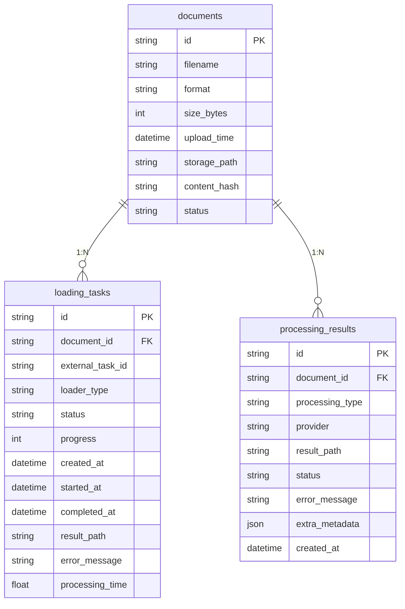

# 数据模型与存储

**更新日期**: 2026-02-02  
**项目**: RAG Framework - 文档加载模块  

---

## 目录

1. [数据库表一览](#1-数据库表一览)
2. [实体关系图](#2-实体关系图)
3. [核心实体详解](#3-核心实体详解)
4. [数据库索引](#4-数据库索引)
5. [文件存储](#5-文件存储)

---

## 1. 数据库表一览

项目使用 SQLite 数据库（`app.db`）存储文档加载相关数据，共有 **3 张核心表**：

| 表名 | 作用 | 数据量级 | 模型文件 |
|------|------|----------|----------|
| `documents` | **核心数据** - 文档基本信息 | 每个上传文档一条 | `models/document.py` |
| `loading_tasks` | 加载任务管理 | 每次加载操作一条 | `models/loading_task.py` |
| `processing_results` | 处理结果元信息 | 每次处理操作一条 | `models/processing_result.py` |

> **注意**: 项目根目录下的 `rag_framework.db` 文件是遗留文件，未被使用，可安全删除。实际使用的数据库是 `app.db`。

---

## 2. 实体关系图

```
┌──────────────────────────────────────────────┐
│              Document (文档)                  │
│              ────────────                    │
│  - id (PK)                                   │
│  - filename                                  │
│  - format (pdf/docx/doc/txt/md)             │
│  - size_bytes                                │
│  - storage_path                              │
│  - content_hash                              │
│  - status (uploaded/processing/ready/error) │
│  - upload_time                               │
└──────────────────────────────────────────────┘
         │                           │
         │ 1:N                       │ 1:N
         ▼                           ▼
┌────────────────────────┐   ┌──────────────────────────────────┐
│  LoadingTask (加载任务) │   │  ProcessingResult (处理结果)     │
│  ──────────────        │   │  ──────────────────              │
│  - id (PK)             │   │  - id (PK)                       │
│  - document_id (FK)    │   │  - document_id (FK → Document)   │
│  - external_task_id    │   │  - processing_type (load/chunk)  │
│  - loader_type         │   │  - provider (pymupdf/pypdf/...)  │
│  - status              │   │  - result_path                   │
│  - progress            │   │  - status                        │
│  - created_at          │   │  - error_message                 │
│  - started_at          │   │  - extra_metadata (JSON)         │
│  - completed_at        │   │  - created_at                    │
│  - result_path         │   └──────────────────────────────────┘
│  - error_message       │                   │
│  - processing_time     │                   │ 1:1 (JSON文件)
└────────────────────────┘                   ▼
                              ┌──────────────────────────────────┐
                              │    LoadResult (JSON文件)          │
                              │    ──────────────                │
                              │  {                               │
                              │    "success": true,              │
                              │    "loader": "pymupdf",          │
                              │    "metadata": {...},            │
                              │    "pages": [...],               │
                              │    "full_text": "...",           │
                              │    "total_pages": 10,            │
                              │    "total_chars": 5234           │
                              │  }                               │
                              └──────────────────────────────────┘
```

### 2.2 Mermaid ER 图



---

## 3. 核心实体详解

### 3.1 Document (文档)

**位置**: `backend/src/models/document.py`

**字段说明**:

| 字段 | 类型 | 说明 |
|------|------|------|
| id | String(36) | UUID主键 |
| filename | String(255) | 存储文件名(唯一) |
| original_filename | String(255) | 原始文件名 |
| format | String(10) | 文件格式(pdf/docx/doc/txt/md) |
| size_bytes | BigInteger | 文件大小(字节) |
| storage_path | String(500) | 存储路径 |
| status | String(20) | 文档状态 |
| upload_time | DateTime | 上传时间 |
| last_processed | DateTime | 最后处理时间 |

**状态枚举**:
```python
class DocumentStatus(enum.Enum):
    UPLOADED = "uploaded"     # 已上传
    PROCESSING = "processing" # 处理中
    READY = "ready"          # 就绪
    ERROR = "error"          # 错误
```

**模型定义**:
```python
class Document(Base):
    __tablename__ = "documents"
    
    id = Column(String(36), primary_key=True, default=lambda: str(uuid.uuid4()))
    filename = Column(String(255), nullable=False, unique=True)
    original_filename = Column(String(255), nullable=False)
    format = Column(String(10), nullable=False)
    size_bytes = Column(BigInteger, nullable=False)
    storage_path = Column(String(500), nullable=False)
    status = Column(String(20), nullable=False, default="uploaded")
    upload_time = Column(DateTime(timezone=True), server_default=func.now())
    last_processed = Column(DateTime(timezone=True), nullable=True)
    
    # Relationships
    processing_results = relationship(
        "ProcessingResult", 
        back_populates="document",
        cascade="all, delete-orphan"
    )
    
    # Indexes
    __table_args__ = (
        Index('idx_document_filename', 'filename'),
        Index('idx_document_format', 'format'),
        Index('idx_document_status', 'status'),
        Index('idx_document_upload_time', 'upload_time'),
    )
```

**业务逻辑**:
```python
def update_status(self, new_status: str):
    """更新文档状态"""
    self.status = new_status
    if new_status in ['ready', 'error']:
        self.last_processed = datetime.now(timezone.utc)

def get_processing_result(self, processing_type: str = None):
    """获取处理结果"""
    query = [r for r in self.processing_results]
    if processing_type:
        query = [r for r in query if r.processing_type == processing_type]
    return sorted(query, key=lambda x: x.created_at, reverse=True)

def get_latest_load_result(self):
    """获取最新加载结果"""
    results = self.get_processing_result('load')
    return results[0] if results else None
```

---

### 3.2 LoadingTask (加载任务)

**位置**: `backend/src/models/loading_task.py`

**字段说明**:

| 字段 | 类型 | 说明 |
|------|------|------|
| id | String(36) | UUID主键 |
| document_id | String(36, FK) | 文档ID |
| external_task_id | String(36) | 外部任务ID |
| loader_type | String(50) | 加载器类型 |
| status | String(20) | 任务状态 |
| progress | Integer | 进度(0-100) |
| created_at | DateTime | 创建时间 |
| started_at | DateTime | 开始时间 |
| completed_at | DateTime | 完成时间 |
| result_path | String(500) | 结果文件路径 |
| error_message | String | 错误信息 |
| processing_time | Float | 处理时间(秒) |

**状态枚举**:
```python
class LoadingTaskStatus(enum.Enum):
    PENDING = "pending"     # 待处理
    RUNNING = "running"     # 运行中
    COMPLETED = "completed" # 已完成
    FAILED = "failed"       # 失败
```

**模型定义**:
```python
class LoadingTask(Base):
    __tablename__ = "loading_tasks"
    
    id = Column(String(36), primary_key=True, default=lambda: str(uuid.uuid4()))
    document_id = Column(
        String(36), 
        ForeignKey("documents.id", ondelete="CASCADE"),
        nullable=False
    )
    external_task_id = Column(String(36), nullable=True)
    loader_type = Column(String(50), nullable=False)
    status = Column(String(20), nullable=False, default="pending")
    progress = Column(Integer, nullable=False, default=0)
    created_at = Column(DateTime(timezone=True), server_default=func.now())
    started_at = Column(DateTime(timezone=True), nullable=True)
    completed_at = Column(DateTime(timezone=True), nullable=True)
    result_path = Column(String(500), nullable=True)
    error_message = Column(String, nullable=True)
    processing_time = Column(Float, nullable=True)
    
    # Relationships
    document = relationship("Document", back_populates="loading_tasks")
    
    # Indexes
    __table_args__ = (
        Index('idx_loading_task_document_id', 'document_id'),
        Index('idx_loading_task_status', 'status'),
        Index('idx_loading_task_created_at', 'created_at'),
    )
```

**业务逻辑**:
```python
def update_status(self, new_status: str):
    """更新任务状态"""
    self.status = new_status
    if new_status == "running":
        self.started_at = datetime.now(timezone.utc)
    elif new_status in ["completed", "failed"]:
        self.completed_at = datetime.now(timezone.utc)
        self.processing_time = (self.completed_at - self.started_at).total_seconds()

def update_progress(self, progress: int):
    """更新进度"""
    self.progress = progress
```

---

### 3.3 ProcessingResult (处理结果)

**位置**: `backend/src/models/processing_result.py`

**字段说明**:

| 字段 | 类型 | 说明 |
|------|------|------|
| id | String(36) | UUID主键 |
| document_id | String(36, FK) | 文档ID |
| processing_type | String(50) | 处理类型 |
| provider | String(50) | 提供者/加载器 |
| result_path | String(500) | 结果文件路径 |
| status | String(20) | 处理状态 |
| error_message | String | 错误信息 |
| extra_metadata | JSON | 额外元数据 |
| created_at | DateTime | 创建时间 |

**处理类型枚举**:
```python
class ProcessingType(enum.Enum):
    LOAD = "load"           # 文档加载
    CHUNK = "chunk"         # 文档分块
    EMBED = "embed"         # 向量嵌入
    INDEX = "index"         # 索引构建
    GENERATE = "generate"   # 内容生成
```

**加载器类型**:
```python
class LoaderType(enum.Enum):
    PYMUPDF = "pymupdf"
    PYPDF = "pypdf"
    UNSTRUCTURED = "unstructured"
    DOCX = "docx"
    DOC = "doc"
    TEXT = "text"
```

**模型定义**:
```python
class ProcessingResult(Base):
    __tablename__ = "processing_results"
    
    id = Column(String(36), primary_key=True, default=lambda: str(uuid.uuid4()))
    document_id = Column(
        String(36), 
        ForeignKey("documents.id", ondelete="CASCADE"),
        nullable=False
    )
    processing_type = Column(String(50), nullable=False)
    provider = Column(String(50), nullable=True)
    result_path = Column(String(500), nullable=False)
    status = Column(String(20), nullable=False, default="pending")
    error_message = Column(String, nullable=True)
    extra_metadata = Column(JSON, nullable=True)
    created_at = Column(DateTime(timezone=True), server_default=func.now())
    
    # Relationships
    document = relationship("Document", back_populates="processing_results")
    
    # Indexes
    __table_args__ = (
        Index('idx_result_document_id', 'document_id'),
        Index('idx_result_document_type_time', 
              'document_id', 'processing_type', 'created_at'),
        Index('idx_result_type_status', 'processing_type', 'status'),
    )
```

**extra_metadata 结构** (针对load类型):
```json
{
  "total_pages": 10,
  "total_chars": 5234,
  "loader_type": "pymupdf",
  "file_format": "pdf",
  "processing_time": 2.5
}
```

---

## 4. 数据库索引

### 4.1 Document索引

```python
__table_args__ = (
    Index('idx_document_filename', 'filename'),
    Index('idx_document_format', 'format'),
    Index('idx_document_status', 'status'),
    Index('idx_document_upload_time', 'upload_time'),
)
```

**用途**:
- `idx_document_filename`: 按文件名查询(唯一性检查)
- `idx_document_format`: 按格式过滤(PDF/DOCX/TXT等)
- `idx_document_status`: 按状态过滤(ready/processing等)
- `idx_document_upload_time`: 按上传时间排序

**查询示例**:
```python
# 查询特定格式的文档
documents = session.query(Document)\
    .filter(Document.format == 'pdf')\
    .order_by(Document.upload_time.desc())\
    .all()

# 查询就绪状态的文档
ready_docs = session.query(Document)\
    .filter(Document.status == 'ready')\
    .all()

# 检查文件名是否存在
exists = session.query(Document)\
    .filter(Document.filename == 'example.pdf')\
    .first() is not None
```

---

### 4.2 LoadingTask索引

```python
__table_args__ = (
    Index('idx_loading_task_document_id', 'document_id'),
    Index('idx_loading_task_status', 'status'),
    Index('idx_loading_task_created_at', 'created_at'),
)
```

**用途**:
- `idx_loading_task_document_id`: 查询文档的所有加载任务
- `idx_loading_task_status`: 按状态过滤任务
- `idx_loading_task_created_at`: 按创建时间排序

**查询示例**:
```python
# 查询文档的所有加载任务
tasks = session.query(LoadingTask)\
    .filter(LoadingTask.document_id == doc_id)\
    .order_by(LoadingTask.created_at.desc())\
    .all()

# 查询所有待处理的任务
pending_tasks = session.query(LoadingTask)\
    .filter(LoadingTask.status == 'pending')\
    .all()
```

---

### 4.3 ProcessingResult索引

```python
__table_args__ = (
    Index('idx_result_document_id', 'document_id'),
    Index('idx_result_document_type_time', 
          'document_id', 'processing_type', 'created_at'),
    Index('idx_result_type_status', 'processing_type', 'status'),
)
```

**用途**:
- `idx_result_document_id`: 查询文档的所有处理结果
- `idx_result_document_type_time`: 查询文档特定类型的最新结果
- `idx_result_type_status`: 查询特定类型的处理状态

**查询示例**:
```python
# 查询文档的所有加载结果
load_results = session.query(ProcessingResult)\
    .filter(
        ProcessingResult.document_id == doc_id,
        ProcessingResult.processing_type == 'load'
    )\
    .order_by(ProcessingResult.created_at.desc())\
    .all()

# 查询最新的加载结果
latest_result = session.query(ProcessingResult)\
    .filter(
        ProcessingResult.document_id == doc_id,
        ProcessingResult.processing_type == 'load'
    )\
    .order_by(ProcessingResult.created_at.desc())\
    .first()

# 查询所有失败的处理
failed_results = session.query(ProcessingResult)\
    .filter(ProcessingResult.status == 'failed')\
    .all()
```

---

## 5. 文件存储

### 5.1 目录结构

```
项目根目录/
├── uploads/                    # 原始文档存储
│   ├── doc_123456.pdf
│   ├── doc_234567.docx
│   └── doc_345678.txt
│
└── backend/
    └── results/                # 处理结果存储
        ├── load/               # 加载结果
        │   ├── doc_123456_pymupdf_20251210_100500.json
        │   ├── doc_234567_docx_20251210_103000.json
        │   └── doc_345678_text_20251210_105500.json
        │
        ├── chunking/           # 分块结果
        └── embedding/          # 向量结果
```

### 5.2 文件命名规则

**原始文档**:
- 格式: `{document_id}.{extension}`
- 示例: `doc_123456.pdf`

**加载结果JSON**:
- 格式: `{document_id}_{loader_type}_{timestamp}.json`
- 示例: `doc_123456_pymupdf_20251210_100500.json`
- 时间戳: `YYYYMMdd_HHmmss`

### 5.3 LoadResult JSON格式

**完整结构**:
```json
{
  "success": true,
  "loader": "pymupdf",
  "metadata": {
    "page_count": 10,
    "title": "示例文档",
    "author": "张三",
    "subject": "技术文档",
    "creator": "Microsoft Word",
    "producer": "Adobe PDF Library",
    "format": "PDF 1.7"
  },
  "pages": [
    {
      "page_number": 1,
      "text": "第一页的文本内容...",
      "char_count": 523
    },
    {
      "page_number": 2,
      "text": "第二页的文本内容...",
      "char_count": 487
    }
  ],
  "full_text": "第一页的文本内容...\n\n第二页的文本内容...",
  "total_pages": 10,
  "total_chars": 5234
}
```

**字段说明**:

| 字段 | 类型 | 说明 |
|------|------|------|
| success | Boolean | 是否成功 |
| loader | String | 使用的加载器 |
| metadata | Object | 文档元数据 |
| pages | Array | 页面列表 |
| full_text | String | 完整文本 |
| total_pages | Integer | 总页数 |
| total_chars | Integer | 总字符数 |

**pages数组元素**:

| 字段 | 类型 | 说明 |
|------|------|------|
| page_number | Integer | 页码(从1开始) |
| text | String | 页面文本内容 |
| char_count | Integer | 字符数 |

**metadata对象** (PDF):

| 字段 | 类型 | 说明 |
|------|------|------|
| page_count | Integer | 页数 |
| title | String | 标题 |
| author | String | 作者 |
| subject | String | 主题 |
| creator | String | 创建工具 |
| producer | String | 生成工具 |
| format | String | PDF版本 |

---

### 5.4 存储策略

**双重存储**:
1. **数据库**: 存储元信息和索引
   - 文档基本信息
   - 处理结果状态
   - 文件路径引用
   - 统计信息

2. **文件系统**: 存储完整数据
   - 原始文档文件
   - 加载结果JSON
   - 保持数据完整性
   - 支持直接访问

**优点**:
- ✅ 快速查询: 数据库索引支持
- ✅ 完整性: JSON文件保存原始数据
- ✅ 灵活导出: 可直接下载JSON文件
- ✅ 数据安全: 删除时同步清理
- ✅ 可扩展: 支持多种存储后端

---

### 5.5 JSON存储服务

**位置**: `backend/src/storage/json_storage.py`

**核心功能**:
```python
class JSONStorage:
    def __init__(self, base_dir: str = "./results"):
        self.base_dir = Path(base_dir)
        self.load_dir = self.base_dir / "load"
        self.load_dir.mkdir(parents=True, exist_ok=True)
    
    def save_result(
        self, 
        document_filename: str, 
        processing_type: str,
        result_data: Dict[str, Any]
    ) -> str:
        """
        保存处理结果为JSON文件
        
        Args:
            document_filename: 文档文件名
            processing_type: 处理类型(load/parse/chunk)
            result_data: 结果数据
            
        Returns:
            保存的文件路径
        """
        # 生成文件名
        timestamp = datetime.now().strftime("%Y%m%d_%H%M%S")
        doc_id = Path(document_filename).stem
        loader = result_data.get("loader", "unknown")
        
        filename = f"{doc_id}_{loader}_{timestamp}.json"
        
        # 确定保存目录
        if processing_type == "load":
            save_dir = self.load_dir
        else:
            save_dir = self.base_dir / processing_type
            save_dir.mkdir(parents=True, exist_ok=True)
        
        # 保存文件
        file_path = save_dir / filename
        with open(file_path, 'w', encoding='utf-8') as f:
            json.dump(result_data, f, ensure_ascii=False, indent=2)
        
        return str(file_path)
    
    def load_result(self, file_path: str) -> Dict[str, Any]:
        """
        加载JSON结果文件
        
        Args:
            file_path: 文件路径
            
        Returns:
            结果数据字典
        """
        with open(file_path, 'r', encoding='utf-8') as f:
            return json.load(f)
    
    def delete_result(self, file_path: str) -> bool:
        """
        删除结果文件
        
        Args:
            file_path: 文件路径
            
        Returns:
            是否成功删除
        """
        try:
            Path(file_path).unlink()
            return True
        except Exception as e:
            logger.error(f"Failed to delete {file_path}: {e}")
            return False

# 全局实例
json_storage = JSONStorage()
```

---

### 5.6 清理策略

**自动清理**:
```python
def cleanup_orphaned_files():
    """清理数据库中不存在的文件"""
    # 获取所有结果文件
    result_files = set(glob.glob("backend/results/load/*.json"))
    
    # 获取数据库中的所有result_path
    db_paths = set([r.result_path for r in session.query(ProcessingResult).all()])
    
    # 找出孤立文件
    orphaned = result_files - db_paths
    
    # 删除孤立文件
    for file_path in orphaned:
        os.remove(file_path)
        logger.info(f"Removed orphaned file: {file_path}")
```

**手动清理**:
```bash
# 清理脚本
#!/bin/bash
# cleanup_results.sh

# 清理30天前的结果文件
find backend/results/load -name "*.json" -mtime +30 -delete

# 清理失败的处理结果
python -c "
from backend.src.storage.database import get_db
from backend.src.models.processing_result import ProcessingResult
from backend.src.storage.json_storage import json_storage

db = next(get_db())
failed_results = db.query(ProcessingResult).filter(
    ProcessingResult.status == 'failed'
).all()

for result in failed_results:
    json_storage.delete_result(result.result_path)
    db.delete(result)

db.commit()
"
```

---

## 6. 数据一致性

### 6.1 事务处理

**完整事务示例**:
```python
def load_document_with_transaction(db: Session, document_id: str, loader_type: str):
    """带事务的文档加载"""
    try:
        # 开始事务
        db.begin()
        
        # 1. 更新文档状态
        document = db.query(Document).filter(Document.id == document_id).first()
        document.status = "processing"
        db.flush()
        
        # 2. 创建处理结果记录
        result = ProcessingResult(
            document_id=document_id,
            processing_type="load",
            provider=loader_type,
            status="running"
        )
        db.add(result)
        db.flush()
        
        # 3. 执行加载
        loader = get_loader(loader_type)
        result_data = loader.extract_text(document.storage_path)
        
        # 4. 保存结果JSON
        result_path = json_storage.save_result(
            document.filename,
            "load",
            result_data
        )
        
        # 5. 更新结果记录
        result.result_path = result_path
        result.status = "completed"
        result.extra_metadata = {
            "total_pages": result_data.get("total_pages"),
            "total_chars": result_data.get("total_chars")
        }
        
        # 6. 更新文档状态
        document.status = "ready"
        document.last_processed = datetime.now(timezone.utc)
        
        # 提交事务
        db.commit()
        
        return result
        
    except Exception as e:
        # 回滚事务
        db.rollback()
        
        # 清理已创建的文件
        if result_path:
            json_storage.delete_result(result_path)
        
        # 标记为失败
        if result:
            result.status = "failed"
            result.error_message = str(e)
            db.commit()
        
        raise
```

### 6.2 级联删除

```python
# Document模型中的级联删除配置
processing_results = relationship(
    "ProcessingResult",
    back_populates="document",
    cascade="all, delete-orphan"  # 删除文档时自动删除所有处理结果
)

# 删除文档时的完整清理
def delete_document_completely(db: Session, document_id: str):
    """完整删除文档及其所有相关数据"""
    document = db.query(Document).filter(Document.id == document_id).first()
    
    if document:
        # 1. 删除所有结果JSON文件
        for result in document.processing_results:
            if result.result_path:
                json_storage.delete_result(result.result_path)
        
        # 2. 删除原始文档文件
        if os.path.exists(document.storage_path):
            os.remove(document.storage_path)
        
        # 3. 删除数据库记录(级联删除processing_results)
        db.delete(document)
        db.commit()
```

---

## 7. 最佳实践

### 7.1 性能优化
- 使用适当的索引加速查询
- 大文件采用流式读取
- 缓存频繁访问的结果
- 定期清理过期数据

### 7.2 数据安全
- 实施数据库事务确保一致性
- 定期备份重要数据
- 文件权限控制
- 敏感信息加密存储

### 7.3 扩展性
- 支持多种数据库后端(SQLite/PostgreSQL/MySQL)
- 支持对象存储(S3/OSS/COS)
- 支持分布式文件系统
- 支持数据库分表分库
