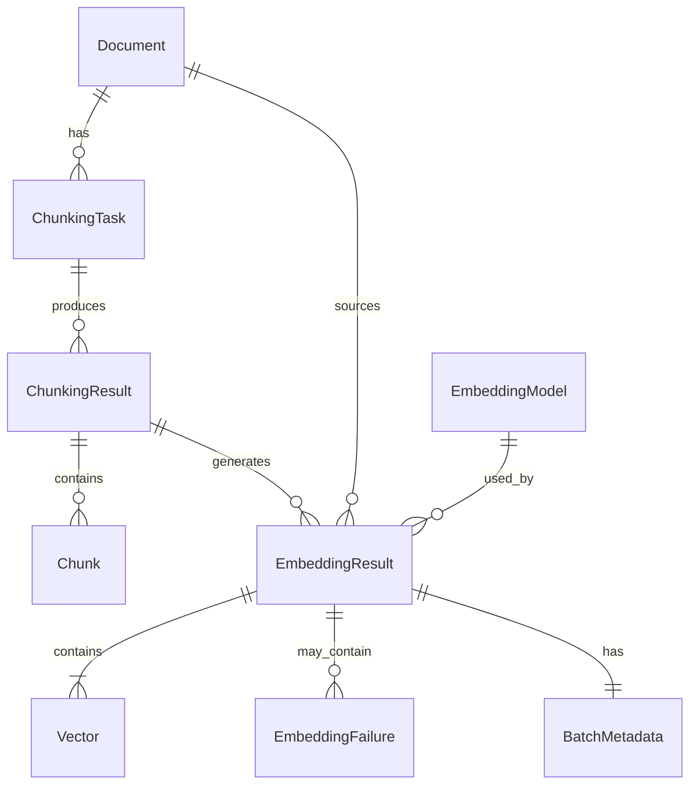

# Data Model: Vector Embedding Module

**Feature**: 003-vector-embedding  
**Date**: 2025-12-15  
**Status**: Phase 1 Design

---

## Overview

This document defines the data entities, relationships, validation rules, and state transitions for the Vector Embedding Module. The module integrates with existing chunking infrastructure and introduces new entities for embedding configuration, results, and metadata tracking.

---

## Entity Definitions

### 1. EmbeddingModel

**Purpose**: Represents a supported embedding model configuration

**Source**: Static registry (not database-persisted, defined in code)

**Attributes**:

| Field | Type | Constraints | Description |
|-------|------|-------------|-------------|
| `name` | string | Primary key, enum | Model identifier (e.g., "bge-m3") |
| `dimension` | integer | > 0 | Vector dimension size (768, 1024, 1536) |
| `description` | string | Not null | Human-readable model description |
| `provider` | string | Not null | Provider name (e.g., "bge", "qwen") |
| `supports_multilingual` | boolean | Not null | Whether model supports non-English text |
| `max_batch_size` | integer | > 0, ≤ 1000 | Maximum documents per batch request |

**Supported Models**:
```python
{
    "bge-m3": {
        "dimension": 1024,
        "description": "BGE-M3 多语言模型，支持中英文，性能优秀",
        "provider": "bge",
        "supports_multilingual": True,
        "max_batch_size": 1000
    },
    "qwen3-embedding-8b": {
        "dimension": 1536,
        "description": "通义千问 Embedding 模型，8B 参数",
        "provider": "qwen",
        "supports_multilingual": True,
        "max_batch_size": 1000
    },
    "hunyuan-embedding": {
        "dimension": 1024,
        "description": "腾讯混元 Embedding 模型",
        "provider": "hunyuan",
        "supports_multilingual": True,
        "max_batch_size": 1000
    },
    "jina-embeddings-v4": {
        "dimension": 768,
        "description": "Jina AI Embeddings v4，多语言支持",
        "provider": "jina",
        "supports_multilingual": True,
        "max_batch_size": 1000
    }
}
```

**Validation Rules**:
- VR-M1: Model name must be one of the supported models
- VR-M2: Dimension must match model specification exactly
- VR-M3: Max batch size cannot exceed global limit (1000)

---

### 2. EmbeddingRequest (Request DTO)

**Purpose**: Captures parameters for an embedding operation

**Lifecycle**: Ephemeral (not persisted, exists only during request processing)

**Variants**:

#### 2.1 SingleEmbeddingRequest
```python
{
    "text": string,           # Text to vectorize
    "model": string,          # Model name
    "max_retries": int = 3,   # Retry attempts
    "timeout": int = 60       # Request timeout in seconds
}
```

#### 2.2 BatchEmbeddingRequest
```python
{
    "texts": List[string],    # Multiple texts to vectorize
    "model": string,
    "result_id": string?,     # Optional: source chunking result ID
    "max_retries": int = 3,
    "timeout": int = 60
}
```

#### 2.3 ChunkingResultEmbeddingRequest
```python
{
    "result_id": string,      # Chunking result ID
    "document_id": string?,   # Optional: for display purposes
    "model": string,
    "max_retries": int = 3,
    "timeout": int = 60
}
```

#### 2.4 DocumentEmbeddingRequest
```python
{
    "document_id": string,    # Document ID
    "model": string,
    "strategy_type": string?, # Optional: filter by chunking strategy
    "max_retries": int = 3,
    "timeout": int = 60
}
```

**Validation Rules**:
- VR-R1: `text` must contain non-whitespace characters (single request)
- VR-R2: `texts` must contain 1-1000 items (batch request)
- VR-R3: `model` must be a supported model name
- VR-R4: `max_retries` must be 0-10
- VR-R5: `timeout` must be 1-300 seconds
- VR-R6: `result_id` must reference existing completed chunking result
- VR-R7: `document_id` must reference existing document
- VR-R8: `strategy_type` if provided must be one of: `fixed_size`, `semantic`, `recursive`, `markdown`, `sentence`, `paragraph`

---

### 3. Vector

**Purpose**: Represents a single embedded vector with metadata

**Attributes**:

| Field | Type | Constraints | Description |
|-------|------|-------------|-------------|
| `index` | integer | ≥ 0 | Position in source batch (0-based) |
| `vector` | float[] | length = model.dimension | Numerical vector representation |
| `dimension` | integer | > 0 | Vector dimension (redundant but cached) |
| `text_hash` | string | Pattern: `sha256:[a-f0-9]{64}` | SHA-256 hash of source text |
| `text_length` | integer | > 0 | Character count of source text |
| `processing_time_ms` | float | ≥ 0 | Time to embed this specific text |

**Validation Rules**:
- VR-V1: `vector` length must match `dimension`
- VR-V2: `vector` must contain only finite numbers (no NaN/Inf)
- VR-V3: `text_hash` must be valid SHA-256 format
- VR-V4: `index` must be unique within a batch result

**Invariants**:
- IV-V1: Vector dimension must match selected model's dimension

---

### 4. EmbeddingFailure

**Purpose**: Captures details of a failed embedding attempt

**Attributes**:

| Field | Type | Constraints | Description |
|-------|------|-------------|-------------|
| `index` | integer | ≥ 0 | Position in source batch where failure occurred |
| `text_preview` | string | max 200 chars | Truncated source text for debugging |
| `error_type` | ErrorType | enum | Categorized error type |
| `error_message` | string | Not null | Human-readable error description |
| `retry_recommended` | boolean | Not null | Whether retry might succeed |
| `retry_count` | integer | ≥ 0 | Number of retry attempts made |

**ErrorType Enum**:
```python
class ErrorType(str, Enum):
    INVALID_TEXT_ERROR = "INVALID_TEXT_ERROR"           # Empty/whitespace text
    RATE_LIMIT_ERROR = "RATE_LIMIT_ERROR"               # API rate limit hit
    API_TIMEOUT_ERROR = "API_TIMEOUT_ERROR"             # Request timeout
    NETWORK_ERROR = "NETWORK_ERROR"                     # Network connectivity
    AUTHENTICATION_ERROR = "AUTHENTICATION_ERROR"        # Invalid API key
    DIMENSION_MISMATCH_ERROR = "DIMENSION_MISMATCH_ERROR" # Vector size mismatch
    UNKNOWN_ERROR = "UNKNOWN_ERROR"                     # Unclassified error
```

### Error Message Format Standards

For consistent error reporting and debugging, the following error types have standardized message formats:

#### VectorDimensionMismatchError

**Format**:
```
Vector dimension mismatch for model '{model_name}': expected {expected_dim} dimensions, but received {actual_dim} dimensions from API
```

**Example**:
```
Vector dimension mismatch for model 'qwen3-embedding-8b': expected 1536 dimensions, but received 1024 dimensions from API
```

**Fields**:
- `model_name`: The embedding model name used (e.g., "qwen3-embedding-8b")
- `expected_dim`: Expected dimension from EMBEDDING_MODELS registry (e.g., 1536)
- `actual_dim`: Actual dimension returned by API (e.g., 1024)

**HTTP Status**: 500 Internal Server Error  
**Error Code**: `DIMENSION_MISMATCH_ERROR`  
**Retry Recommended**: False (non-retryable, requires model configuration fix)

#### AuthenticationError

**Format**:
```
Authentication failed: {reason}. Please verify your API credentials in configuration.
```

**Example**:
```
Authentication failed: Invalid API key. Please verify your API credentials in configuration.
```

#### RateLimitError

**Format**:
```
Rate limit exceeded for embedding API. {retry_info}
```

**Example**:
```
Rate limit exceeded for embedding API. Retry after 30 seconds or contact API provider to increase quota.
```

**Fields**:
- `retry_info`: 
  - If `retry_after` header present: "Retry after {retry_after} seconds"
  - Otherwise: "or contact API provider to increase quota"

---

**Validation Rules**:
- VR-F1: `error_type` must be valid ErrorType enum value
- VR-F2: `retry_recommended` = true only for RATE_LIMIT, TIMEOUT, NETWORK errors
- VR-F3: `text_preview` must not exceed 200 characters

---

### 5. EmbeddingResult (Response DTO)

**Purpose**: Complete result of an embedding operation with all metadata

**Lifecycle**: Generated per request, persisted to JSON file

**Variants**:

#### 5.1 SingleEmbeddingResponse
```python
{
    "request_id": string (UUID),
    "status": ResponseStatus,
    "vector": Vector,
    "metadata": EmbeddingMetadata,
    "timestamp": datetime (ISO 8601)
}
```

#### 5.2 BatchEmbeddingResponse
```python
{
    "request_id": string (UUID),
    "status": ResponseStatus,
    "vectors": Vector[],
    "failures": EmbeddingFailure[],
    "metadata": BatchMetadata,
    "timestamp": datetime (ISO 8601)
}
```

**ResponseStatus Enum**:
```python
class ResponseStatus(str, Enum):
    SUCCESS = "success"               # All items succeeded
    PARTIAL_SUCCESS = "partial_success" # Some items failed
    FAILED = "failed"                 # All items failed
```

**State Transition Rules**:
- ST-R1: `status = SUCCESS` iff `failures = []` and `vectors != []`
- ST-R2: `status = FAILED` iff `vectors = []` and `failures != []`
- ST-R3: `status = PARTIAL_SUCCESS` iff `vectors != []` and `failures != []`

---

### 6. EmbeddingMetadata (Single Request)

**Purpose**: Operational metrics for single embedding request

**Attributes**:

| Field | Type | Description |
|-------|------|-------------|
| `model` | string | Model name used |
| `model_dimension` | integer | Model's vector dimension |
| `processing_time_ms` | float | Total time including retries |
| `api_latency_ms` | float | Actual API call time (excluding retries) |
| `retry_count` | integer | Total retry attempts across all operations |
| `rate_limit_hits` | integer | Number of rate limit errors encountered |
| `config` | EmbeddingConfig | API configuration snapshot |

---

### 7. BatchMetadata (Batch Request)

**Purpose**: Operational metrics for batch embedding request

**Extends**: EmbeddingMetadata

**Additional Attributes**:

| Field | Type | Description |
|-------|------|-------------|
| `batch_size` | integer | Total items in batch |
| `successful_count` | integer | Number of successfully embedded items |
| `failed_count` | integer | Number of failed items |
| `vectors_per_second` | float | Throughput metric |

**Invariants**:
- IV-B1: `successful_count + failed_count = batch_size`
- IV-B2: `vectors_per_second = successful_count / (processing_time_ms / 1000)`

---

### 8. EmbeddingConfig

**Purpose**: Snapshot of API configuration used for request

**Attributes**:

| Field | Type | Description |
|-------|------|-------------|
| `api_endpoint` | string (URL) | Embedding API base URL |
| `max_retries` | integer | Maximum retry attempts |
| `timeout_seconds` | integer | Request timeout |
| `exponential_backoff` | boolean | Whether backoff enabled |
| `initial_delay_seconds` | float | First retry delay |
| `max_delay_seconds` | float | Maximum retry delay cap |

---

## Integration Entities (Existing)

These entities are **not created by this module** but are referenced for integration:

### Document (from document module)
```python
{
    "document_id": string (UUID),
    "file_name": string,
    "upload_time": datetime,
    "status": DocumentStatus
}
```

### ChunkingResult (from chunking module)
```python
{
    "result_id": string (UUID),
    "task_id": string (UUID),
    "status": ResultStatus,        # COMPLETED required for embedding
    "is_active": boolean,           # Only active results used
    "created_at": datetime,
    "chunk_count": integer
}
```

### ChunkingTask (from chunking module)
```python
{
    "task_id": string (UUID),
    "source_document_id": string (UUID),
    "chunking_strategy": StrategyType  # e.g., FIXED_SIZE, SEMANTIC
}
```

**StrategyType Enum** (defined in chunking module, referenced here):
```python
class StrategyType(str, Enum):
    FIXED_SIZE = "fixed_size"           # Fixed character/token count chunks
    SEMANTIC = "semantic"               # Semantic meaning-based chunks
    RECURSIVE = "recursive"             # Recursive character text splitting
    MARKDOWN = "markdown"               # Markdown structure-aware splitting
    SENTENCE = "sentence"               # Sentence-based chunking
    PARAGRAPH = "paragraph"             # Paragraph-based chunking
```

**Usage in Embedding Module**:
- When calling `/embedding/from-document` with `strategy_type` parameter
- System filters ChunkingResults to only those matching the specified strategy
- If no matching result exists, returns 404 error
- If `strategy_type` is omitted, uses latest active result regardless of strategy

### Chunk (from chunking module)
```python
{
    "chunk_id": string (UUID),
    "result_id": string (UUID),
    "sequence_number": integer,     # Ordering within result
    "content": string,              # Text to be embedded
    "metadata": dict
}
```

---

## Relationships



**Relationship Rules**:
- RR-1: An `EmbeddingResult` must reference either a `ChunkingResult` (via `source.result_id`) or a `Document` (via `source.document_id`)
- RR-2: A `ChunkingResult` can have multiple `EmbeddingResult` records (different models, re-embeddings)
- RR-3: Each `Vector` in an `EmbeddingResult` corresponds to exactly one `Chunk` by `index = sequence_number`
- RR-4: An `EmbeddingFailure` index indicates which `Chunk` failed to embed

---

## Validation Summary

### Request Validation Pipeline

```
1. Model validation (VR-M1)
   ↓
2. Text validation (VR-R1, VR-R2)
   ↓
3. Parameter bounds (VR-R3-R5)
   ↓
4. Reference validation (VR-R6-R8)
   ↓
5. Batch size limit (VR-R2, VR-M3)
```

### Response Validation Pipeline

```
1. Vector dimension check (VR-V1, IV-V1)
   ↓
2. Vector numeric validity (VR-V2)
   ↓
3. Batch consistency (IV-B1)
   ↓
4. Status derivation (ST-R1-R3)
```

---

## State Transitions

### Embedding Request Lifecycle

```
┌─────────────┐
│  INITIATED  │ (Request received)
└──────┬──────┘
       │
       ▼
┌─────────────┐
│ VALIDATING  │ (Input validation)
└──────┬──────┘
       │
       ├─[Invalid]──► REJECTED (400 error)
       │
       ▼
┌─────────────┐
│ PROCESSING  │ (Calling embedding API)
└──────┬──────┘
       │
       ├─[All success]──────────► SUCCESS
       ├─[All failed]───────────► FAILED
       └─[Some failed]──────────► PARTIAL_SUCCESS
```

### Retry State Machine

```
┌────────────┐
│   ATTEMPT  │
└─────┬──────┘
      │
      ▼
   [API Call]
      │
      ├─[Success]──────► Return vector
      │
      ├─[Retryable]────► [Retry count < max?]
      │                         │
      │                         ├─[Yes]──► Wait (exponential backoff) ──► ATTEMPT
      │                         └─[No]───► Return failure
      │
      └─[Non-retryable]► Return failure immediately
```

**Retryable Errors**: RATE_LIMIT_ERROR, API_TIMEOUT_ERROR, NETWORK_ERROR  
**Non-retryable Errors**: INVALID_TEXT_ERROR, AUTHENTICATION_ERROR, DIMENSION_MISMATCH_ERROR

---

## Storage Schema

### JSON File Structure (Persisted Result)

**File Path**: `results/embedding/{document_name}_{timestamp}.json`

**Schema**:
```json
{
  "request_id": "550e8400-e29b-41d4-a716-446655440000",
  "timestamp": "2025-12-15T10:30:45.123Z",
  "status": "success",
  "source": {
    "type": "chunking_result",
    "document_id": "doc-uuid",
    "result_id": "result-uuid",
    "document_name": "research_paper.pdf"
  },
  "model": {
    "name": "qwen3-embedding-8b",
    "dimension": 1536,
    "provider": "qwen"
  },
  "vectors": [
    {
      "index": 0,
      "vector": [0.123, -0.456, ...],
      "dimension": 1536,
      "text_hash": "sha256:abc123...",
      "text_length": 250,
      "processing_time_ms": 45.2
    }
  ],
  "failures": [],
  "metadata": {
    "model": "qwen3-embedding-8b",
    "model_dimension": 1536,
    "processing_time_ms": 2345.6,
    "batch_size": 50,
    "successful_count": 50,
    "failed_count": 0,
    "retry_count": 2,
    "rate_limit_hits": 1,
    "vectors_per_second": 21.3,
    "config": {
      "api_endpoint": "http://dev.fit-ai.woa.com/api/llmproxy",
      "max_retries": 3,
      "timeout_seconds": 60,
      "exponential_backoff": true,
      "initial_delay_seconds": 1.0,
      "max_delay_seconds": 32.0
    }
  }
}
```

---

## Indexing Strategy (Database)

Since embedding results are stored as JSON files, minimal database indexing is required. However, for efficient querying:

**ChunkingResult indexes** (already exist):
- Primary: `result_id`
- Foreign: `task_id`
- Composite: `(status, is_active, created_at)` for latest active result queries

**ChunkingTask indexes** (already exist):
- Primary: `task_id`
- Foreign: `source_document_id`
- Composite: `(source_document_id, chunking_strategy)` for strategy filtering

---

## Data Integrity Constraints

### Hard Constraints (Enforced)

1. **DC-1**: Vector dimension must match model specification
2. **DC-2**: Batch size cannot exceed model's `max_batch_size`
3. **DC-3**: Referenced `result_id` must exist and have status = COMPLETED
4. **DC-4**: Referenced `document_id` must exist
5. **DC-5**: `successful_count + failed_count = batch_size`

### Soft Constraints (Logged but not enforced)

1. **DC-6**: Embedding requests should typically complete within 30s for 100 chunks (performance metric)
2. **DC-7**: Retry count should not exceed 3 in 95% of cases (reliability metric)
3. **DC-8**: Rate limit hits should be < 10% of requests (API quota metric)

---

**Next Steps**: Generate API contracts (Phase 1 continues)
