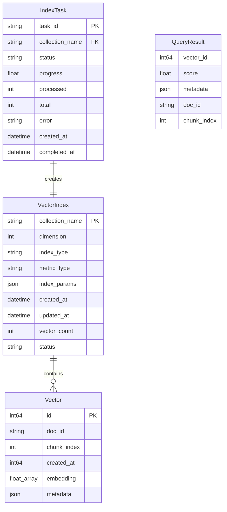

# Data Model: 向量索引模块（优化版）

**Branch**: `004-vector-index-opt`
**Date**: 2026-02-06
**Status**: Complete

## Overview

本文档定义向量索引模块的数据实体、字段、关系和验证规则。

---

## Entity Relationship Diagram



---

## Entity Definitions

### 1. VectorIndex（向量索引）

代表一个 Milvus Collection，存储向量数据和索引配置。

| Field | Type | Required | Description | Constraints |
|-------|------|----------|-------------|-------------|
| `collection_name` | string | ✅ | Collection 名称（主键） | 唯一，3-64字符，[a-zA-Z0-9_] |
| `dimension` | int | ✅ | 向量维度 | 128/256/512/768/1024/1536/2048/3072/4096 |
| `index_type` | string | ✅ | 索引算法类型 | FLAT/IVF_FLAT/IVF_PQ/HNSW |
| `metric_type` | string | ✅ | 距离度量方式 | L2/IP/COSINE |
| `index_params` | json | ❌ | 索引参数 | 根据 index_type 验证 |
| `created_at` | datetime | ✅ | 创建时间 | ISO 8601 格式 |
| `updated_at` | datetime | ✅ | 最后更新时间 | ISO 8601 格式 |
| `vector_count` | int | ✅ | 向量数量 | >= 0 |
| `status` | string | ✅ | 索引状态 | CREATING/READY/ERROR/DELETED |
| `source_task_id` | string | ❌ | 来源向量化任务ID | 关联 Embedding 任务 |

**State Transitions**:
```
CREATING → READY (索引构建成功)
CREATING → ERROR (索引构建失败)
READY → DELETED (用户删除)
ERROR → CREATING (重新构建)
```

### 2. Vector（向量）

存储在 Milvus Collection 中的单个向量数据点。

| Field | Type | Required | Description | Constraints |
|-------|------|----------|-------------|-------------|
| `id` | int64 | ✅ | 向量主键（自增） | Milvus 自动生成 |
| `doc_id` | string | ✅ | 文档ID | 最大256字符 |
| `chunk_index` | int | ✅ | 分块索引 | >= 0 |
| `created_at` | int64 | ✅ | 创建时间戳 | Unix timestamp |
| `embedding` | float[] | ✅ | 向量值 | 维度与 Collection 一致 |
| `metadata` | json | ❌ | 可选元数据 | 最大 1KB |

**Validation Rules**:
- `embedding` 不允许包含 NaN 或 Inf 值
- `doc_id` + `chunk_index` 组合应唯一（业务约束）

### 3. IndexTask（索引任务）

追踪索引构建任务的进度和状态。

| Field | Type | Required | Description | Constraints |
|-------|------|----------|-------------|-------------|
| `task_id` | string | ✅ | 任务ID（主键） | UUID 格式 |
| `collection_name` | string | ✅ | 目标 Collection | 外键关联 VectorIndex |
| `embedding_task_id` | string | ✅ | 来源向量化任务ID | 关联 Embedding 结果 |
| `index_type` | string | ✅ | 索引算法 | FLAT/IVF_FLAT/IVF_PQ/HNSW |
| `status` | string | ✅ | 任务状态 | pending/running/completed/failed |
| `progress` | float | ✅ | 进度百分比 | 0.0-100.0 |
| `processed` | int | ✅ | 已处理向量数 | >= 0 |
| `total` | int | ✅ | 总向量数 | >= 0 |
| `error` | string | ❌ | 错误信息 | 失败时填充 |
| `created_at` | datetime | ✅ | 创建时间 | ISO 8601 |
| `completed_at` | datetime | ❌ | 完成时间 | 完成/失败时填充 |

**State Transitions**:
```
pending → running (开始处理)
running → completed (处理成功)
running → failed (处理失败)
```

### 4. QueryResult（查询结果）

单次相似度查询返回的结果项。

| Field | Type | Required | Description | Constraints |
|-------|------|----------|-------------|-------------|
| `vector_id` | int64 | ✅ | 匹配的向量ID | 来自 Milvus |
| `score` | float | ✅ | 相似度分数 | 取决于 metric_type |
| `distance` | float | ✅ | 距离值 | L2/IP 原始值 |
| `doc_id` | string | ✅ | 文档ID | 来自向量元数据 |
| `chunk_index` | int | ✅ | 分块索引 | 来自向量元数据 |
| `metadata` | json | ❌ | 完整元数据 | 来自向量存储 |

---

## Index Parameters by Type

### FLAT
```json
{
  "index_type": "FLAT",
  "metric_type": "L2",
  "params": {}
}
```

### IVF_FLAT
```json
{
  "index_type": "IVF_FLAT",
  "metric_type": "L2",
  "params": {
    "nlist": 128
  }
}
```
- `nlist`: 聚类中心数量，推荐值 `sqrt(n_vectors)`，范围 1-65536

### IVF_PQ
```json
{
  "index_type": "IVF_PQ",
  "metric_type": "L2",
  "params": {
    "nlist": 128,
    "m": 8,
    "nbits": 8
  }
}
```
- `nlist`: 聚类中心数量
- `m`: 子向量数量，必须能整除维度
- `nbits`: 编码位数，范围 1-16

### HNSW
```json
{
  "index_type": "HNSW",
  "metric_type": "L2",
  "params": {
    "M": 16,
    "efConstruction": 200
  }
}
```
- `M`: 每层最大连接数，范围 4-64
- `efConstruction`: 构建时搜索范围，范围 8-512

---

## Search Parameters

### IVF 系列
```json
{
  "nprobe": 16
}
```
- `nprobe`: 搜索时探测的聚类数量，越大越精确但越慢

### HNSW
```json
{
  "ef": 64
}
```
- `ef`: 搜索时的动态列表大小，范围 top_k 到 32768

---

## Milvus Collection Schema

```python
from pymilvus import FieldSchema, CollectionSchema, DataType

def create_collection_schema(dimension: int) -> CollectionSchema:
    """
    创建 Milvus Collection Schema
    """
    fields = [
        FieldSchema(
            name="id",
            dtype=DataType.INT64,
            is_primary=True,
            auto_id=True,
            description="自增主键"
        ),
        FieldSchema(
            name="doc_id",
            dtype=DataType.VARCHAR,
            max_length=256,
            description="文档ID"
        ),
        FieldSchema(
            name="chunk_index",
            dtype=DataType.INT32,
            description="分块索引"
        ),
        FieldSchema(
            name="created_at",
            dtype=DataType.INT64,
            description="创建时间戳"
        ),
        FieldSchema(
            name="embedding",
            dtype=DataType.FLOAT_VECTOR,
            dim=dimension,
            description="向量值"
        ),
        FieldSchema(
            name="metadata",
            dtype=DataType.JSON,
            description="可选元数据"
        )
    ]
    
    return CollectionSchema(
        fields=fields,
        description="Vector index collection for RAG framework"
    )
```

---

## SQLite/PostgreSQL Metadata Schema

用于持久化索引任务元数据（非向量数据）。

```sql
-- 索引任务表
CREATE TABLE index_tasks (
    task_id VARCHAR(36) PRIMARY KEY,
    collection_name VARCHAR(64) NOT NULL,
    embedding_task_id VARCHAR(36) NOT NULL,
    index_type VARCHAR(16) NOT NULL,
    status VARCHAR(16) NOT NULL DEFAULT 'pending',
    progress REAL NOT NULL DEFAULT 0.0,
    processed INTEGER NOT NULL DEFAULT 0,
    total INTEGER NOT NULL DEFAULT 0,
    error TEXT,
    created_at TIMESTAMP NOT NULL DEFAULT CURRENT_TIMESTAMP,
    completed_at TIMESTAMP,
    
    INDEX idx_status (status),
    INDEX idx_collection (collection_name)
);

-- 索引历史记录表
CREATE TABLE index_history (
    id INTEGER PRIMARY KEY AUTOINCREMENT,
    collection_name VARCHAR(64) NOT NULL,
    dimension INTEGER NOT NULL,
    index_type VARCHAR(16) NOT NULL,
    metric_type VARCHAR(16) NOT NULL,
    vector_count INTEGER NOT NULL,
    source_task_id VARCHAR(36),
    created_at TIMESTAMP NOT NULL DEFAULT CURRENT_TIMESTAMP,
    deleted_at TIMESTAMP,
    
    INDEX idx_created (created_at DESC)
);
```

---

## Validation Rules Summary

| Entity | Field | Rule | Error Code |
|--------|-------|------|------------|
| VectorIndex | collection_name | 3-64字符，[a-zA-Z0-9_] | ERR_INVALID_NAME |
| VectorIndex | dimension | 枚举值之一 | ERR_INVALID_DIM |
| VectorIndex | index_type | 枚举值之一 | ERR_INVALID_INDEX |
| Vector | embedding | 无 NaN/Inf，维度匹配 | ERR_INVALID_VECTOR |
| Vector | doc_id | 非空，最大256字符 | ERR_INVALID_DOC_ID |
| IndexTask | progress | 0.0-100.0 | ERR_INVALID_PROGRESS |
