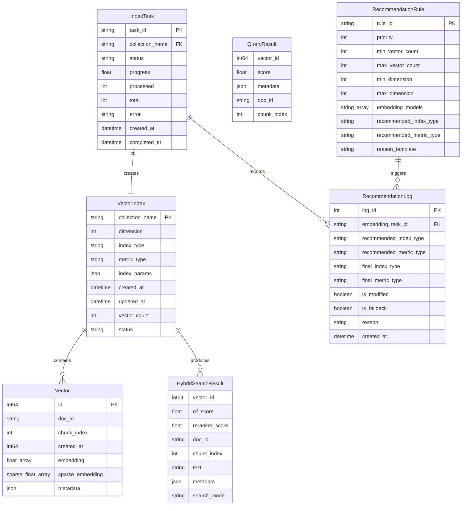

# Data Model: 向量索引模块（优化版）

**Branch**: `004-vector-index-opt`
**Date**: 2026-02-26
**Status**: Updated (功能同步 2026-02-26)

## Overview

本文档定义向量索引模块的数据实体、字段、关系和验证规则。

---

## Entity Relationship Diagram



---

## Entity Definitions

### 1. VectorIndex（向量索引记录）

代表一次"向量化结果 → Milvus Collection"的导入操作记录。一个 Collection（知识库）可以包含多条 VectorIndex 记录（多个文档）。 [Updated: 2026-02-25]

| Field | Type | Required | Description | Constraints |
|-------|------|----------|-------------|-------------|
| `collection_name` | string | ✅ | 所属 Milvus Collection 名称 [Updated: 2026-02-25] | 默认 'default_collection'，3-64字符，[a-zA-Z0-9_] |
| `dimension` | int | ✅ | 向量维度 | 128/256/512/768/1024/1536/2048/3072/4096 |
| `index_type` | string | ✅ | 索引算法类型 | FLAT/IVF_FLAT/IVF_SQ8/IVF_PQ/HNSW |
| `metric_type` | string | ✅ | 距离度量方式 | L2/IP/COSINE |
| `index_params` | json | ❌ | 索引参数 | 根据 index_type 验证 |
| `created_at` | datetime | ✅ | 创建时间 | ISO 8601 格式 |
| `updated_at` | datetime | ✅ | 最后更新时间 | ISO 8601 格式 |
| `vector_count` | int | ✅ | 本次导入的向量数量 | >= 0 |
| `status` | string | ✅ | 索引状态 | BUILDING/READY/UPDATING/ERROR |
| `source_task_id` | string | ❌ | 来源向量化任务ID | 关联 Embedding 任务 |
| `has_sparse` | boolean | ✅ | 是否包含稀疏向量 | true/false |
| `physical_collection_name` | string | ❌ | 物理 Milvus Collection 名称（Dify 方案） [Added: 2026-02-25] | 如 default_collection_dim1024 |
| `uuid` | string | ✅ | 外部展示用 UUID 标识符 [Added: 2026-02-25] | UUID 格式，唯一 |
| `embedding_result_id` | string | ❌ | 关联的向量化任务ID | 关联 Embedding 结果 |
| `source_document_name` | string | ❌ | 源文档名称（冗余存储） | 最大 255 字符 |
| `source_model` | string | ❌ | 源向量化模型（冗余存储） | 如 bge-m3, qwen3-embedding |
| `namespace` | string | ❌ | 命名空间 | 默认 'default' |
| `index_params` | json | ❌ | 索引算法参数 | 根据 index_type 验证 |
| `error_message` | text | ❌ | 错误信息 | 构建失败时填充 |

**设计说明 [Updated: 2026-02-25]**:
- 一个知识库对应一个 Milvus Collection，通过 `collection_name` 关联
- 多个文档的向量可追加到同一个 Collection
- 系统提供默认 Collection（`default_collection`），用户也可创建新的 Collection
- VectorIndex 记录追踪每次导入操作，而非 Collection 本身

**State Transitions**:
```
BUILDING → READY (索引构建成功)
BUILDING → ERROR (索引构建失败)
READY → UPDATING (增量更新)
UPDATING → READY (更新完成)
UPDATING → ERROR (更新失败)
ERROR → BUILDING (重新构建)
```

### 2. Vector（向量）

存储在 Milvus Collection 中的单个向量数据点。

> **注意**：Vector 是 Milvus Collection 中的内嵌记录（非独立应用层实体），无需独立 Pydantic Schema。应用层通过 `VectorInput`（API 请求模型）和 Milvus SDK 的原生数据结构交互。

| Field | Type | Required | Description | Constraints |
|-------|------|----------|-------------|-------------|
| `id` | varchar(100) | ✅ | 向量主键（UUID） | Milvus 自动生成 |
| `doc_id` | string | ✅ | 文档ID（Partition Key） [Updated: 2026-02-25] | 最大256字符，标记为 is_partition_key=True，Milvus 自动按此字段哈希分区 |
| `chunk_index` | int | ✅ | 分块索引 | >= 0 |
| `created_at` | int64 | ✅ | 创建时间戳 | Unix timestamp |
| `embedding` | float[] | ✅ | 稠密向量值 | 维度与 Collection 一致 |
| `sparse_embedding` | sparse_float[] | ❌ | 稀疏向量值（BM25 算法生成） [Updated: 2026-02-25] | 可变维度，IP 度量 |
| `metadata` | json | ❌ | 可选元数据 | 最大 1KB |

**Validation Rules**:
- `embedding` 不允许包含 NaN 或 Inf 值
- `sparse_embedding` 为可选字段（由 BM25SparseService 在索引构建阶段生成），为空时触发降级检索
- `doc_id` 作为 Partition Key，查询时加 `filter='doc_id == "xxx"'` 可自动路由到对应分区 [Updated: 2026-02-25]
- `doc_id` + `chunk_index` 组合应唯一（业务约束）

### 3. IndexTask（索引任务）

追踪索引构建任务的进度和状态。

| Field | Type | Required | Description | Constraints |
|-------|------|----------|-------------|-------------|
| `task_id` | string | ✅ | 任务ID（主键） | UUID 格式 |
| `collection_name` | string | ✅ | 目标 Collection | 外键关联 VectorIndex |
| `embedding_task_id` | string | ✅ | 来源向量化任务ID | 关联 Embedding 结果 |
| `index_type` | string | ✅ | 索引算法 | FLAT/IVF_FLAT/IVF_SQ8/IVF_PQ/HNSW |
| `status` | string | ✅ | 任务状态 | pending/running/completed/failed |
| `progress` | float | ✅ | 进度百分比 | 0.0-100.0 |
| `processed` | int | ✅ | 已处理向量数 | >= 0 |
| `total` | int | ✅ | 总向量数 | >= 0 |
| `error` | string | ❌ | 错误信息 | 失败时填充 |
| `created_at` | datetime | ✅ | 创建时间 | ISO 8601 |
| `completed_at` | datetime | ❌ | 完成时间 | 完成/失败时填充 |

**State Transitions**:
```
pending → running (开始处理)
running → completed (处理成功)
running → failed (处理失败)
```

### 4. QueryResult（查询结果）

单次相似度查询返回的结果项。

> **说明**：spec.md 中的 Key Entity「IndexMetadata（索引元数据）」对应 API 层的 `IndexStatsResponse`（GET /vector-index/indexes/{collection_name}/stats），包含向量总数、索引占用空间等统计信息，非独立数据模型实体。

| Field | Type | Required | Description | Constraints |
|-------|------|----------|-------------|-------------|
| `vector_id` | int64 | ✅ | 匹配的向量ID | 来自 Milvus |
| `score` | float | ✅ | 相似度分数 | 取决于 metric_type |
| `distance` | float | ✅ | 距离值 | L2/IP 原始值 |
| `doc_id` | string | ✅ | 文档ID | 来自向量元数据 |
| `chunk_index` | int | ✅ | 分块索引 | 来自向量元数据 |
| `metadata` | json | ❌ | 完整元数据 | 来自向量存储 |

### 5. HybridSearchResult（混合检索结果）— 新增

混合检索（稠密+稀疏双路召回 + RRF + Reranker）返回的结果项。

| Field | Type | Required | Description | Constraints |
|-------|------|----------|-------------|-------------|
| `vector_id` | int64 | ✅ | 匹配的向量ID | 来自 Milvus |
| `rrf_score` | float | ✅ | RRF 粗排融合分数 | 0.0-1.0 |
| `reranker_score` | float | ❌ | Reranker 精排分数 | 0.0-1.0，精排时填充 |
| `doc_id` | string | ✅ | 文档ID | 来自向量元数据 |
| `chunk_index` | int | ✅ | 分块索引 | 来自向量元数据 |
| `text` | string | ❌ | 文本内容 | 用于 Reranker 精排输入 |
| `metadata` | json | ❌ | 完整元数据 | 来自向量存储 |
| `search_mode` | string | ✅ | 检索模式 | `hybrid` / `dense_only` |

### 6. RecommendationRule（推荐规则）— 新增

智能推荐引擎的决策规则实体，用于根据向量特征自动推荐索引算法和度量类型。

| Field | Type | Required | Description | Constraints |
|-------|------|----------|-------------|-------------|
| `rule_id` | string | ✅ | 规则ID（主键） | 唯一标识 |
| `priority` | int | ✅ | 规则优先级 | 数字越小优先级越高 |
| `min_vector_count` | int | ❌ | 最小数据量条件 | >= 0，null 表示不限制 |
| `max_vector_count` | int | ❌ | 最大数据量条件 | >= 0，null 表示不限制 |
| `min_dimension` | int | ❌ | 最小向量维度条件 | >= 1，null 表示不限制 |
| `max_dimension` | int | ❌ | 最大向量维度条件 | >= 1，null 表示不限制 |
| `embedding_models` | string[] | ❌ | 适用的 Embedding 模型列表 | null 表示全部适用 |
| `recommended_index_type` | string | ✅ | 推荐索引算法 | FLAT/IVF_FLAT/IVF_PQ/HNSW |
| `recommended_metric_type` | string | ❌ | 推荐度量类型 | L2/IP/COSINE，null 则由模型规则推断 |
| `reason_template` | string | ✅ | 推荐理由文案模板 | 支持 `{count}`, `{dim}`, `{model}` 占位符 |

**匹配规则**：
- 规则按 `priority` 升序排列，首个命中的规则生效
- 当所有规则均不匹配时，使用兜底默认值（HNSW + COSINE）
- 度量类型推断逻辑：BGE 系列→COSINE，Qwen 系列→COSINE，OpenAI→COSINE，Cohere→COSINE，未识别→L2

### 7. RecommendationLog（推荐行为日志）— 新增

记录用户对推荐值的采纳/修改行为，用于推荐采纳率统计。

| Field | Type | Required | Description | Constraints |
|-------|------|----------|-------------|-------------|
| `log_id` | int | ✅ | 日志ID（自增主键） | 自动生成 |
| `embedding_task_id` | string | ✅ | 向量化任务ID | 触发推荐的任务 |
| `recommended_index_type` | string | ✅ | 推荐的索引算法 | FLAT/IVF_FLAT/IVF_PQ/HNSW |
| `recommended_metric_type` | string | ✅ | 推荐的度量类型 | L2/IP/COSINE |
| `final_index_type` | string | ✅ | 用户最终选择的索引算法 | FLAT/IVF_FLAT/IVF_PQ/HNSW |
| `final_metric_type` | string | ✅ | 用户最终选择的度量类型 | L2/IP/COSINE |
| `is_modified` | boolean | ✅ | 用户是否修改了推荐值 | true = 修改，false = 采纳 |
| `is_fallback` | boolean | ✅ | 是否使用了兜底默认值 | true/false |
| `reason` | string | ✅ | 推荐理由文案 | 显示给用户的文案 |
| `created_at` | datetime | ✅ | 记录时间 | ISO 8601 |

### 8. IndexOperationLog（索引操作日志）— 新增

记录索引的关键操作（创建、更新、删除、搜索、持久化、恢复），用于操作审计和性能追踪。[Added: 2026-02-26]

| Field | Type | Required | Description | Constraints |
|-------|------|----------|-------------|-------------|
| `id` | int | ✅ | 日志ID（自增主键） | 自动生成 |
| `index_id` | int | ❌ | 关联的索引ID | 外键关联 vector_indexes.id，CASCADE 删除 |
| `operation_type` | string | ✅ | 操作类型 | CREATE/UPDATE/DELETE/SEARCH/PERSIST/RECOVER |
| `user_id` | string | ❌ | 操作用户ID | 最大 255 字符 |
| `started_at` | datetime | ✅ | 操作开始时间 | 自动生成 |
| `completed_at` | datetime | ❌ | 操作完成时间 | 操作完成时填充 |
| `duration_ms` | float | ❌ | 操作耗时（毫秒） | >= 0 |
| `status` | string | ✅ | 操作状态 | STARTED/SUCCESS/FAILED |
| `details` | json | ❌ | 操作详情 | 如搜索参数、向量数等 |
| `error_message` | text | ❌ | 错误信息 | 失败时填充 |
| `created_at` | datetime | ✅ | 记录创建时间 | ISO 8601 |

### 9. BM25 统计数据（持久化格式）— 新增

BM25SparseService 在索引构建阶段生成稀疏向量时使用的统计数据，持久化为 JSON 文件。[Added: 2026-02-26]

**文件路径**: `data/bm25_stats/{collection_name}_bm25_stats.json`

| Field | Type | Description |
|-------|------|-------------|
| `vocab` | dict | 词汇表（词 → 词频） |
| `idf` | dict | 逆文档频率（词 → IDF 值） |
| `df` | dict | 文档频率（词 → 包含该词的文档数） |
| `total_docs` | int | 总文档数 |
| `avg_doc_len` | float | 平均文档长度 |
| `created_at` | string | 创建时间（ISO 8601） |

**说明**:
- BM25 使用 jieba 中文分词器进行文本分词
- 稀疏向量格式与 Milvus SPARSE_FLOAT_VECTOR 兼容（`{index: weight}` 字典）
- 在索引构建阶段由 `BM25SparseService.fit_transform()` 生成
- 在混合检索时由 `BM25SparseService.transform()` 为查询生成稀疏向量

---

## Index Parameters by Type

### FLAT
```json
{
  "index_type": "FLAT",
  "metric_type": "L2",
  "params": {}
}
```

### IVF_FLAT
```json
{
  "index_type": "IVF_FLAT",
  "metric_type": "L2",
  "params": {
    "nlist": 128
  }
}
```
- `nlist`: 聚类中心数量，推荐值 `sqrt(n_vectors)`，范围 1-65536

### IVF_PQ
```json
{
  "index_type": "IVF_PQ",
  "metric_type": "L2",
  "params": {
    "nlist": 128,
    "m": 8,
    "nbits": 8
  }
}
```
- `nlist`: 聚类中心数量
- `m`: 子向量数量，必须能整除维度
- `nbits`: 编码位数，范围 1-16

### IVF_SQ8 — 新增
```json
{
  "index_type": "IVF_SQ8",
  "metric_type": "L2",
  "params": {
    "nlist": 128
  }
}
```
- `nlist`: 聚类中心数量，推荐值 `sqrt(n_vectors)`，范围 1-65536
- IVF_SQ8 使用标量量化（8-bit），在精度损失极小的情况下节省约 75% 内存
- 推荐适用于 50万~500万 数据量场景

### HNSW
```json
{
  "index_type": "HNSW",
  "metric_type": "L2",
  "params": {
    "M": 16,
    "efConstruction": 200
  }
}
```
- `M`: 每层最大连接数，范围 4-64
- `efConstruction`: 构建时搜索范围，范围 8-512

---

## Search Parameters

### IVF 系列
```json
{
  "nprobe": 16
}
```
- `nprobe`: 搜索时探测的聚类数量，越大越精确但越慢

### HNSW
```json
{
  "ef": 64
}
```
- `ef`: 搜索时的动态列表大小，范围 top_k 到 32768

---

## Milvus Collection Schema

### 「逻辑与物理分层」架构（Dify 方案）[Updated: 2026-02-25]

采用「逻辑与物理分层」架构，对外暴露逻辑知识库名（如 `default_collection`），底层按「知识库 + 维度」拆分为多个物理 Collection：

```
逻辑知识库: default_collection
├── 物理 Collection: default_collection_dim1024  (1024维向量)
├── 物理 Collection: default_collection_dim2048  (2048维向量)
└── 物理 Collection: default_collection_dim4096  (4096维向量)
```

- **命名规则**: `{逻辑知识库名}_dim{维度数}`
- **工具函数**: `vector_config.get_physical_collection_name(logical_name, dimension)` 和 `parse_physical_collection_name(physical_name)`
- **优势**: 每个物理 Collection 只包含一个固定维度的 `embedding` 字段，从根源解决 Milvus 不支持动态添加 FLOAT_VECTOR 字段的问题

```python
from pymilvus import FieldSchema, CollectionSchema, DataType

def create_collection_schema(dimension: int, enable_sparse: bool = True) -> CollectionSchema:
    """
    创建 Milvus Collection Schema
    
    Args:
        dimension: 稠密向量维度
        enable_sparse: 是否启用稀疏向量字段（默认 True）
    
    设计说明 [Updated: 2026-02-25]:
    - doc_id 作为 Partition Key，Milvus 自动按文档 ID 哈希分区
    - 查询时加 filter='doc_id == "xxx"' 可自动路由到对应分区，避免全 Collection 扫描
    - 无需手动管理分区，Milvus 内部自动处理
    """
    fields = [
        FieldSchema(
            name="id",
            dtype=DataType.VARCHAR,
            is_primary=True,
            max_length=100,
            description="向量主键（UUID）"
        ),
        FieldSchema(
            name="doc_id",
            dtype=DataType.VARCHAR,
            max_length=256,
            is_partition_key=True,
            description="文档ID（Partition Key，Milvus 自动按此字段哈希分区）"
        ),
        FieldSchema(
            name="embedding",
            dtype=DataType.FLOAT_VECTOR,
            dim=dimension,
            description="稠密向量（Embedding 模型输出）"
        ),
        FieldSchema(
            name="metadata",
            dtype=DataType.JSON,
            description="可选元数据"
        )
    ]
    
    # 新增：稀疏向量字段（用于混合检索）
    if enable_sparse:
        fields.insert(-1, FieldSchema(
            name="sparse_embedding",
            dtype=DataType.SPARSE_FLOAT_VECTOR,
            description="稀疏向量（BM25 算法生成，jieba 分词 + 自建词表 + IDF）"
        ))
    
    schema = CollectionSchema(
        fields=fields,
        description="Hybrid vector collection for RAG framework"
    )
    
    # num_partitions 需要在 Collection 构造函数中传递，而非 CollectionSchema
    collection = Collection(
        name=collection_name,
        schema=schema,
        num_partitions=64  # Partition Key 模式下的分区数量
    )
    return collection
```

### 索引构建策略

```python
# 稠密向量索引（用户可选择的五种算法之一：FLAT/IVF_FLAT/IVF_SQ8/IVF_PQ/HNSW）
dense_index_params = {
    "field_name": "embedding",
    "index_type": "HNSW",  # 或 FLAT/IVF_FLAT/IVF_SQ8/IVF_PQ
    "metric_type": "L2",
    "params": {"M": 16, "efConstruction": 200}
}

# 稀疏向量索引（系统自动创建，用户无需选择）
sparse_index_params = {
    "field_name": "sparse_embedding",
    "index_type": "SPARSE_INVERTED_INDEX",
    "metric_type": "IP",
    "params": {"drop_ratio_build": 0.2}
}
```

---

## SQLite/PostgreSQL Metadata Schema

用于持久化索引任务元数据（非向量数据）。

```sql
-- 索引任务表
CREATE TABLE index_tasks (
    task_id VARCHAR(36) PRIMARY KEY,
    collection_name VARCHAR(64) NOT NULL,
    embedding_task_id VARCHAR(36) NOT NULL,
    index_type VARCHAR(16) NOT NULL,
    status VARCHAR(16) NOT NULL DEFAULT 'pending',
    progress REAL NOT NULL DEFAULT 0.0,
    processed INTEGER NOT NULL DEFAULT 0,
    total INTEGER NOT NULL DEFAULT 0,
    error TEXT,
    created_at TIMESTAMP NOT NULL DEFAULT CURRENT_TIMESTAMP,
    completed_at TIMESTAMP,
    
    INDEX idx_status (status),
    INDEX idx_collection (collection_name)
);

-- 索引历史记录表（对应 vector_indexes）
CREATE TABLE index_history (
    id INTEGER PRIMARY KEY AUTOINCREMENT,
    uuid VARCHAR(36) NOT NULL UNIQUE,
    collection_name VARCHAR(64) NOT NULL,
    physical_collection_name VARCHAR(255),  -- 物理 Collection 名称（Dify 方案，如 default_collection_dim1024）
    dimension INTEGER NOT NULL,
    index_type VARCHAR(16) NOT NULL,
    metric_type VARCHAR(16) NOT NULL,
    vector_count INTEGER NOT NULL,
    source_task_id VARCHAR(36),
    embedding_result_id VARCHAR(36),       -- 关联的向量化任务ID
    source_document_name VARCHAR(255),     -- 源文档名称
    source_model VARCHAR(50),              -- 源向量化模型
    has_sparse BOOLEAN NOT NULL DEFAULT false,
    status VARCHAR(16) NOT NULL DEFAULT 'BUILDING',
    error_message TEXT,
    created_at TIMESTAMP NOT NULL DEFAULT CURRENT_TIMESTAMP,
    updated_at TIMESTAMP NOT NULL DEFAULT CURRENT_TIMESTAMP,
    deleted_at TIMESTAMP,
    
    INDEX idx_created (created_at DESC),
    INDEX idx_uuid (uuid),
    INDEX idx_collection (collection_name)
);

-- 推荐规则表（JSON 配置持久化）
CREATE TABLE recommendation_rules (
    rule_id VARCHAR(36) PRIMARY KEY,
    priority INTEGER NOT NULL,
    min_vector_count INTEGER,
    max_vector_count INTEGER,
    min_dimension INTEGER,
    max_dimension INTEGER,
    embedding_models TEXT,          -- JSON array: ["bge-m3", "openai"]
    recommended_index_type VARCHAR(16) NOT NULL,
    recommended_metric_type VARCHAR(16),
    reason_template TEXT NOT NULL,
    is_active BOOLEAN NOT NULL DEFAULT true,
    created_at TIMESTAMP NOT NULL DEFAULT CURRENT_TIMESTAMP,
    updated_at TIMESTAMP NOT NULL DEFAULT CURRENT_TIMESTAMP,
    
    INDEX idx_priority (priority ASC)
);

-- 推荐行为日志表
CREATE TABLE recommendation_logs (
    log_id INTEGER PRIMARY KEY AUTOINCREMENT,
    embedding_task_id VARCHAR(36) NOT NULL,
    recommended_index_type VARCHAR(16) NOT NULL,
    recommended_metric_type VARCHAR(16) NOT NULL,
    final_index_type VARCHAR(16) NOT NULL,
    final_metric_type VARCHAR(16) NOT NULL,
    is_modified BOOLEAN NOT NULL DEFAULT false,
    is_fallback BOOLEAN NOT NULL DEFAULT false,
    reason TEXT NOT NULL,
    created_at TIMESTAMP NOT NULL DEFAULT CURRENT_TIMESTAMP,
    
    INDEX idx_created (created_at DESC),
    INDEX idx_task (embedding_task_id)
);

-- 索引操作日志表 [Added: 2026-02-26]
CREATE TABLE index_operation_logs (
    id INTEGER PRIMARY KEY AUTOINCREMENT,
    index_id INTEGER REFERENCES vector_indexes(id) ON DELETE CASCADE,
    operation_type VARCHAR(50) NOT NULL,  -- CREATE, UPDATE, DELETE, SEARCH, PERSIST, RECOVER
    user_id VARCHAR(255),
    started_at TIMESTAMP NOT NULL DEFAULT CURRENT_TIMESTAMP,
    completed_at TIMESTAMP,
    duration_ms REAL,
    status VARCHAR(20) NOT NULL DEFAULT 'STARTED',  -- STARTED, SUCCESS, FAILED
    details JSON,
    error_message TEXT,
    created_at TIMESTAMP NOT NULL DEFAULT CURRENT_TIMESTAMP,
    
    INDEX idx_index_id (index_id),
    INDEX idx_operation (operation_type),
    INDEX idx_created (created_at DESC)
);
```

---

## Validation Rules Summary

| Entity | Field | Rule | Error Code |
|--------|-------|------|------------|
| VectorIndex | collection_name | 3-64字符，[a-zA-Z0-9_] | ERR_INVALID_NAME |
| VectorIndex | dimension | 枚举值之一 | ERR_INVALID_DIM |
| VectorIndex | index_type | FLAT/IVF_FLAT/IVF_SQ8/IVF_PQ/HNSW | ERR_INVALID_INDEX |
| Vector | embedding | 无 NaN/Inf，维度匹配 | ERR_INVALID_VECTOR |
| Vector | sparse_embedding | 可选，为空触发降级 | — |
| Vector | doc_id | 非空，最大256字符 | ERR_INVALID_DOC_ID |
| IndexTask | progress | 0.0-100.0 | ERR_INVALID_PROGRESS |
| HybridSearchResult | search_mode | hybrid 或 dense_only | ERR_INVALID_MODE |
| RecommendationRule | priority | >= 1，唯一 | ERR_INVALID_PRIORITY |
| RecommendationRule | recommended_index_type | FLAT/IVF_FLAT/IVF_SQ8/IVF_PQ/HNSW | ERR_INVALID_INDEX |
| RecommendationLog | is_modified | true/false | — |
