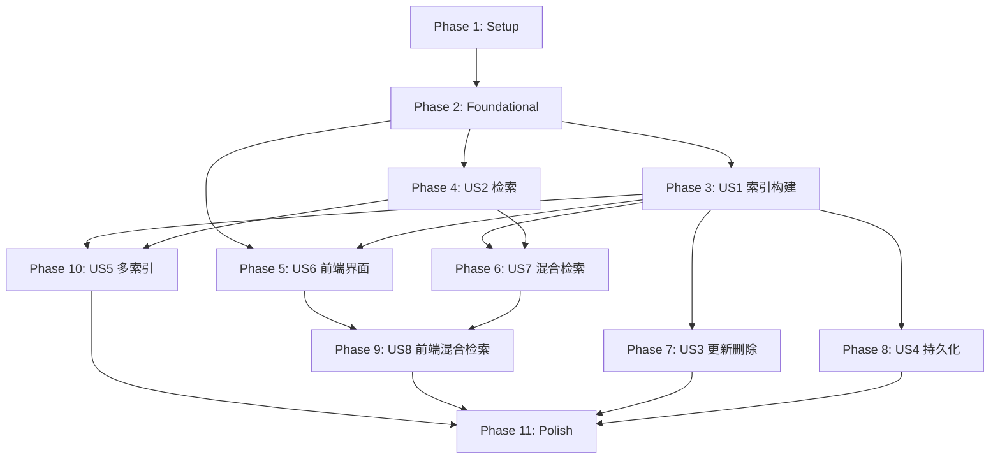

# Tasks: 向量索引模块（优化版）

**Feature**: 004-vector-index-opt  
**Branch**: `004-vector-index-opt`  
**Generated**: 2026-02-06  
**Total Tasks**: 74
**Spec**: [spec.md](./spec.md) | **Plan**: [plan.md](./plan.md)

---

## Task Summary

| Phase | Description | Tasks | Parallel |
|-------|-------------|-------|----------|
| Phase 1 | Setup & 项目初始化 | T001-T005 (5) | 3 |
| Phase 2 | Foundational — 基础设施 | T006-T014 (9) | 5 |
| Phase 3 | US1 — 向量数据索引构建 (P1) | T015-T024 (10) | 4 |
| Phase 4 | US2 — 向量相似度检索 (P1) | T025-T032 (8) | 3 |
| Phase 5 | US6 — 前端索引管理界面 (P1) | T033-T041 (9) | 4 |
| Phase 6 | US7 — 混合检索基础能力 (P1) | T042-T049 (8) | 3 |
| Phase 7 | US3 — 索引更新与删除 (P2) | T050-T055 (6) | 3 |
| Phase 8 | US4 — 索引持久化与恢复 (P2) | T056-T059 (4) | 2 |
| Phase 9 | US8 — 前端混合检索界面 (P2) | T060-T064 (5) | 3 |
| Phase 10 | US5 — 多索引管理 (P3) | T065-T069 (5) | 2 |
| Phase 11 | Polish & 横切关注点 | T070-T074 (5) | 2 |

---

## Phase 1: Setup & 项目初始化

> **Goal**: 确认项目结构、安装依赖、验证 Milvus 连接。

- [x] T001 确认后端项目结构与 plan.md 一致，创建缺失目录 `backend/src/config/`, `backend/migrations/vector_index/`
- [x] T002 [P] 验证 `backend/requirements.txt` 包含所有必需依赖（pymilvus==2.4.9, FlagEmbedding>=1.2.0, FastAPI>=0.110.0, SQLAlchemy>=2.0.23）
- [x] T003 [P] 验证前端依赖 `frontend/package.json` 包含 vue@3.x, tdesign-vue-next, pinia
- [x] T004 [P] 创建推荐规则 JSON 配置文件 `backend/src/config/recommendation_rules.json`（包含默认四条规则 + 度量类型映射 + 兜底默认值）
- [x] T005 创建数据库迁移脚本 `backend/migrations/vector_index/008_recommendation.sql`（recommendation_rules 表 + recommendation_logs 表）

---

## Phase 2: Foundational — 基础设施（阻塞后续所有用户故事）

> **Goal**: 建立后端核心模型、Milvus 连接管理、异常体系和工具函数，所有用户故事均依赖此阶段。

- [x] T006 实现向量索引数据模型 `backend/src/models/vector_index.py`：VectorIndex, IndexTask, QueryResult Pydantic schemas（确认 has_sparse, source_task_id 字段存在）
- [x] T007 [P] 实现混合检索结果模型：在 `backend/src/models/vector_index.py` 中添加 HybridSearchResult schema（rrf_score, reranker_score, search_mode 字段）
- [x] T008 [P] 实现推荐引擎数据模型：在 `backend/src/models/vector_index.py` 中添加 RecommendationRule 和 RecommendationLog Pydantic schemas
- [x] T009 [P] 实现异常体系 `backend/src/exceptions/vector_index_errors.py`：VectorIndexError, MilvusConnectionError, DimensionMismatchError, ValidationError 等（确认包含 type, code, message, detail, suggestion 字段）
- [x] T010 [P] 实现向量工具函数 `backend/src/utils/vector_utils.py`：向量验证（NaN/Inf 检查）、维度校验、批量处理工具
- [x] T011 [P] 实现稀疏向量工具函数 `backend/src/utils/sparse_utils.py`：稀疏向量有效性检查、格式转换
- [x] T012 实现 Milvus Provider `backend/src/services/providers/milvus_provider.py`：连接管理（连接池 MILVUS_POOL_SIZE=10）、指数退避重试（1s→2s→4s，最多3次）、Collection CRUD、Schema 创建（含 sparse_embedding 字段）
- [x] T013 实现结果持久化工具 `backend/src/utils/result_persistence.py`：JSON 格式持久化、文件命名含时间戳（满足 Constitution III NON-NEGOTIABLE）
- [x] T014 在 `backend/src/main.py` 中注册向量索引相关路由（确认 /api/v1/vector-index/* 路由挂载）

---

## Phase 3: US1 — 向量数据索引构建 (P1)

> **Story Goal**: 接收文档向量数据，通过 Milvus 构建高效索引结构，支持 FLAT/IVF_FLAT/IVF_PQ/HNSW 四种算法。  
> **Independent Test**: 提交 100 条向量数据 → 索引创建成功 → 状态变为 READY → 可通过 API 查询。

- [x] T015 [US1] 实现索引构建核心逻辑 `backend/src/services/vector_index_service.py`：create_index 方法（接收 embedding_task_id、index_type、metric_type），创建 Milvus Collection + 插入向量 + 创建索引
- [x] T016 [US1] 实现索引任务进度追踪：在 `backend/src/services/vector_index_service.py` 中实现 IndexTask 状态机（pending→running→completed/failed），支持进度百分比更新
- [x] T017 [US1] 实现向量数据验证逻辑：在 `backend/src/services/vector_index_service.py` 中添加维度一致性校验、NaN/Inf 拒绝、元数据必需字段校验（doc_id, chunk_index, created_at）
- [x] T018 [P] [US1] 实现智能推荐服务 `backend/src/services/recommendation_service.py`：RecommendationEngine 类（分层规则匹配），加载 recommendation_rules.json，支持 recommend() 方法返回推荐的 index_type + metric_type + reason
- [x] T019 [P] [US1] 实现推荐行为日志记录：在 `backend/src/services/recommendation_service.py` 中添加 log_recommendation() 和 get_recommendation_stats() 方法
- [x] T020 [P] [US1] 实现推荐 API 端点 `backend/src/api/vector_index.py`：POST /vector-index/recommend、POST /vector-index/recommend/log、GET /vector-index/recommend/stats
- [x] T021 [US1] 实现创建索引 API 端点：在 `backend/src/api/vector_index.py` 中实现 POST /vector-index/indexes（接收 CreateIndexRequest，返回 task_id）
- [x] T022 [US1] 实现获取向量化任务列表 API：在 `backend/src/api/vector_index.py` 中实现 GET /vector-index/embedding-tasks（返回已完成的向量化任务）
- [x] T023 [US1] 实现任务进度查询 API：在 `backend/src/api/vector_index.py` 中实现 GET /vector-index/tasks/{task_id}（返回 TaskProgressResponse）
- [x] T024 [US1] 实现取消任务 API：在 `backend/src/api/vector_index.py` 中实现 POST /vector-index/tasks/{task_id}/cancel

---

## Phase 4: US2 — 向量相似度检索 (P1)

> **Story Goal**: 接收查询向量，通过 Milvus 返回最相似的 K 个向量及其元数据，支持阈值过滤和批量查询。  
> **Independent Test**: 提交查询向量 → 100ms 内返回 Top5 结果 → 每个结果包含 vector_id, score, doc_id, chunk_index。

- [x] T025 [US2] 实现向量检索核心逻辑 `backend/src/services/search_service.py`：search 方法（collection_name, query_vector, top_k, threshold），调用 Milvus collection.search()
- [x] T026 [US2] 实现相似度阈值过滤：在 `backend/src/services/search_service.py` 中添加 threshold 过滤逻辑，只返回 score >= threshold 的结果
- [x] T027 [US2] 实现批量向量查询：在 `backend/src/services/search_service.py` 中添加 batch_search 方法，一次请求处理多个查询向量
- [x] T028 [P] [US2] 实现单向量检索 API：在 `backend/src/api/vector_index.py` 中实现 POST /vector-index/search（SearchRequest → SearchResponse）
- [x] T029 [P] [US2] 实现批量检索 API：在 `backend/src/api/vector_index.py` 中实现 POST /vector-index/batch-search（BatchSearchRequest → BatchSearchResponse）
- [x] T030 [P] [US2] 实现索引统计信息 API：在 `backend/src/api/vector_index.py` 中实现 GET /vector-index/indexes/{collection_name}/stats（IndexStatsResponse）
- [x] T031 [US2] 实现检索结果持久化：在 `backend/src/services/search_service.py` 中调用 result_persistence 保存检索结果为 JSON（含时间戳）
- [x] T032 [US2] 预留多 Collection 联合查询参数：在 `backend/src/services/search_service.py` 的 search 方法中支持 collection_names 可选参数（实际多 Collection 查询逻辑在 T067 US5 中实现）

---

## Phase 5: US6 — 前端索引管理界面 (P1)

> **Story Goal**: 用户通过 Web 界面创建索引、查看结果和历史记录，左右分栏布局，智能推荐自动填充。  
> **Independent Test**: 打开索引页面 → 选择向量化任务 → 推荐值自动填充 → 创建索引 → 进度条展示 → 历史记录可查。

- [x] T033 [US6] 实现索引配置面板 `frontend/src/components/VectorIndex/IndexCreate.vue`：左侧配置区（向量化任务选择下拉框、索引算法选择、度量类型选择），智能推荐自动填充逻辑
- [x] T034 [P] [US6] 实现推荐理由标签组件 `frontend/src/components/VectorIndex/RecommendBadge.vue`：显示推荐理由文案（reason），is_fallback 时显示兜底提示
- [x] T035 [P] [US6] 实现推荐兜底提示组件 `frontend/src/components/VectorIndex/RecommendFallback.vue`：显示"未精确匹配推荐规则，已使用通用默认值"提示
- [x] T036 [P] [US6] 实现索引进度组件 `frontend/src/components/VectorIndex/IndexProgress.vue`：实时进度条（百分比 + 已处理/总数）+ 状态文字提示
- [x] T037 [P] [US6] 实现索引列表组件 `frontend/src/components/VectorIndex/IndexList.vue`：展示所有索引（collection_name, dimension, index_type, status, has_sparse badge）
- [x] T038 [US6] 实现索引历史记录组件 `frontend/src/components/VectorIndex/IndexHistory.vue`：历史记录列表 + 查看详情 + 删除操作
- [x] T039 [US6] 实现前端 API 调用层 `frontend/src/services/vectorIndexApi.js`：添加 getRecommendation()、logRecommendation()、getRecommendStats() 方法
- [x] T040 [US6] 实现 Pinia 状态管理 `frontend/src/stores/vectorIndexStore.js`：添加 recommendation state、fetchRecommendation action、logRecommendation action
- [x] T041 [US6] 实现索引管理主页面 `frontend/src/views/VectorIndex.vue`：左右分栏布局，左侧 IndexCreate，右侧双 Tab（IndexList + IndexHistory），错误弹窗（Modal）展示

---

## Phase 6: US7 — 混合检索基础能力 (P1)

> **Story Goal**: 稠密+稀疏双路向量召回 → RRF 粗排融合 → Reranker 精排，自动降级到纯稠密检索。  
> **Independent Test**: 发送混合检索请求 → 返回 hybrid mode 结果（含 rrf_score + reranker_score）→ 去掉 sparse_vector → 自动降级为 dense_only。

- [x] T042 [US7] 扩展 Milvus Provider 支持混合检索：在 `backend/src/services/providers/milvus_provider.py` 中实现 hybrid_search 方法（AnnSearchRequest 双路 + RRFRanker(k=60)）
- [x] T043 [US7] 扩展 Collection Schema 支持稀疏向量：在 `backend/src/services/providers/milvus_provider.py` 中更新 create_collection 方法，添加 sparse_embedding 字段和 SPARSE_INVERTED_INDEX 索引
- [x] T044 [US7] 实现 Reranker 精排服务 `backend/src/services/reranker_service.py`：加载 bge-reranker-v2-m3 模型（FlagEmbedding），rerank() 方法（query + candidates → top_k scored results）
- [x] T045 [P] [US7] 实现混合检索编排逻辑：在 `backend/src/services/search_service.py` 中实现 hybrid_search 方法（自动检测稀疏向量 → 选择 hybrid/dense_only → RRF → Reranker）
- [x] T046 [P] [US7] 实现稀疏向量降级策略：在 `backend/src/services/search_service.py` 中实现 _collection_has_sparse_field() 和 _is_sparse_vector_valid() 检测，自动降级
- [x] T047 [P] [US7] 实现 Reranker 降级策略：在 `backend/src/services/search_service.py` 中处理 Reranker 不可用场景（跳过精排，返回 RRF 粗排结果，标注 reranker_available=false）
- [x] T048 [US7] 实现混合检索 API 端点：在 `backend/src/api/vector_index.py` 中实现 POST /vector-index/hybrid-search（HybridSearchRequest → HybridSearchResponse，含 search_mode, timing 指标）
- [x] T049 [US7] 实现混合检索结果持久化：在 `backend/src/services/search_service.py` 中保存混合检索结果为 JSON（含 search_mode, rrf_score, reranker_score, timing）

---

## Phase 7: US3 — 索引更新与删除 (P2)

> **Story Goal**: 支持增量添加、更新和删除向量，幂等性删除设计。  
> **Independent Test**: 向已有索引添加 100 条向量 → 新向量可检索 → 删除指定向量 → 不再返回 → 删除不存在 ID 返回成功。

- [x] T050 [US3] 实现增量添加向量：在 `backend/src/services/vector_index_service.py` 中实现 add_vectors 方法（验证维度 → 插入 Milvus）
- [x] T051 [US3] 实现向量更新：在 `backend/src/services/vector_index_service.py` 中实现 update_vectors 方法（删除旧向量 + 插入新向量）
- [x] T052 [US3] 实现幂等删除：在 `backend/src/services/vector_index_service.py` 中实现 delete_vectors 方法（静默忽略不存在的 ID，返回 deleted_count + requested_count）
- [x] T053 [P] [US3] 实现添加向量 API：在 `backend/src/api/vector_index.py` 中实现 POST /vector-index/indexes/{collection_name}/vectors
- [x] T054 [P] [US3] 实现删除向量 API：在 `backend/src/api/vector_index.py` 中实现 DELETE /vector-index/indexes/{collection_name}/vectors（幂等性）
- [x] T055 [P] [US3] 实现索引删除 API：在 `backend/src/api/vector_index.py` 中实现 DELETE /vector-index/indexes/{collection_name}（删除 Collection + 清理元数据）

---

## Phase 8: US4 — 索引持久化与恢复 (P2)

> **Story Goal**: Milvus 原生持久化，服务重启后索引自动恢复。  
> **Independent Test**: 创建索引 → 重启 Milvus → 验证索引仍可用 → 查询返回正确结果。

- [x] T056 [US4] 实现 Milvus 连接恢复逻辑：在 `backend/src/services/providers/milvus_provider.py` 中实现启动时自动检测已有 Collection 并加载到内存
- [x] T057 [P] [US4] 实现索引元数据同步：在 `backend/src/services/vector_index_service.py` 中实现启动时从 Milvus 同步 Collection 信息到本地元数据表（index_history）
- [x] T058 [P] [US4] 实现健康检查端点：在 `backend/src/api/vector_index.py` 中实现 GET /vector-index/health（检查 Milvus 连接状态 + Reranker 可用性）
- [x] T059 [US4] 实现索引历史记录 API：在 `backend/src/api/vector_index.py` 中实现 GET /vector-index/history 和 DELETE /vector-index/history/{history_id}

---

## Phase 9: US8 — 前端混合检索界面 (P2)

> **Story Goal**: 前端支持切换纯稠密/混合检索模式，展示 RRF + Reranker 分数和耗时指标。  
> **Independent Test**: 切换到混合检索模式 → 配置 Reranker 参数 → 发送检索请求 → 结果展示 search_mode 标签 + 双分数 + 耗时。

- [x] T060 [US8] 实现混合检索面板 `frontend/src/components/VectorIndex/VectorSearch.vue`：检索模式切换（纯稠密/混合），混合模式显示 Reranker 参数配置（top_n, top_k）
- [x] T061 [P] [US8] 实现混合检索结果展示：在 `frontend/src/components/VectorIndex/VectorSearch.vue` 中渲染 search_mode 标签、rrf_score、reranker_score、耗时指标（query_time_ms, rrf_time_ms, reranker_time_ms）
- [x] T062 [P] [US8] 实现前端混合检索 API 调用：在 `frontend/src/services/vectorIndexApi.js` 中添加 hybridSearch() 方法（调用 /vector-index/hybrid-search）
- [x] T063 [P] [US8] 在 IndexCreate 中添加 enable_sparse 复选框：在 `frontend/src/components/VectorIndex/IndexCreate.vue` 中添加"启用稀疏向量"选项，创建时传递 enable_sparse 参数
- [x] T064 [US8] 实现 has_sparse 标识展示：在 `frontend/src/components/VectorIndex/IndexList.vue` 和 `IndexHistory.vue` 中显示 has_sparse badge

---

## Phase 10: US5 — 多索引管理 (P3)

> **Story Goal**: 支持多个独立 Milvus Collection 管理，Collection 间隔离，跨 Collection 查询。  
> **Independent Test**: 创建 3 个 Collection → 分别插入不同数据 → 各自查询互不干扰 → 跨 Collection 查询返回合并结果。

- [x] T065 [US5] 实现多 Collection 管理：在 `backend/src/services/vector_index_service.py` 中实现 list_collections、get_collection_info 方法
- [x] T066 [P] [US5] 实现 Collection 隔离验证：在 `backend/src/services/vector_index_service.py` 中确保每个 Collection 独立存储、互不干扰
- [x] T067 [P] [US5] 实现跨 Collection 联合查询：在 `backend/src/services/search_service.py` 中实现 multi_collection_search（支持 collection_names 数组，合并多 Collection 结果按 score 排序并标注来源 Collection），复用 T032 预留的参数接口
- [x] T068 [US5] 实现索引列表 API：在 `backend/src/api/vector_index.py` 中实现 GET /vector-index/indexes（含分页、状态过滤）
- [x] T069 [US5] 实现索引详情 API：在 `backend/src/api/vector_index.py` 中实现 GET /vector-index/indexes/{collection_name}（IndexDetailResponse）

---

## Phase 11: Polish & 横切关注点

> **Goal**: 统一错误处理、日志记录、性能优化和最终验收。

- [x] T070 实现统一错误处理中间件：在 `backend/src/utils/error_handlers.py` 中实现全局异常处理（VectorIndexError → ErrorResponse 格式统一输出，包含 type, code, message, detail, suggestion）
- [x] T071 实现操作日志记录：在 `backend/src/utils/index_logging.py` 中实现关键操作日志（索引创建/更新/删除/查询），满足 FR-013
- [x] T072 实现数据库迁移执行脚本：在 `backend/src/storage/database.py` 中添加 recommendation_rules 和 recommendation_logs 表的初始化逻辑，执行 `008_recommendation.sql`
- [x] T073 实现性能基准测试：创建 `backend/tests/benchmark/test_performance.py`，验证 SC-002（索引构建 ≥1000条/秒）、SC-003（50 QPS 吞吐量）、SC-005（检索准确率 ≥95%，近似算法 vs FLAT 暴力搜索对比）
- [x] T074 [P] 实现边界情况综合验证：创建 `backend/tests/integration/test_edge_cases.py`，验证以下边界场景：① Collection 为空时查询返回空列表；② K 值大于向量总数时返回全部结果；③ RRF k 参数为非正数时返回 ERR_VALIDATION；④ query_text 为空时跳过 Reranker 直接返回 RRF 粗排结果；⑤ 稀疏向量全零权重视为无效触发降级

---

## Dependencies Graph



### User Story Completion Order

```
US1 (P1, 索引构建)     ──┐
US2 (P1, 检索)          ──┤── US7 (P1, 混合检索) ── US8 (P2, 前端混合检索)
US6 (P1, 前端界面)      ──┘
                           ├── US3 (P2, 更新删除)
                           ├── US4 (P2, 持久化)
                           └── US5 (P3, 多索引管理) ── Polish
```

---

## Parallel Execution Examples

### Phase 2: Foundational（5 个并行任务）
```
Parallel Group A: T007 + T008 + T009 + T010 + T011 (独立模型/工具)
Sequential:       T006 → T012 → T013 → T014
```

### Phase 3: US1 — 索引构建（4 个并行任务）
```
Sequential:       T015 → T016 → T017
Parallel Group B: T018 + T019 + T020 (推荐引擎独立模块)
Sequential:       T021 → T022 → T023 → T024
```

### Phase 5: US6 — 前端界面（4 个并行任务）
```
Parallel Group C: T034 + T035 + T036 + T037 (独立 Vue 组件)
Sequential:       T033 → T038 → T039 → T040 → T041
```

### Phase 6: US7 — 混合检索（3 个并行任务）
```
Sequential:       T042 → T043 → T044
Parallel Group D: T045 + T046 + T047 (检索逻辑并行)
Sequential:       T048 → T049
```

---

## Implementation Strategy

### MVP Scope (推荐首次交付)

**MVP = Phase 1 + Phase 2 + Phase 3 (US1)**

- 核心索引构建能力（FLAT/IVF_FLAT/IVF_PQ/HNSW）
- 智能推荐引擎（核心差异化功能）
- Milvus 连接管理 + 指数退避重试
- 推荐 API（/recommend, /recommend/log, /recommend/stats）
- **交付物**: 可通过 API 创建索引、获取推荐、记录推荐行为
- **预计任务数**: 24 (T001-T024)

### Incremental Delivery

| 交付轮次 | 内容 | 累计任务 |
|----------|------|---------|
| MVP | US1 索引构建 + 智能推荐 | 24 |
| +检索 | US2 检索 + US6 前端 | 41 |
| +混合检索 | US7 混合检索 | 49 |
| +增量更新 | US3 更新删除 + US4 持久化 | 59 |
| +前端混合检索 | US8 前端混合检索 | 64 |
| +多索引 | US5 多索引管理 | 69 |
| +收尾 | Polish & 横切关注点 | 74 |

---

## Important Notes

### 已有代码基线

> ⚠️ 以下文件已存在实现代码（来自混合检索 Phase 9-12 的 VIBE 实现）。任务执行时需**在现有代码基础上扩展**，而非从零创建：

| 文件 | 已有能力 | 本次增量 |
|------|---------|---------|
| `backend/src/api/vector_index.py` (34KB) | 索引 CRUD + 混合检索端点 | +推荐 API 端点 |
| `backend/src/services/vector_index_service.py` (59KB) | 索引构建 + 更新 + 删除 | +推荐引擎集成 |
| `backend/src/services/providers/milvus_provider.py` (37KB) | Milvus CRUD + hybrid_search | 确认/修复 |
| `backend/src/services/reranker_service.py` (6KB) | Reranker 精排 | 确认/修复 |
| `backend/src/services/search_service.py` (19KB) | 检索 + 混合检索 | 确认/修复 |
| `backend/src/models/vector_index.py` (13KB) | 基础模型 | +RecommendationRule, RecommendationLog |
| `frontend/src/components/VectorIndex/IndexCreate.vue` (14KB) | 索引配置面板 | +推荐自动填充 + RecommendBadge |
| `frontend/src/components/VectorIndex/VectorSearch.vue` (14KB) | 检索面板 | +混合检索模式切换 |
| `frontend/src/services/vectorIndexApi.js` (13KB) | API 调用层 | +推荐接口 |
| `frontend/src/stores/vectorIndexStore.js` (16KB) | Pinia 状态 | +推荐状态 |
| `frontend/src/views/VectorIndex.vue` (29KB) | 索引管理页面 | +推荐展示集成 |

### 全新创建的文件

| 文件 | 说明 |
|------|------|
| `backend/src/services/recommendation_service.py` | 智能推荐引擎核心服务 |
| `backend/src/config/recommendation_rules.json` | 推荐规则 JSON 配置表 |
| `backend/migrations/vector_index/008_recommendation.sql` | 推荐相关数据库迁移 |
| `frontend/src/components/VectorIndex/RecommendBadge.vue` | 推荐理由标签组件 |
| `frontend/src/components/VectorIndex/RecommendFallback.vue` | 兜底提示组件 |
