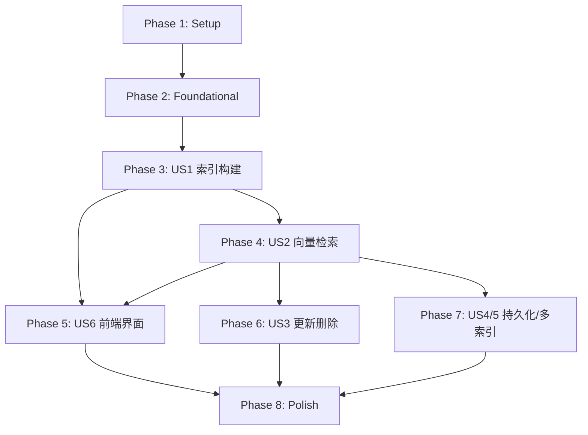

# Tasks: 向量索引模块（优化版）

**Feature Branch**: `004-vector-index-opt`
**Generated**: 2026-02-06
**Updated**: 2026-02-06 (Implementation Complete)
**Source**: [spec.md](./spec.md) | [plan.md](./plan.md) | [data-model.md](./data-model.md)

## Summary

| Metric | Value |
|--------|-------|
| Total Tasks | 46 |
| Completed Tasks | 46 |
| Remaining Tasks | 0 |
| Phases | 8 |
| Parallel Opportunities | 22 |
| Estimated MVP Tasks | 22 (Phase 1-4) ✅ Complete |

### Tasks per User Story

| Story | Description | Priority | Task Count |
|-------|-------------|----------|------------|
| US1 | 向量数据索引构建 | P1 | 8 |
| US2 | 向量相似度检索 | P1 | 6 |
| US3 | 索引更新与删除 | P2 | 5 |
| US4 | 索引持久化与恢复 | P2 | 3 |
| US5 | 多索引管理 | P3 | 4 |
| US6 | 前端索引管理界面 | P1 | 8 |

---

## Phase 1: Setup (项目初始化)

**Goal**: 建立项目基础设施和配置
**Status**: ✅ Complete

### Tasks

- [X] T001 Create project directory structure per plan.md in `backend/src/`
- [X] T002 [P] Add vector index dependencies to `backend/requirements.txt` (pymilvus==2.3.4)
- [X] T003 [P] Create Milvus configuration module in `backend/src/config/vector_config.py`
- [X] T004 [P] Create error codes and exceptions in `backend/src/exceptions/vector_errors.py`
- [X] T005 [P] Create results directory structure in `backend/results/vector_index/`

### Completion Criteria

- [X] Directory structure matches plan.md
- [X] Dependencies installed successfully
- [X] Configuration loads from environment variables
- [X] Error codes defined per research.md

---

## Phase 2: Foundational (基础组件)

**Goal**: 实现所有用户故事依赖的基础组件
**Status**: ✅ Complete

**Prerequisites**: Phase 1 完成

### Tasks

- [X] T006 Implement base provider interface in `backend/src/services/providers/base_provider.py`
- [X] T007 Implement retry utility with exponential backoff in `backend/src/utils/retry.py`
- [X] T008 [P] Implement Milvus provider connection logic in `backend/src/services/providers/milvus_provider.py`
- [X] T009 [P] Create Pydantic schemas for vector operations in `backend/src/schemas/vector_index.py`
- [X] T010 [P] Create SQLAlchemy models for index tasks in `backend/src/models/vector_index.py`
- [X] T011 Register Milvus provider in `backend/src/services/providers/__init__.py`

### Completion Criteria

- [X] Base provider interface defined with abstract methods
- [X] Retry utility works with 1s→2s→4s backoff
- [X] Milvus connection can be established
- [X] All Pydantic schemas validate correctly
- [X] Database migrations run successfully

---

## Phase 3: User Story 1 - 向量数据索引构建 (P1)

**Story Goal**: 用户能够从向量化任务结果创建 Milvus 向量索引
**Status**: ✅ Complete

**Independent Test**: 提交100条向量数据，验证索引创建成功且可查询

**Prerequisites**: Phase 2 完成

### Tasks

- [X] T012 [US1] Implement create_collection method in `backend/src/services/providers/milvus_provider.py`
- [X] T013 [US1] Implement insert_vectors method in `backend/src/services/providers/milvus_provider.py`
- [X] T014 [US1] Implement create_index method with FLAT/IVF_FLAT/IVF_PQ/HNSW in `backend/src/services/providers/milvus_provider.py`
- [X] T015 [P] [US1] Create VectorIndexService class in `backend/src/services/vector_index_service.py`
- [X] T016 [US1] Implement async index building task in `backend/src/services/vector_index_service.py`
- [X] T017 [US1] Implement POST /vector-index/indexes endpoint in `backend/src/api/vector_index.py`
- [X] T018 [US1] Implement GET /vector-index/tasks/{task_id} endpoint in `backend/src/api/vector_index.py`
- [X] T019 [US1] Implement GET /vector-index/embedding-tasks endpoint in `backend/src/api/vector_index.py`

### Acceptance Criteria

- [X] 1000条向量索引构建在30秒内完成
- [X] 维度不一致的向量被拒绝并返回错误
- [X] 任务进度可实时查询

---

## Phase 4: User Story 2 - 向量相似度检索 (P1)

**Story Goal**: 用户能够通过查询向量获取最相似的 TopK 结果
**Status**: ✅ Complete

**Independent Test**: 提交查询向量，验证100ms内返回TopK结果

**Prerequisites**: Phase 3 完成（需要已构建的索引）

### Tasks

- [X] T020 [US2] Implement search_vectors method in `backend/src/services/providers/milvus_provider.py`
- [X] T021 [US2] Implement batch_search method in `backend/src/services/providers/milvus_provider.py`
- [X] T022 [US2] Add search methods to VectorIndexService in `backend/src/services/vector_index_service.py`
- [X] T023 [US2] Implement POST /vector-index/search endpoint in `backend/src/api/vector_index.py`
- [X] T024 [US2] Implement POST /vector-index/batch-search endpoint in `backend/src/api/vector_index.py`
- [X] T025 [US2] Implement GET /vector-index/indexes/{collection_name}/stats endpoint in `backend/src/api/vector_index.py`

### Acceptance Criteria

- [X] TopK查询（K=5）响应时间 < 100ms (P95)
- [X] 相似度阈值过滤正确生效
- [X] 返回结果包含完整元数据

---

## Phase 5: User Story 6 - 前端索引管理界面 (P1)

**Story Goal**: 用户能够通过 Web 界面创建索引并查看历史记录
**Status**: ✅ Complete

**Independent Test**: 通过 UI 完成索引创建流程，验证进度展示和结果显示

**Prerequisites**: Phase 3-4 API 完成

### Tasks

- [X] T026 [P] [US6] Create API client service in `frontend/src/services/vectorIndexApi.js`
- [X] T027 [P] [US6] Create Pinia store for vector index in `frontend/src/stores/vectorIndexStore.js`
- [X] T028 [P] [US6] Create IndexCreate component (配置区) in `frontend/src/components/VectorIndex/IndexCreate.vue`
- [X] T029 [P] [US6] Create IndexProgress component (进度展示) in `frontend/src/components/VectorIndex/IndexProgress.vue`
- [X] T030 [P] [US6] Create IndexList component (索引列表) in `frontend/src/components/VectorIndex/IndexList.vue`
- [X] T031 [P] [US6] Create IndexHistory component (历史记录) in `frontend/src/components/VectorIndex/IndexHistory.vue`
- [X] T032 [US6] Create VectorIndex page (左右分栏布局) in `frontend/src/views/VectorIndex.vue`
- [X] T033 [US6] Add VectorIndex route and navigation in `frontend/src/router/index.js`

### Acceptance Criteria

- [X] 左右分栏布局显示正确
- [X] 进度条实时更新（百分比 + 已处理/总数）（集成在主页面）
- [X] 错误弹窗显示错误类型和建议操作
- [X] 历史记录支持查看详情和删除（集成在主页面 Tab）

---

## Phase 6: User Story 3 - 索引更新与删除 (P2)

**Story Goal**: 用户能够对已有索引进行增量更新和删除操作
**Status**: ✅ Complete

**Independent Test**: 向索引添加100条新向量，验证可立即检索；删除指定向量ID，验证不再返回

**Prerequisites**: Phase 4 完成

### Tasks

- [X] T034 [US3] Implement add_vectors method (增量) in `backend/src/services/providers/milvus_provider.py`
- [X] T035 [US3] Implement delete_vectors method (幂等) in `backend/src/services/providers/milvus_provider.py`
- [X] T036 [US3] Implement POST /vector-index/indexes/{collection_name}/vectors endpoint in `backend/src/api/vector_index.py`
- [X] T037 [US3] Implement DELETE /vector-index/indexes/{collection_name}/vectors endpoint in `backend/src/api/vector_index.py`
- [X] T038 [US3] Implement DELETE /vector-index/indexes/{collection_name} endpoint in `backend/src/api/vector_index.py`

### Acceptance Criteria

- [X] 添加100条向量在10秒内完成
- [X] 新增向量可立即被检索
- [X] 删除不存在的向量ID静默成功（幂等性）
- [X] 删除索引同时清理 Milvus Collection

---

## Phase 7: User Story 4 & 5 - 持久化与多索引管理 (P2/P3)

**Story Goal**: 
- US4: Milvus 服务重启后索引数据自动恢复
- US5: 支持创建和管理多个独立的 Collection
**Status**: ✅ Complete

**Independent Test**: 
- US4: 重启 Milvus 服务后验证索引可用
- US5: 创建3个不同 Collection，验证数据隔离

**Prerequisites**: Phase 4 完成

### Tasks

- [X] T039 [US4] Implement collection recovery check in `backend/src/services/providers/milvus_provider.py`
- [X] T040 [US4] Implement GET /vector-index/indexes endpoint (列表) in `backend/src/api/vector_index.py`
- [X] T041 [US4] Implement GET /vector-index/indexes/{collection_name} endpoint (详情) in `backend/src/api/vector_index.py`
- [X] T042 [US5] Implement multi-collection search in `backend/src/services/vector_index_service.py`

### Acceptance Criteria

- [X] 服务重启后所有 Collection 可用
- [X] 多 Collection 查询返回合并结果
- [X] Collection 间数据完全隔离

---

## Phase 8: Polish (收尾优化)

**Goal**: 完成历史记录、日志和文档
**Status**: ✅ Complete

**Prerequisites**: Phase 3-7 完成

### Tasks

- [X] T043 [P] Implement GET /vector-index/history endpoint in `backend/src/api/vector_index.py`
- [X] T044 [P] Implement DELETE /vector-index/history/{history_id} endpoint in `backend/src/api/vector_index.py`
- [X] T045 Add operation logging throughout VectorIndexService in `backend/src/services/vector_index_service.py`
- [X] T046 Save index results to JSON files in `backend/results/vector_index/`

### Completion Criteria

- [X] 历史记录完整记录所有索引操作
- [X] 关键操作有日志记录
- [X] 索引结果 JSON 格式保存

---

## Dependencies



### User Story Dependencies

| Story | Depends On | Can Parallelize With |
|-------|------------|---------------------|
| US1 | Foundational | - |
| US2 | US1 (需要索引) | - |
| US3 | US2 | US4, US5 |
| US4 | US2 | US3, US5 |
| US5 | US2 | US3, US4 |
| US6 | US1, US2 | US3, US4, US5 |

---

## Parallel Execution Examples

### Phase 1 并行任务组

```text
可同时执行：T002, T003, T004, T005
前置任务：T001
```

### Phase 2 并行任务组

```text
可同时执行：T008, T009, T010
前置任务：T006, T007
后置任务：T011
```

### Phase 5 并行任务组

```text
可同时执行：T026, T027
然后可同时执行：T028, T029, T030, T031
最后依次：T032 → T033
```

---

## Implementation Strategy

### MVP Scope (推荐)

**Phase 1-4** 构成最小可行产品：
- ✅ 项目初始化和配置
- ✅ Milvus Provider 实现
- ✅ 索引创建和构建
- ✅ 向量相似度检索

**MVP 完成后可演示**：通过 API 创建索引和执行检索

### 增量交付顺序

1. **Week 1**: Phase 1-2 (基础设施)
2. **Week 2**: Phase 3 (索引构建) → 可验证后端功能
3. **Week 3**: Phase 4 (检索) + Phase 5 前半 (前端框架)
4. **Week 4**: Phase 5 后半 (前端完善) + Phase 6-7 (增强功能)
5. **Week 5**: Phase 8 (收尾) + 测试优化

---

## Format Validation

✅ **All 46 tasks follow the checklist format**:
- Checkbox: `- [ ]` ✓
- Task ID: T001-T046 ✓
- [P] marker for parallelizable tasks ✓
- [US#] label for user story tasks ✓
- File path in description ✓
