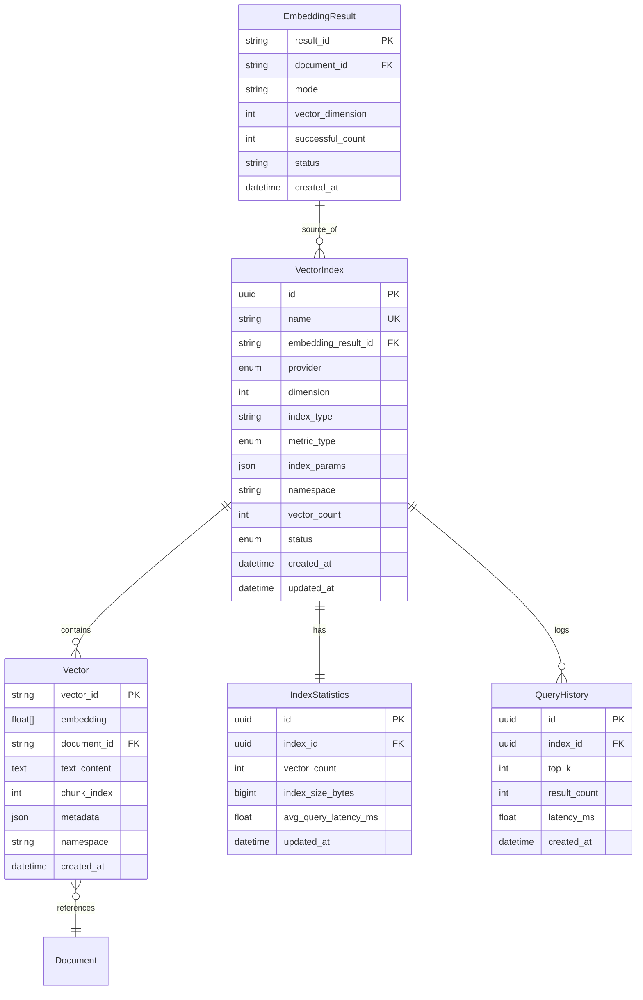

# Data Model: 向量索引模块

**Feature**: 004-vector-index  
**Date**: 2025-12-24 (Updated)  
**Status**: Design Phase

## Overview

向量索引模块的数据模型设计分为两层：
1. **Milvus/FAISS层**：存储向量数据和基础元数据（向量ID、文档ID、命名空间等）
2. **PostgreSQL层**：存储索引配置、统计信息、查询历史和复杂元数据

**2024-12-24 更新**：新增与向量化任务（EmbeddingResult）的关联关系，支持从已完成的向量化任务创建索引。

## Core Entities

### 1. VectorIndex（向量索引）

**Description**: 代表一个完整的向量索引实例，管理索引的生命周期和配置。

**Attributes**:

| Field | Type | Required | Description | Validation |
|-------|------|----------|-------------|------------|
| id | UUID | Yes | 索引唯一标识符 | UUID v4 |
| name | String(255) | Yes | 索引名称（用户可读） | ^[a-zA-Z0-9_-]+$, unique |
| provider | Enum | Yes | 向量数据库提供商 | `MILVUS` \| `FAISS` |
| dimension | Integer | Yes | 向量维度 | 128, 256, 512, 768, 1024, 1536, 2048, 3072, 4096 |
| index_type | String(50) | Yes | 索引算法类型 | Milvus: FLAT/IVF_FLAT/IVF_PQ/HNSW<br>FAISS: IndexFlatIP/IndexIVFPQ |
| metric_type | Enum | Yes | 相似度度量方法 | `cosine` \| `euclidean` \| `dot_product` |
| index_params | JSON | No | 索引算法参数 | Provider-specific config |
| namespace | String(255) | No | 命名空间（用于多租户） | Default: "default" |
| vector_count | Integer | Yes | 当前向量数量 | >= 0, auto-updated |
| status | Enum | Yes | 索引状态 | `BUILDING` \| `READY` \| `UPDATING` \| `ERROR` |
| file_path | String(512) | No | 索引文件路径（仅FAISS） | Absolute path to .index file |
| milvus_collection | String(255) | No | Milvus Collection名称 | 仅Provider=milvus时有效 |
| created_at | DateTime | Yes | 创建时间 | ISO 8601 UTC |
| updated_at | DateTime | Yes | 最后更新时间 | ISO 8601 UTC, auto-update |
| created_by | String(255) | No | 创建者用户ID | Foreign key to users |

**Example**:
```json
{
  "id": "a1b2c3d4-e5f6-7890-abcd-ef1234567890",
  "name": "legal_docs_index",
  "provider": "MILVUS",
  "dimension": 1536,
  "index_type": "HNSW",
  "metric_type": "cosine",
  "index_params": {
    "M": 16,
    "efConstruction": 200
  },
  "namespace": "legal_department",
  "vector_count": 125430,
  "status": "READY",
  "milvus_collection": "legal_docs_index_col",
  "created_at": "2025-12-23T08:00:00Z",
  "updated_at": "2025-12-23T10:30:00Z",
  "created_by": "user_001"
}
```

**State Transitions**:
```
[Create] → BUILDING → READY
              ↓          ↓
              ERROR ← UPDATING ← [Update/Delete]
                         ↓
                       READY
```

---

### 2. Vector（向量数据）

**Description**: 单个向量数据点及其关联元数据。**注意**：向量数据主要存储在Milvus/FAISS中，PostgreSQL仅存储引用和扩展元数据。

**Attributes** (Milvus/FAISS存储):

| Field | Type | Required | Description | Validation |
|-------|------|----------|-------------|------------|
| vector_id | String(255) | Yes | 向量唯一标识 | UUID or custom ID |
| embedding | Float[] | Yes | 向量值（浮点数组） | Length = index.dimension |
| document_id | String(255) | No | 关联文档ID | Foreign key |
| text_content | Text | No | 向量对应的文本片段 | Max 4KB (Milvus scalar) |
| chunk_index | Integer | No | 文档分块索引 | >= 0 |
| metadata | JSON | No | 自定义元数据 | Max 1KB |
| namespace | String(255) | No | 命名空间 | Must match index.namespace |
| created_at | DateTime | Yes | 创建时间 | ISO 8601 UTC |

**Attributes** (PostgreSQL扩展存储):

| Field | Type | Required | Description |
|-------|------|----------|-------------|
| vector_id | String(255) | Yes | 主键，关联Milvus/FAISS |
| index_id | UUID | Yes | 所属索引ID |
| large_metadata | JSONB | No | 大型元数据（>1KB） |
| access_count | Integer | Yes | 访问统计 |
| last_accessed | DateTime | No | 最后访问时间 |

**Example** (Milvus):
```python
{
  "vector_id": "vec_001",
  "embedding": [0.123, -0.456, 0.789, ...],  # 1536 dimensions
  "document_id": "doc_12345",
  "text_content": "The quick brown fox jumps over the lazy dog.",
  "chunk_index": 3,
  "metadata": {
    "source": "contract_v2.pdf",
    "page": 5,
    "category": "legal"
  },
  "namespace": "legal_department",
  "created_at": "2025-12-23T09:15:00Z"
}
```

---

### 3. IndexStatistics（索引统计信息）

**Description**: 索引的运行时统计和性能指标。

**Attributes**:

| Field | Type | Required | Description | Validation |
|-------|------|----------|-------------|------------|
| id | UUID | Yes | 统计记录ID | UUID v4 |
| index_id | UUID | Yes | 关联索引ID | Foreign key |
| vector_count | Integer | Yes | 向量总数 | >= 0 |
| index_size_bytes | BigInteger | Yes | 索引占用空间（字节） | >= 0 |
| avg_vector_norm | Float | No | 平均向量模长 | >= 0 |
| query_count_24h | Integer | Yes | 24小时查询次数 | >= 0, rolling window |
| avg_query_latency_ms | Float | Yes | 平均查询延迟（毫秒） | >= 0, P95 metric |
| last_build_duration_s | Float | No | 最后一次构建耗时（秒） | >= 0 |
| last_persist_at | DateTime | No | 最后持久化时间 | ISO 8601 UTC |
| error_count_24h | Integer | Yes | 24小时错误次数 | >= 0 |
| created_at | DateTime | Yes | 记录创建时间 | Auto-set |
| updated_at | DateTime | Yes | 最后更新时间 | Auto-update |

**Validation Rules**:
- `index_size_bytes` 应约为 `vector_count * dimension * 4 * 1.5` (含索引结构开销)
- `avg_query_latency_ms` 应 <100ms (触发告警阈值)
- `updated_at` 应在每次索引操作后自动更新

**Example**:
```json
{
  "id": "stat_001",
  "index_id": "a1b2c3d4-e5f6-7890-abcd-ef1234567890",
  "vector_count": 125430,
  "index_size_bytes": 1152345600,
  "avg_vector_norm": 1.0023,
  "query_count_24h": 3420,
  "avg_query_latency_ms": 42.3,
  "last_build_duration_s": 127.5,
  "last_persist_at": "2025-12-23T10:00:00Z",
  "error_count_24h": 2,
  "updated_at": "2025-12-23T10:30:15Z"
}
```

---

### 4. QueryResult（查询结果）

**Description**: 向量相似度查询的单个结果项（运行时对象，不持久化到数据库）。

**Attributes**:

| Field | Type | Required | Description |
|-------|------|----------|-------------|
| vector_id | String(255) | Yes | 匹配向量的ID |
| score | Float | Yes | 相似度分数 |
| distance | Float | No | 距离值（如使用欧氏距离） |
| document_id | String(255) | No | 关联文档ID |
| text_content | String | No | 向量对应的文本内容 |
| metadata | JSON | No | 元数据信息 |
| rank | Integer | Yes | 结果排名（1-based） |

**Example**:
```json
{
  "vector_id": "vec_00789",
  "score": 0.9523,
  "document_id": "doc_12345",
  "text_content": "The contract stipulates that...",
  "metadata": {
    "source": "contract_v2.pdf",
    "page": 5,
    "category": "legal"
  },
  "rank": 1
}
```

---

### 5. QueryHistory（查询历史）

**Description**: 记录查询操作历史，用于审计和分析。

**Attributes**:

| Field | Type | Required | Description |
|-------|------|----------|-------------|
| id | UUID | Yes | 查询记录ID |
| index_id | UUID | Yes | 索引ID |
| query_vector | Float[] | No | 查询向量（可选存储） |
| query_text | Text | No | 查询文本（如有） |
| top_k | Integer | Yes | 返回结果数 |
| threshold | Float | No | 相似度阈值 |
| result_count | Integer | Yes | 实际返回结果数 |
| latency_ms | Float | Yes | 查询延迟（毫秒） |
| filter_expr | JSON | No | 过滤条件（Milvus） |
| user_id | String(255) | No | 查询用户ID |
| created_at | DateTime | Yes | 查询时间 |

---

## Entity Relationships



## 新增：与向量化任务的关联 (2024-12-24)

### VectorIndex 扩展字段

| Field | Type | Required | Description |
|-------|------|----------|-------------|
| embedding_result_id | String(36) | No | 关联的向量化任务ID |
| source_document_name | String(255) | No | 源文档名称（冗余存储，便于展示） |
| source_model | String(50) | No | 源向量化模型（冗余存储） |

### 数据流说明

```
EmbeddingResult (已完成的向量化任务)
    ↓ 用户选择
VectorIndex (创建索引配置)
    ↓ 读取向量数据
Milvus/FAISS (存储向量)
    ↓ 构建索引
IndexStatistics (记录统计)
```

### 前端数据流

1. **获取向量化任务列表**: `GET /api/v1/vector-index/embedding-tasks?status=SUCCESS`
2. **用户选择任务**: 获取 `embedding_result_id`
3. **创建索引**: `POST /api/v1/vector-index/indexes/from-embedding`
4. **读取向量数据**: 从 JSON 结果文件加载向量
5. **插入向量数据库**: 批量写入 Milvus/FAISS
6. **更新统计信息**: 记录向量数量、索引大小等

## Database Schema (PostgreSQL)

### Tables

```sql
-- 向量索引配置表 (2024-12-24 更新：添加 embedding_result_id 关联)
CREATE TABLE vector_indexes (
    id UUID PRIMARY KEY DEFAULT gen_random_uuid(),
    name VARCHAR(255) UNIQUE NOT NULL,
    
    -- 数据源关联 (新增)
    embedding_result_id VARCHAR(36) REFERENCES embedding_results(result_id),
    source_document_name VARCHAR(255),  -- 冗余存储，便于展示
    source_model VARCHAR(50),           -- 冗余存储
    
    -- 索引配置
    provider VARCHAR(20) NOT NULL CHECK (provider IN ('MILVUS', 'FAISS')),
    dimension INTEGER NOT NULL CHECK (dimension IN (128, 256, 512, 768, 1024, 1536, 2048, 3072, 4096)),
    index_type VARCHAR(50) NOT NULL,
    metric_type VARCHAR(20) NOT NULL CHECK (metric_type IN ('cosine', 'euclidean', 'dot_product')),
    index_params JSONB DEFAULT '{}',
    namespace VARCHAR(255) DEFAULT 'default',
    
    -- 状态和统计
    vector_count INTEGER DEFAULT 0 CHECK (vector_count >= 0),
    status VARCHAR(20) NOT NULL CHECK (status IN ('BUILDING', 'READY', 'UPDATING', 'ERROR')),
    error_message TEXT,  -- 错误信息 (新增)
    
    -- Provider 特定字段
    file_path VARCHAR(512),  -- FAISS only
    milvus_collection VARCHAR(255),  -- Milvus only
    
    -- 审计字段
    created_at TIMESTAMP WITH TIME ZONE DEFAULT CURRENT_TIMESTAMP,
    updated_at TIMESTAMP WITH TIME ZONE DEFAULT CURRENT_TIMESTAMP,
    created_by VARCHAR(255)
);

-- 新增索引
CREATE INDEX idx_vector_indexes_embedding_result ON vector_indexes(embedding_result_id);

-- 索引统计信息表
CREATE TABLE index_statistics (
    id UUID PRIMARY KEY DEFAULT gen_random_uuid(),
    index_id UUID NOT NULL REFERENCES vector_indexes(id) ON DELETE CASCADE,
    vector_count INTEGER DEFAULT 0 CHECK (vector_count >= 0),
    index_size_bytes BIGINT DEFAULT 0 CHECK (index_size_bytes >= 0),
    avg_vector_norm FLOAT,
    query_count_24h INTEGER DEFAULT 0 CHECK (query_count_24h >= 0),
    avg_query_latency_ms FLOAT DEFAULT 0 CHECK (avg_query_latency_ms >= 0),
    last_build_duration_s FLOAT,
    last_persist_at TIMESTAMP WITH TIME ZONE,
    error_count_24h INTEGER DEFAULT 0 CHECK (error_count_24h >= 0),
    created_at TIMESTAMP WITH TIME ZONE DEFAULT CURRENT_TIMESTAMP,
    updated_at TIMESTAMP WITH TIME ZONE DEFAULT CURRENT_TIMESTAMP,
    UNIQUE(index_id)  -- One stats record per index
);

-- 向量元数据扩展表（仅存储大型元数据和引用）
CREATE TABLE vector_metadata (
    vector_id VARCHAR(255) PRIMARY KEY,
    index_id UUID NOT NULL REFERENCES vector_indexes(id) ON DELETE CASCADE,
    large_metadata JSONB,
    access_count INTEGER DEFAULT 0,
    last_accessed TIMESTAMP WITH TIME ZONE,
    created_at TIMESTAMP WITH TIME ZONE DEFAULT CURRENT_TIMESTAMP
);

-- 查询历史表
CREATE TABLE query_history (
    id UUID PRIMARY KEY DEFAULT gen_random_uuid(),
    index_id UUID NOT NULL REFERENCES vector_indexes(id) ON DELETE CASCADE,
    query_text TEXT,
    top_k INTEGER NOT NULL CHECK (top_k > 0),
    threshold FLOAT CHECK (threshold >= 0 AND threshold <= 1),
    result_count INTEGER DEFAULT 0,
    latency_ms FLOAT NOT NULL CHECK (latency_ms >= 0),
    filter_expr JSONB,
    user_id VARCHAR(255),
    created_at TIMESTAMP WITH TIME ZONE DEFAULT CURRENT_TIMESTAMP
);

-- Indexes for performance
CREATE INDEX idx_vector_indexes_name ON vector_indexes(name);
CREATE INDEX idx_vector_indexes_provider ON vector_indexes(provider);
CREATE INDEX idx_vector_indexes_namespace ON vector_indexes(namespace);
CREATE INDEX idx_vector_metadata_index ON vector_metadata(index_id);
CREATE INDEX idx_query_history_index ON query_history(index_id);
CREATE INDEX idx_query_history_created ON query_history(created_at DESC);

-- Auto-update trigger for updated_at
CREATE OR REPLACE FUNCTION update_updated_at_column()
RETURNS TRIGGER AS $$
BEGIN
    NEW.updated_at = CURRENT_TIMESTAMP;
    RETURN NEW;
END;
$$ LANGUAGE plpgsql;

CREATE TRIGGER update_vector_indexes_updated_at
    BEFORE UPDATE ON vector_indexes
    FOR EACH ROW
    EXECUTE FUNCTION update_updated_at_column();

CREATE TRIGGER update_index_statistics_updated_at
    BEFORE UPDATE ON index_statistics
    FOR EACH ROW
    EXECUTE FUNCTION update_updated_at_column();
```

---

## Milvus Schema

### Collection Schema (Example: legal_docs_index)

```python
from pymilvus import CollectionSchema, FieldSchema, DataType

# Define fields
fields = [
    FieldSchema(name="vector_id", dtype=DataType.VARCHAR, is_primary=True, max_length=255),
    FieldSchema(name="embedding", dtype=DataType.FLOAT_VECTOR, dim=1536),
    FieldSchema(name="document_id", dtype=DataType.VARCHAR, max_length=255),
    FieldSchema(name="text_content", dtype=DataType.VARCHAR, max_length=4096),
    FieldSchema(name="chunk_index", dtype=DataType.INT64),
    FieldSchema(name="metadata", dtype=DataType.JSON),
    FieldSchema(name="namespace", dtype=DataType.VARCHAR, max_length=255),
    FieldSchema(name="created_at", dtype=DataType.INT64),  # Unix timestamp
]

schema = CollectionSchema(fields=fields, description="Legal documents vector index")

# Create index on embedding field
index_params = {
    "metric_type": "IP",  # Inner Product (for cosine similarity)
    "index_type": "HNSW",
    "params": {"M": 16, "efConstruction": 200}
}
```

---

## Data Validation Rules

### VectorIndex Validation

```python
class VectorIndexValidator:
    VALID_DIMENSIONS = [128, 256, 512, 768, 1024, 1536, 2048, 3072, 4096]
    VALID_PROVIDERS = ["MILVUS", "FAISS"]
    VALID_METRIC_TYPES = ["cosine", "euclidean", "dot_product"]
    
    MILVUS_INDEX_TYPES = ["FLAT", "IVF_FLAT", "IVF_PQ", "HNSW"]
    FAISS_INDEX_TYPES = ["IndexFlatIP", "IndexFlatL2", "IndexIVFPQ"]
    
    @staticmethod
    def validate_index_params(provider: str, index_type: str, params: dict):
        """Validate provider-specific index parameters"""
        if provider == "milvus":
            if index_type == "HNSW":
                assert "M" in params and "efConstruction" in params
                assert 4 <= params["M"] <= 64
                assert 100 <= params["efConstruction"] <= 500
            elif index_type == "IVF_PQ":
                assert "nlist" in params and "m" in params
                assert params["nlist"] >= 16
                assert params["m"] in [4, 8, 16, 32]
        # ... FAISS validation
```

### Vector Validation

```python
def validate_vector(vector: list, expected_dim: int):
    """Validate vector data"""
    assert len(vector) == expected_dim, f"Vector dimension mismatch: {len(vector)} != {expected_dim}"
    assert all(isinstance(v, (int, float)) for v in vector), "Vector must contain numeric values"
    assert not any(math.isnan(v) or math.isinf(v) for v in vector), "Vector contains NaN or Inf"
    
    # Check if normalized (for cosine similarity)
    norm = math.sqrt(sum(v**2 for v in vector))
    if not math.isclose(norm, 1.0, rel_tol=1e-3):
        logging.warning(f"Vector not normalized: norm={norm}")
```

---

## Naming Conventions

### Database Objects

- **Tables**: `snake_case` (e.g., `vector_indexes`, `index_statistics`)
- **Columns**: `snake_case` (e.g., `created_at`, `vector_count`)
- **Indexes**: `idx_{table}_{column}` (e.g., `idx_vector_indexes_name`)
- **Constraints**: `chk_{table}_{column}` (e.g., `chk_vector_indexes_dimension`)

### Python Models

- **Classes**: `PascalCase` (e.g., `VectorIndex`, `IndexStatistics`)
- **Attributes**: `snake_case` (e.g., `index_type`, `created_at`)
- **Methods**: `snake_case` (e.g., `create_index()`, `search_vectors()`)

### Milvus Collections

- **Collection Names**: `{index_name}_col` (e.g., `legal_docs_index_col`)
- **Field Names**: `snake_case` (e.g., `vector_id`, `embedding`)

---

## Migration Strategy

### Phase 1: Initial Schema
1. Create `vector_indexes` table
2. Create `index_statistics` table
3. Create triggers and indexes

### Phase 2: Metadata Support
4. Create `vector_metadata` table
5. Create `query_history` table

### Phase 3: Milvus Integration
6. Initialize Milvus connection
7. Create default collections
8. Sync PostgreSQL and Milvus schemas

---

## Sample Data

### Development Environment

```sql
-- Sample index (FAISS for development)
INSERT INTO vector_indexes (name, provider, dimension, index_type, metric_type, namespace, status)
VALUES ('dev_test_index', 'FAISS', 1536, 'IndexFlatIP', 'COSINE', 'default', 'READY');

-- Sample statistics
INSERT INTO index_statistics (index_id, vector_count, index_size_bytes, avg_query_latency_ms)
SELECT id, 1000, 9216000, 25.3 FROM vector_indexes WHERE name = 'dev_test_index';
```

### Production Environment

```sql
-- Sample index (Milvus for production)
INSERT INTO vector_indexes (name, provider, dimension, index_type, metric_type, index_params, namespace, status)
VALUES (
    'legal_docs_index',
    'MILVUS',
    1536,
    'HNSW',
    'COSINE',
    '{"M": 16, "efConstruction": 200}',
    'legal_department',
    'READY'
);
```

---

## Appendix: Field Size Calculations

### Index Size Estimation

```python
def estimate_index_size(vector_count: int, dimension: int, index_type: str) -> int:
    """Estimate index size in bytes"""
    base_size = vector_count * dimension * 4  # 4 bytes per float32
    
    if index_type == "FLAT":
        return int(base_size * 1.05)  # 5% overhead
    elif index_type == "HNSW":
        return int(base_size * 1.5)   # 50% overhead (graph structure)
    elif index_type == "IVF_PQ":
        return int(base_size * 0.3)   # 70% compression
    else:
        return int(base_size * 1.2)   # 20% default overhead
```

### Memory Requirements

| Vector Count | Dimension | Index Type | Memory (GB) |
|--------------|-----------|------------|-------------|
| 10,000 | 1536 | FLAT | 0.06 |
| 100,000 | 1536 | HNSW | 0.92 |
| 1,000,000 | 1536 | IVF_PQ | 1.84 |
| 10,000,000 | 1536 | IVF_PQ | 18.4 |
