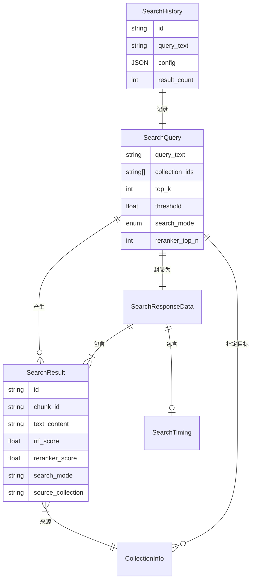
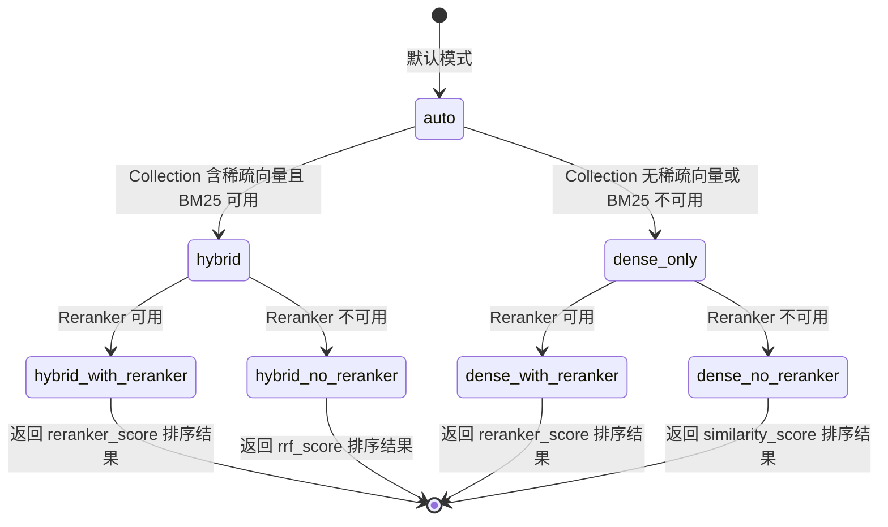
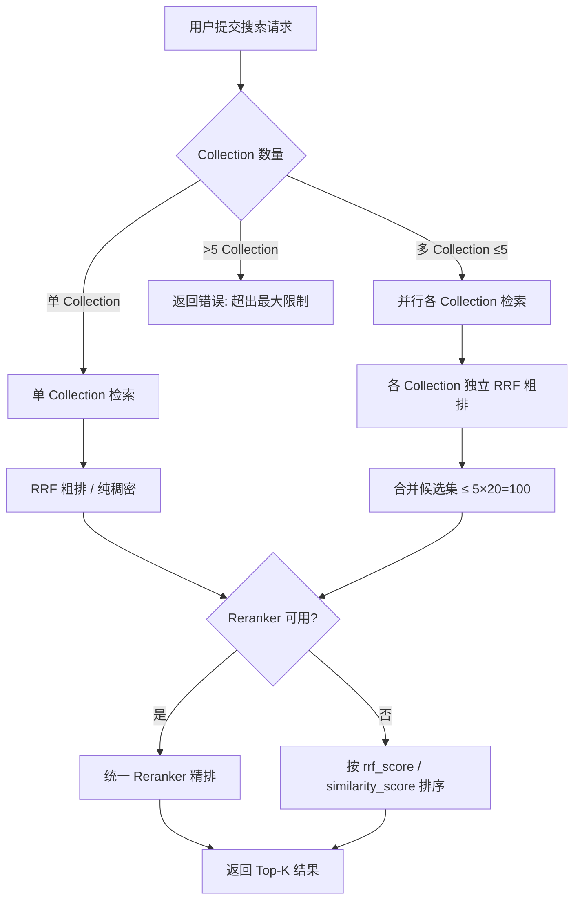

# Data Model: 检索查询模块优化版

**Feature**: 005-search-query-opt | **Date**: 2026-02-26

## 概述

本文档定义检索查询模块优化版的数据模型，包括实体定义、字段说明、关系、验证规则和状态转换。基于 005-search-query 已有模型进行**增量扩展**。

---

## 1. 核心实体

### 1.1 SearchQuery（搜索查询请求）

表示一次搜索请求的完整参数。

| 字段 | 类型 | 必填 | 默认值 | 验证规则 | 说明 |
|------|------|------|--------|---------|------|
| query_text | string | ✅ | - | 1 ≤ len ≤ 2000 | 查询文本 |
| collection_ids | string[] | ❌ | [] | 0 ≤ len ≤ 5 | 目标 Collection ID 列表 |
| top_k | int | ❌ | 10 | 1 ≤ val ≤ 100 | 最终返回结果数量 |
| threshold | float | ❌ | 0.5 | 0 ≤ val ≤ 1 | 相似度阈值 |
| metric_type | enum | ❌ | "cosine" | cosine/euclidean/dot_product | 相似度计算方法 |
| **search_mode** | enum | ❌ | "auto" | auto/hybrid/dense_only | 🆕 检索模式 |
| **reranker_top_n** | int | ❌ | 20 | 10 ≤ val ≤ 100 | 🆕 Reranker 候选集大小 |
| **reranker_top_k** | int | ❌ | null | 1 ≤ val ≤ top_n | 🆕 Reranker 最终返回数（null 时使用 top_k） |

**search_mode 枚举**:
- `auto`: 系统默认值。自动检测 Collection 是否含稀疏向量，有则混合检索，无则纯稠密。等价于「乐观尝试混合检索 + 自动降级」，用户无需手动选择，仅供 API 调用方使用
- `hybrid`: 强制混合检索（Collection 无稀疏向量时降级为 dense_only），仅供 API 调用方使用
- `dense_only`: 强制纯稠密检索，仅供 API 调用方使用

> 注：前端不提供 search_mode 选择器，仅以只读状态文本提示当前实际检索模式。API 保留 search_mode 参数供高级用户/程序化调用使用。

### 1.2 SearchResult（搜索结果项）

表示单条搜索结果。⚡ 扩展自已有模型。

| 字段 | 类型 | 必填 | 说明 |
|------|------|------|------|
| id | string(UUID) | ✅ | 结果唯一 ID |
| chunk_id | string | ✅ | 文档片段 ID |
| text_content | string | ✅ | 文档片段完整内容 |
| text_summary | string | ✅ | 文本摘要（≤200 字符） |
| similarity_score | float | ✅ | 原始相似度分数 |
| similarity_percent | string | ✅ | 相似度百分比展示 |
| **rrf_score** | float | ❌ | 🆕 RRF 融合分数（混合检索模式） |
| **reranker_score** | float | ❌ | 🆕 Reranker 精排分数 |
| **search_mode** | string | ✅ | 🆕 检索模式标签 (hybrid/dense_only) |
| **source_collection** | string | ✅ | 🆕 来源 Collection 名称 |
| source_document | string | ✅ | 来源文档名称 |
| chunk_position | int | ❌ | 片段位置 |
| metadata | object | ❌ | 元数据 |
| rank | int | ✅ | 结果排名 |

### 1.3 SearchResponseData（搜索响应数据）

表示完整的搜索响应。⚡ 扩展自已有模型。

| 字段 | 类型 | 必填 | 说明 |
|------|------|------|------|
| query_id | string(UUID) | ✅ | 查询 ID |
| query_text | string | ✅ | 原始查询文本 |
| results | SearchResult[] | ✅ | 搜索结果列表 |
| total_count | int | ✅ | 结果总数 |
| execution_time_ms | int | ✅ | 总执行耗时 (ms) |
| **search_mode** | string | ✅ | 🆕 实际使用的检索模式 |
| **reranker_available** | bool | ✅ | 🆕 Reranker 是否可用 |
| **rrf_k** | int | ❌ | 🆕 使用的 RRF k 值 |
| **timing** | SearchTiming | ❌ | 🆕 各阶段耗时明细 |

### 1.4 SearchTiming（检索耗时明细）🆕

| 字段 | 类型 | 说明 |
|------|------|------|
| embedding_ms | int | 查询向量化耗时 |
| bm25_ms | int | BM25 稀疏向量生成耗时 |
| search_ms | int | 向量检索耗时（含 RRF） |
| reranker_ms | int | Reranker 精排耗时 |
| total_ms | int | 总耗时 |

### 1.5 SearchHistory（搜索历史） — 数据库模型

⚡ 扩展已有 `search_history` 表，通过 config JSON 字段扩展，无需 schema migration。

| 字段 | 类型 | 存储位置 | 说明 |
|------|------|---------|------|
| id | string(UUID) | 独立列 | 主键 |
| query_text | text | 独立列 | 查询文本 |
| index_ids | JSON | 独立列 | Collection ID 列表 |
| config | JSON | 独立列 | 搜索配置（扩展） |
| result_count | int | 独立列 | 结果数量 |
| execution_time_ms | int | 独立列 | 执行耗时 |
| created_at | datetime | 独立列 | 创建时间 |

**config JSON 扩展字段**:
```json
{
  "top_k": 10,
  "threshold": 0.5,
  "metric_type": "cosine",
  "search_mode": "hybrid",           // 🆕
  "reranker_available": true,         // 🆕
  "reranker_top_n": 20,              // 🆕
  "rrf_k": 60                        // 🆕
}
```

### 1.6 CollectionInfo（Collection 信息） 🆕

用于联合搜索时展示 Collection 列表。

| 字段 | 类型 | 说明 |
|------|------|------|
| id | string | Collection ID |
| name | string | Collection 名称 |
| provider | string | 向量数据库类型 |
| vector_count | int | 向量数量 |
| dimension | int | 向量维度 |
| metric_type | string | 度量类型 |
| has_sparse | bool | 是否含稀疏向量字段 |
| created_at | datetime | 创建时间 |

---

## 2. 实体关系图



---

## 3. 状态转换

### 3.1 搜索模式状态转换



### 3.2 多 Collection 联合搜索流程



---

## 4. 验证规则汇总

| 实体 | 字段 | 规则 | 错误码 |
|------|------|------|--------|
| SearchQuery | query_text | 非空, ≤2000 字符 | EMPTY_QUERY / QUERY_TOO_LONG |
| SearchQuery | collection_ids | ≤5 个 | MAX_COLLECTIONS_EXCEEDED |
| SearchQuery | top_k | 1-100 | ERR_VALIDATION |
| SearchQuery | threshold | 0-1 | ERR_VALIDATION |
| SearchQuery | reranker_top_n | 10-100 | ERR_VALIDATION |
| SearchQuery | search_mode | auto/hybrid/dense_only | ERR_VALIDATION |
| Collection | exists | Collection 存在且可用 | INDEX_NOT_FOUND |
| RRF | k | > 0 (后端配置) | ERR_VALIDATION |
