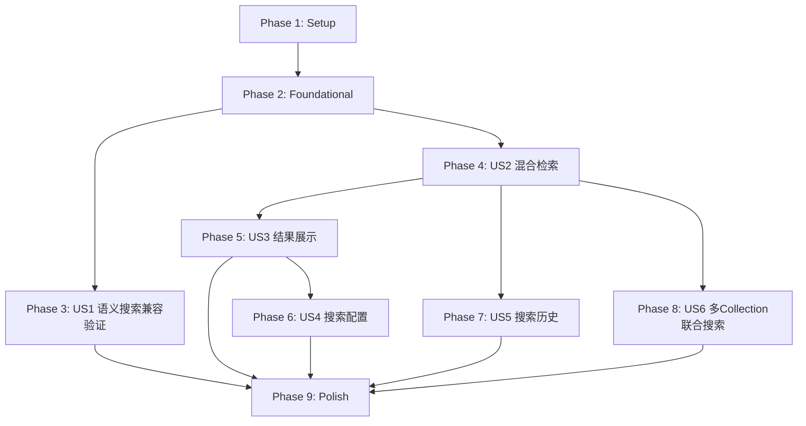

# Tasks: 检索查询模块（优化版）

**Input**: Design documents from `/specs/005-search-query-opt/`
**Prerequisites**: plan.md ✅, spec.md ✅, research.md ✅, data-model.md ✅, contracts/ ✅, quickstart.md ✅

**Tests**: spec 中未明确要求 TDD 或测试优先，但 plan.md 中规划了测试文件，因此测试任务作为各 Phase 的末尾补充任务。

**Organization**: 任务按 User Story 分组，支持独立实现和测试。本项目为**增量扩展**（基于 005-search-query 已有代码），重点是混合检索、Reranker 精排、多 Collection 联合搜索的集成。

## Format: `[ID] [P?] [Story] Description`

- **[P]**: 可并行执行（不同文件，无依赖）
- **[Story]**: 所属 User Story（US1, US2, US3, US4, US5, US6）
- 描述中包含精确文件路径

## Path Conventions

- **Backend**: `backend/src/`、`backend/tests/`
- **Frontend**: `frontend/src/`、`frontend/tests/`

---

## Phase 1: Setup（共享基础设施）

**Purpose**: 扩展现有配置和 Schema，为所有 User Story 提供基础

- [x] T001 扩展后端配置，新增 RRF_K、RERANKER_TOP_N、MAX_COLLECTIONS、DEFAULT_SEARCH_MODE 配置项（支持环境变量覆盖）in `backend/src/config/__init__.py`
- [x] T002 [P] 扩展 Schema 定义，新增 HybridSearchRequest、HybridSearchResponse、HybridSearchResultItem、SearchTiming、RerankerHealthResponse schema in `backend/src/schemas/search.py`
- [x] T003 [P] 扩展 SearchHistory 模型的 config JSON 字段文档注释，标注新增 search_mode/reranker_available/rrf_k/reranker_top_n 字段 in `backend/src/models/search.py`

**Checkpoint**: 配置和数据模型基础就绪，后续所有 Story 可引用新增的 Schema 和配置项。

---

## Phase 2: Foundational（阻塞性前置）

**Purpose**: 核心服务层扩展，所有 User Story 的混合检索能力依赖此阶段

**⚠️ CRITICAL**: US2-US6 的实现均依赖此阶段中 SearchService 的核心方法扩展

- [x] T004 在 SearchService 中新增 `_dense_search_in_collection()` 内部方法，封装单 Collection 纯稠密检索逻辑（EmbeddingService → MilvusProvider.search()），返回带 search_mode="dense_only" 标签的候选集 in `backend/src/services/search_service.py`
- [x] T005 在 SearchService 中新增 `_hybrid_search_in_collection()` 内部方法，封装单 Collection 混合检索逻辑（EmbeddingService + BM25SparseService.encode_query() → MilvusProvider.hybrid_search()），返回带 rrf_score 和 search_mode="hybrid" 标签的候选集 in `backend/src/services/search_service.py`
- [x] T006 在 SearchService 中新增 `_determine_search_mode()` 方法，实现 auto/hybrid/dense_only 模式的自动检测和降级判断逻辑（检查 Collection 稀疏向量字段、BM25 统计数据可用性）in `backend/src/services/search_service.py`
- [x] T007 在 SearchService 中新增 `_rerank_candidates()` 方法，封装 RerankerService.rerank() 调用和降级逻辑（Reranker 不可用时跳过精排，返回原始排序结果并标注 reranker_available=false）in `backend/src/services/search_service.py`
- [x] T008 在 SearchService 中新增 `_build_search_timing()` 辅助方法，收集各阶段耗时（embedding_ms、bm25_ms、search_ms、reranker_ms）并构建 SearchTiming 对象 in `backend/src/services/search_service.py`

**Checkpoint**: SearchService 核心方法就绪——纯稠密检索、混合检索、模式判断、Reranker 精排、耗时追踪均可独立调用。

---

## Phase 3: User Story 1 - 语义搜索查询 (Priority: P1) 🎯 MVP

**Goal**: 用户输入自然语言查询，系统通过稠密向量在 Milvus Collection 中检索相似文档片段并返回结果。这是 RAG 系统的核心检索入口。

**Independent Test**: 输入查询文本（如"什么是向量数据库？"），验证系统返回相关文档片段列表，包含文本内容、相似度分数、来源信息。

**说明**: 此 Story 已在 005-search-query 中基本实现（POST /search 端点、SearchService.search()、前端 Search.vue）。本阶段仅需验证已有功能的**向后兼容性**并确保 POST /search 端点在新代码扩展后仍正常工作。

### Implementation for User Story 1

- [x] T009 [US1] 验证并确保已有 POST /search 端点在配置/Schema 扩展后仍向后兼容（请求不含新字段时使用默认值），必要时修复兼容性问题 in `backend/src/api/search.py`
- [x] T010 [US1] 验证已有前端搜索流程（输入查询 → 调用 API → 展示结果）在后端扩展后仍正常工作，修复可能的兼容性问题 in `frontend/src/views/Search.vue`

**Checkpoint**: US1 语义搜索功能正常，POST /search 端点向后兼容，前端基础搜索流程不受影响。

---

## Phase 4: User Story 2 - 混合检索（稠密+稀疏双路召回） (Priority: P1)

**Goal**: 用户发起混合检索，系统使用稠密+稀疏向量双路召回 → RRF 粗排 → Reranker 精排，返回高质量结果。稀疏向量或 Reranker 不可用时智能降级。

**Independent Test**: 创建含稠密+稀疏向量的 Collection，执行混合检索验证 RRF+Reranker 流程；移除稀疏向量后验证自动降级到纯稠密。

### Implementation for User Story 2

- [x] T011 [US2] 在 SearchService 中实现 `hybrid_search()` 公开方法，编排完整的混合检索流程：_determine_search_mode() → _hybrid/_dense_search_in_collection() → _rerank_candidates() → _build_search_timing()，返回 HybridSearchResponseData in `backend/src/services/search_service.py`
- [x] T012 [US2] 新增 POST /search/hybrid API 端点，接收 HybridSearchRequest，调用 SearchService.hybrid_search()，返回 HybridSearchResponse in `backend/src/api/search.py`
- [x] T013 [US2] 新增 GET /search/reranker/health API 端点，调用 RerankerService.health_check()，返回 RerankerHealthResponse in `backend/src/api/search.py`
- [x] T014 [US2] 新增 GET /search/collections API 端点，返回可用 Collection 列表（含 has_sparse 标识），复用 MilvusProvider 已有能力 in `backend/src/api/search.py`
- [x] T015 [P] [US2] 实现混合检索降级逻辑的集成测试：验证 hybrid→dense_only 降级、Reranker 降级、BM25 缺失降级三种场景 in `backend/tests/test_search/test_hybrid_search.py`
- [x] T016 [P] [US2] 实现 Reranker 集成测试：验证 RerankerService 与 SearchService 的集成、候选集格式适配、降级返回 in `backend/tests/test_search/test_reranker_integration.py`

**Checkpoint**: 混合检索完整链路可用——POST /search/hybrid 端点可接收请求，执行双路召回+RRF+Reranker，支持三层智能降级。

---

## Phase 5: User Story 3 - 搜索结果展示与交互 (Priority: P1)

**Goal**: 前端界面以卡片列表形式展示混合检索结果，每张卡片显示 search_mode 标签、rrf_score/reranker_score、来源 Collection、文档摘要等元数据。

**Independent Test**: 执行混合检索后验证结果卡片正确显示所有必要信息（search_mode 标签、分数、来源），点击查看详情正常展开。

### Implementation for User Story 3

- [x] T017 [US3] 扩展前端 searchApi.js，新增 executeHybridSearch()、getRerankerHealth()、getAvailableCollections() API 调用方法 in `frontend/src/services/searchApi.js`
- [x] T018 [US3] 扩展前端 searchStore.js，新增混合检索配置状态（searchMode、rerankerTopN、rerankerTopK）、hybridSearch action、collections 状态 in `frontend/src/stores/searchStore.js`
- [x] T019 [US3] 扩展 ResultCard.vue，新增 search_mode 标签（hybrid/dense_only 徽章）、rrf_score 和 reranker_score 展示（条件渲染），保持纯稠密结果的原有展示 in `frontend/src/components/search/ResultCard.vue`
- [x] T020 [US3] 扩展 SearchResults.vue，适配混合检索响应格式（HybridSearchResponseData），展示 search_mode、reranker_available 状态、timing 耗时明细 in `frontend/src/components/search/SearchResults.vue`
- [x] T021 [US3] 扩展 ResultDetail.vue，在详情弹窗中展示 Reranker 精排详情（reranker_score、rrf_score、source_collection）in `frontend/src/components/search/ResultDetail.vue`
- [x] T022 [US3] 扩展 Search.vue 主页面，集成混合检索流程：根据 searchMode 分发到 executeSearch/executeHybridSearch，统一结果展示 in `frontend/src/views/Search.vue`

**Checkpoint**: 前端完整支持混合检索结果展示——search_mode 标签、rrf/reranker 分数、timing 耗时、详情弹窗均可正常工作。

---

## Phase 6: User Story 4 - 搜索配置与过滤 (Priority: P2)

**Goal**: 用户可在搜索配置面板中配置 Reranker 参数（top_n/top_k），查看当前检索模式状态（只读，由系统自动决定）。检索模式无需用户手动选择：默认使用混合检索，稀疏向量不可用时自动降级为纯稠密检索。

**Independent Test**: 打开搜索配置面板，验证检索模式以只读状态文本展示（如「当前：混合检索」）；修改 Reranker top_n=30 后执行搜索，验证请求参数正确传递。

### Implementation for User Story 4

- [x] T023 [US4] 扩展 SearchConfig.vue，新增检索模式只读状态指示器（显示「当前：混合检索」或「当前：纯稠密检索」，首次查询后根据运行时实际结果更新）、Reranker 参数配置（top_n InputNumber、top_k InputNumber），混合检索模式下通过 v-if 条件渲染显示 Reranker 配置 in `frontend/src/components/search/SearchConfig.vue`
- [x] T024 [US4] 在 SearchConfig.vue 中集成 Collection 列表展示，调用 getAvailableCollections() 获取列表，显示 has_sparse 标识帮助用户判断是否支持混合检索 in `frontend/src/components/search/SearchConfig.vue`
- [x] T025 [US4] 扩展 searchStore.js 中的配置状态持久化逻辑，确保 searchMode、rerankerTopN、rerankerTopK 配置在页面刷新后保持 in `frontend/src/stores/searchStore.js`

**Checkpoint**: 搜索配置面板完整——检索模式只读状态指示器、Reranker 参数配置、Collection has_sparse 标识均正常，配置可持久化。

---

## Phase 7: User Story 5 - 搜索历史记录 (Priority: P2)

**Goal**: 系统自动记录每次搜索的查询文本、检索模式、配置参数、结果数量，用户可查看、重新执行和清除历史记录。

**Independent Test**: 执行混合检索后检查搜索历史是否记录了 search_mode/reranker 信息；点击历史记录验证能否自动填充并重新执行。

### Implementation for User Story 5

- [x] T026 [US5] 扩展 SearchService 中搜索历史保存逻辑，在 hybrid_search() 完成后将 search_mode、reranker_available、rrf_k、reranker_top_n 写入 SearchHistory.config JSON 字段 in `backend/src/services/search_service.py`
- [x] T027 [US5] 扩展前端 SearchHistory.vue，在历史记录列表中显示 search_mode 标签（hybrid/dense_only 徽章），点击历史记录时自动填充 searchMode/rerankerTopN 等配置 in `frontend/src/components/search/SearchHistory.vue`

**Checkpoint**: 搜索历史完整记录混合检索元数据，可查看、重执行、清除，历史中正确展示 search_mode 标签。

---

## Phase 8: User Story 6 - 多 Collection 联合搜索 (Priority: P3)

**Goal**: 用户选择多个 Collection（最多 5 个）进行联合搜索，系统并行在各 Collection 中检索，合并候选集后统一 Reranker 精排，返回全局排序的 Top-K 结果。

**Independent Test**: 选择 2 个 Collection 执行联合搜索，验证结果标注 source_collection；选择 6 个 Collection 验证返回错误提示。

### Implementation for User Story 6

- [x] T028 [US6] 在 SearchService 中实现 `_multi_collection_search()` 方法，使用 asyncio.gather() 并行在各 Collection 执行 _hybrid/_dense_search_in_collection()，合并候选集（标注 source_collection）后统一调用 _rerank_candidates() in `backend/src/services/search_service.py`
- [x] T029 [US6] 扩展 SearchService.hybrid_search() 方法，当 collection_ids 包含多个 ID 时分发到 _multi_collection_search()，单个 ID 时走原有单 Collection 路径 in `backend/src/services/search_service.py`
- [x] T030 [US6] 在 POST /search/hybrid 端点中新增 collection_ids 数量校验（≤5），超出时返回 MAX_COLLECTIONS_EXCEEDED 错误 in `backend/src/api/search.py`
- [x] T031 [US6] 扩展前端 SearchConfig.vue 中的 Collection 选择器，支持多选模式（最多 5 个），显示已选数量 in `frontend/src/components/search/SearchConfig.vue`
- [x] T032 [US6] 扩展前端 ResultCard.vue，在多 Collection 搜索结果中显示 source_collection 标签 in `frontend/src/components/search/ResultCard.vue`
- [x] T033 [P] [US6] 实现多 Collection 联合搜索集成测试：验证并行检索、候选集合并、统一 Reranker 精排、source_collection 标注、Reranker 降级场景 in `backend/tests/test_search/test_multi_collection.py`

**Checkpoint**: 多 Collection 联合搜索完整可用——并行检索、合并精排、source_collection 标注、Collection 数量校验均正常。

---

## Phase 9: Polish & Cross-Cutting Concerns

**Purpose**: 跨 Story 的质量改进和验证

- [x] T034 [P] 后端错误处理统一检查：确保所有新增端点（hybrid-search、reranker/health、collections）的错误码和响应格式与 contracts/search-api.yaml 一致 in `backend/src/api/search.py`
- [x] T035 [P] 后端日志完善：在混合检索、Reranker 精排、降级决策等关键路径添加 INFO/WARNING 级别日志 in `backend/src/services/search_service.py`
- [x] T036 [P] 前端边缘情况处理：搜索防抖（300ms）、查询文本长度校验（≤2000字符）、空结果提示、搜索超时处理 in `frontend/src/views/Search.vue`
- [x] T037 [P] 实现搜索结果分页功能：后端 POST /search/hybrid 支持 page/page_size 参数（默认 page_size=10），前端 SearchResults.vue 实现无限滚动或分页加载 in `backend/src/api/search.py` + `frontend/src/components/search/SearchResults.vue`
- [x] T038 [P] 实现搜索结果文本摘要处理：后端对返回的 text_content 截断为 ≤200 字符的 text_summary 字段，前端 ResultCard.vue 默认展示摘要、点击展开完整内容 in `backend/src/services/search_service.py` + `frontend/src/components/search/ResultCard.vue`
- [x] T039 运行 quickstart.md 验证流程，确认所有 Step 1-7 均可正常执行

---

## Dependencies & Execution Order

### Phase Dependencies

- **Phase 1 (Setup)**: 无依赖 — 可立即开始
- **Phase 2 (Foundational)**: 依赖 Phase 1 — **阻塞所有 User Story**
- **Phase 3 (US1)**: 依赖 Phase 2 — 验证向后兼容性
- **Phase 4 (US2)**: 依赖 Phase 2 — 核心混合检索实现
- **Phase 5 (US3)**: 依赖 Phase 4 (US2) — 前端需要 hybrid-search 端点
- **Phase 6 (US4)**: 依赖 Phase 5 (US3) — 配置面板需要基础前端结构
- **Phase 7 (US5)**: 依赖 Phase 4 (US2) — 历史记录需要 hybrid_search 逻辑
- **Phase 8 (US6)**: 依赖 Phase 4 (US2) — 联合搜索需要 hybrid_search 基础方法
- **Phase 9 (Polish)**: 依赖所有需要的 User Story 完成

### User Story Dependencies



### Within Each User Story

- Schema/模型扩展 → 服务层实现 → API 端点 → 前端集成
- 核心实现 → 降级/边缘处理
- 后端完成 → 前端适配
- 提交每个逻辑任务组后进行验证

### Parallel Opportunities

**Phase 1 中可并行**:
- T001 (config 扩展) ‖ T002 (Schema 扩展) ‖ T003 (Model 注释)

**Phase 2 中有序执行**:
- T004 → T005 → T006（同文件 search_service.py 的方法新增）
- T007、T008 可在 T004-T006 完成后并行

**Phase 4 (US2) 中可并行**:
- T015 (test_hybrid_search.py) ‖ T016 (test_reranker_integration.py)

**Phase 2 完成后可并行的 Story**:
- US1 (Phase 3) ‖ US2 (Phase 4)
- US2 完成后: US3 (Phase 5) ‖ US5 (Phase 7) ‖ US6 (Phase 8)

---

## Parallel Example: Phase 4 (US2 混合检索)

```bash
# T011 完成后，以下可并行:
Task T012: "新增 POST /search/hybrid 端点 in backend/src/api/search.py"
Task T013: "新增 GET /search/reranker/health 端点 in backend/src/api/search.py"  
Task T014: "新增 GET /search/collections 端点 in backend/src/api/search.py"

# T012-T014 完成后，以下可并行:
Task T015: "混合检索降级集成测试 in backend/tests/test_search/test_hybrid_search.py"
Task T016: "Reranker 集成测试 in backend/tests/test_search/test_reranker_integration.py"
```

## Parallel Example: US2 完成后可并行

```bash
# Phase 4 (US2) 完成后，以下三个 Phase 可并行推进:
Phase 5 (US3): "前端结果展示与交互"
Phase 7 (US5): "搜索历史记录"
Phase 8 (US6): "多 Collection 联合搜索"
```

---

## Implementation Strategy

### MVP First (US1 + US2 + US3)

1. Complete Phase 1: Setup — 配置和 Schema 扩展
2. Complete Phase 2: Foundational — SearchService 核心方法
3. Complete Phase 3: US1 — 验证向后兼容
4. Complete Phase 4: US2 — 混合检索后端
5. Complete Phase 5: US3 — 前端结果展示
6. **STOP and VALIDATE**: 端到端混合检索功能可用，前端可展示 search_mode/rrf_score/reranker_score

### Incremental Delivery

1. Setup + Foundational → 基础就绪
2. US1 (语义搜索兼容) → 验证已有功能不回归
3. US2 (混合检索) + US3 (结果展示) → **MVP 交付** 🎯
4. US4 (搜索配置) → 增强搜索灵活性
5. US5 (搜索历史) → 增强用户体验
6. US6 (多 Collection) → 高级功能
7. Polish → 质量收尾

### Parallel Team Strategy

With 2 developers:

1. Team 完成 Setup + Foundational
2. Foundational 完成后:
   - **Dev A**: US2 (混合检索后端) → US6 (多 Collection)
   - **Dev B**: US1 (兼容验证) → 等待 US2 完成 → US3 (前端展示) → US4 (配置) → US5 (历史)

---

## Notes

- 本项目为**增量扩展**，所有修改基于 005-search-query 已有代码
- [P] 标记的任务 = 不同文件、无依赖，可并行
- 后端 search_service.py 是修改最密集的文件（T004-T008, T011, T026, T028-T029, T038），建议顺序执行避免冲突
- 前端组件修改分散在多个文件，可按 Story 独立推进
- 每个 Checkpoint 后验证功能完整性
- 任务完成后运行 quickstart.md 进行端到端验证
