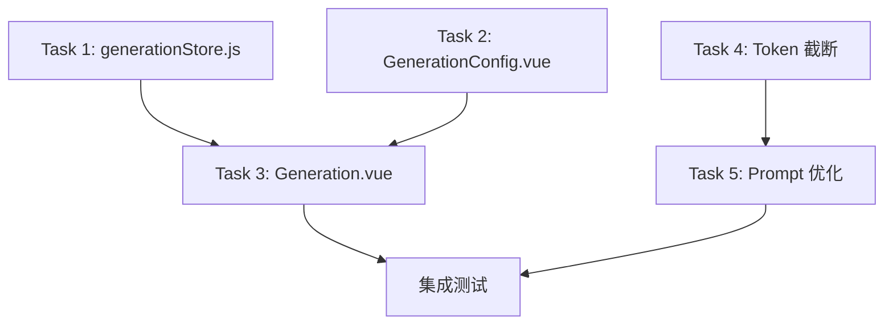

# Implementation Plan: 文本生成功能优化

**Branch**: `006-text-generation-opt` | **Date**: 2026-03-05 | **Spec**: [spec.md](./spec.md)
**Input**: Feature specification from `/specs/006-text-generation/spec.md`

## Summary

基于现有文本生成功能（006-text-generation）进行优化，主要包含 5 项改进：
1. **修复知识库索引选择器**：从文档级索引改为 Collection（逻辑知识库）
2. **优化上下文组装策略**：增加 Token 截断策略防止超出模型上下文限制
3. **标准化引用格式**：确保内联编号引用 + 末尾参考列表格式
4. **增强结果展示**：生成结果支持 Markdown 富文本展示并进行安全清洗
5. **补齐交互闭环**：失败状态支持重试，历史记录支持清空全部

## Technical Context

**Language/Version**: Python 3.11 (Backend) + JavaScript ES2020 / Vue 3 (Frontend)  
**Primary Dependencies**: FastAPI 0.104.1, langchain-openai, Vue 3, Vite, TDesign Vue Next, Pinia  
**Storage**: SQLite (生成历史) + Milvus (向量检索，由搜索模块调用)  
**Testing**: pytest (Backend), Vitest (Frontend)  
**Target Platform**: Web Application (Linux server + Browser)  
**Project Type**: Web (frontend + backend)  
**Performance Goals**: 首 token 响应 < 3s, 流式输出间隔 < 200ms  
**Constraints**: 上下文长度不超过模型限制 (128K tokens)  
**Scale/Scope**: 单用户场景，历史记录 ≤ 100 条

## Constitution Check

*GATE: 本次为优化分支，在现有实现基础上修改，无新增复杂度。*

| Gate | Status | Notes |
|------|--------|-------|
| 新增依赖 | ✅ Pass | 无新增依赖，复用搜索模块已有 API |
| 新增数据表 | ✅ Pass | 无，复用现有 generation_history 表 |
| 架构变更 | ✅ Pass | 无，仅修改现有组件 |

## Project Structure

### Documentation (this feature)

```text
specs/006-text-generation/
├── spec.md              # Feature specification
├── plan.md              # This file
└── tasks.md             # Task breakdown (generated by /speckit.tasks)
```

### Source Code (affected files)

```text
backend/
├── src/
│   ├── api/
│   │   └── generation.py          # [MODIFY] 历史记录清空接口与路由整理
│   └── services/
│       └── generation_service.py  # [MODIFY] 增加 token 截断逻辑

frontend/
├── src/
│   ├── components/
│   │   └── generation/
│   │       ├── GenerationConfig.vue  # [MODIFY] Collection 选择器 UI
│   │       └── GenerationResult.vue  # [MODIFY] Markdown 渲染 + 重试交互
│   ├── stores/
│   │   └── generationStore.js        # [MODIFY] 调用 getAvailableCollections
│   ├── views/
│   │   └── Generation.vue            # [MODIFY] 重试与历史操作反馈
│   └── services/
│       └── generationApi.js          # [NO CHANGE] 无需修改
└── package.json                      # [MODIFY] 引入 Markdown 渲染与安全清洗依赖
```

**Structure Decision**: Web application 结构，前后端分离。本次优化在保留核心架构不变的前提下，补齐后端历史管理接口与前端结果渲染/交互体验。

---

## Phase 1: 设计 (Design)

### 1.1 变更清单

| 优化项 | 影响文件 | 变更类型 | 复杂度 |
|--------|----------|----------|--------|
| Collection 选择器 | `generationStore.js` | API 调用替换 | 低 |
| Collection 选择器 | `GenerationConfig.vue` | UI 字段映射 | 低 |
| Token 截断策略 | `generation_service.py` | 新增函数 | 中 |
| 引用格式优化 | `generation_service.py` | 调整 prompt | 低 |
| Markdown 安全渲染 | `GenerationResult.vue`, `package.json` | 引入渲染/清洗依赖并更新展示 | 中 |
| 重试与历史清空 | `Generation.vue`, `generation.py`, `generationStore.js` | 交互和接口补齐 | 低 |

### 1.2 数据流变更

**当前流程（有问题）**:
```
generationStore.loadAvailableIndexes()
  → searchApi.getAvailableIndexes()
  → 返回 VectorIndex[] (文档级)
  → 下拉框显示 "idx_股票_APP_股票详情页功能介绍_md_..."
```

**优化后流程**:
```
generationStore.loadAvailableCollections()
  → searchApi.getAvailableCollections()
  → 返回 CollectionInfo[] (知识库级)
  → 下拉框显示 "股票APP知识库 (11向量, 4096维)"
```

### 1.3 Token 截断策略设计

```python
def _truncate_context_by_token_budget(
    self,
    context: List[ContextItem],
    model: str,
    question: str,
    max_tokens: int,
) -> List[ContextItem]:
    """按 token 预算截断上下文，保留高相关性内容"""
    
    model_info = GENERATION_MODELS[model]
    max_context_tokens = model_info["context_length"]
    
    # 预算 = 模型最大上下文 - 系统 prompt (~500) - 问题 - 回答预留
    system_prompt_tokens = 500
    question_tokens = self.estimate_tokens(question)
    reserved_output = max_tokens
    
    budget = max_context_tokens - system_prompt_tokens - question_tokens - reserved_output
    
    # 按相似度/reranker_score 排序（假设已排序）
    # 从高到低累加，直到超出预算
    selected = []
    used_tokens = 0
    
    for item in context:
        item_tokens = self.estimate_tokens(item.content)
        if used_tokens + item_tokens <= budget:
            selected.append(item)
            used_tokens += item_tokens
        else:
            break
    
    return selected
```

### 1.4 引用格式 Prompt 优化

当前 `SYSTEM_PROMPT_TEMPLATE` 已包含引用要求，需确认格式一致：

```python
SYSTEM_PROMPT_TEMPLATE = """你是一个智能问答助手。请基于以下参考资料回答用户的问题。

## 参考资料

{context}

## 回答要求

1. 基于参考资料给出准确、详细的回答
2. 如果引用了某段资料，请在回答中使用 [1]、[2] 等编号标注来源
3. 在回答末尾附上参考来源列表，格式如：
   
   **参考来源:**
   [1] 文档名1
   [2] 文档名2

4. 如果参考资料不足以回答问题，请明确说明
5. 回答应该条理清晰，易于理解"""
```

### 1.5 流式接入与结果渲染设计

当前实现采用 **后端 SSE 格式 + 前端 fetch 流式解析**：

- 后端 `StreamingResponse` 按 SSE `data: ...\n\n` 输出
- 前端使用 `fetch('/api/v1/generation/stream', { method: 'POST' })`
- 通过 `ReadableStream + TextDecoder` 逐段解析 SSE
- 结果区对生成回答执行 Markdown 渲染，并在渲染前做 HTML 安全清洗

该方案优于 EventSource 的原因：
- 生成请求需要携带 POST body（问题、模型、上下文）
- EventSource 不适合当前 POST + JSON 请求模型
- `fetch` 更适合与取消、错误处理和自定义请求体结合

### 1.6 历史管理设计补充

- 单条删除：保留现有软删除能力
- 清空全部：新增 `DELETE /api/v1/generation/history/clear`
- 前端在清空/删除/刷新后给出即时反馈

---

## Phase 2: 实现任务分解

### Task 1: 前端 - 修改 generationStore.js

**目标**: 将 `loadAvailableIndexes()` 改为 `loadAvailableCollections()`

**变更点**:
1. 导入 `getAvailableCollections` 替换 `getAvailableIndexes`
2. 重命名函数 `loadAvailableIndexes` → `loadAvailableCollections`
3. 更新状态变量 `availableIndexes` → `availableCollections`
4. 更新变量 `selectedIndexIds` → `selectedCollectionIds`
5. 更新检索调用参数 `index_ids` → `collection_ids`

**估计修改**: ~30 行

---

### Task 2: 前端 - 修改 GenerationConfig.vue

**目标**: 更新 Collection 选择器 UI

**变更点**:
1. Props: `indexIds` → `collectionIds`, `availableIndexes` → `availableCollections`
2. 下拉选项渲染: 显示 `name`, `document_count`, `vector_count`
3. 更新标签文案: "知识库索引" → "知识库"

**估计修改**: ~20 行

---

### Task 3: 前端 - 修改 Generation.vue

**目标**: 同步父组件 props 变更

**变更点**:
1. 更新 storeToRefs 变量名
2. 更新 GenerationConfig 组件 props

**估计修改**: ~10 行

---

### Task 4: 后端 - 增加 Token 截断逻辑

**目标**: 在 `generation_service.py` 中实现 `_truncate_context_by_token_budget()`

**变更点**:
1. 新增 `_truncate_context_by_token_budget()` 方法
2. 在 `generate()` 和 `generate_stream()` 中调用
3. 在 `_build_prompt()` 调用前应用截断

**估计修改**: ~40 行

---

### Task 5: 后端 - 优化引用格式 Prompt

**目标**: 更新 `SYSTEM_PROMPT_TEMPLATE` 确保引用格式清晰

**变更点**:
1. 更新 prompt 模板，明确引用格式要求
2. 确保末尾参考列表格式

**估计修改**: ~10 行

---

### Task 6: 后端 - 补齐历史清空接口

**目标**: 提供清空全部历史记录的后端能力

**变更点**:
1. 在 `backend/src/api/generation.py` 中提供 `DELETE /history/clear`
2. 采用软删除方式标记全部历史记录

**估计修改**: ~15 行

---

### Task 7: 前端 - 结果 Markdown 安全渲染

**目标**: 提升生成结果可读性并确保安全

**变更点**:
1. 在 `frontend/package.json` 中引入 `markdown-it` 与 `dompurify`
2. 在 `frontend/src/components/generation/GenerationResult.vue` 中支持 Markdown 渲染
3. 对渲染结果进行安全清洗，并保留引用高亮

**估计修改**: ~80 行

---

### Task 8: 前端 - 重试与历史操作反馈

**目标**: 提升失败恢复与历史管理体验

**变更点**:
1. 在 `GenerationResult.vue` 中增加重试入口
2. 在 `Generation.vue` 中接入重试事件
3. 在历史刷新/删除/清空后增加消息反馈

**估计修改**: ~30 行

---

## Phase 3: 测试计划

### 单元测试

| 测试项 | 文件 | 测试内容 |
|--------|------|----------|
| Token 截断 | `test_generation_service.py` | 验证截断逻辑正确保留高相关性内容 |
| Token 估算 | `test_generation_service.py` | 验证中英文混合估算准确性 |

### 集成测试

| 测试项 | 测试内容 |
|--------|----------|
| Collection 选择 | 验证下拉框正确显示 Collection 列表 |
| 检索 + 生成 | 验证选择 Collection 后检索 + 生成流程正常 |
| 上下文截断 | 验证大量检索结果被正确截断 |
| Markdown 渲染 | 验证标题、列表、代码块、表格等格式正确展示且无脚本执行 |
| 历史清空 | 验证清空全部后列表刷新且数据软删除 |

### 手动验收测试

1. **Collection 选择器**
   - [ ] 下拉框显示 Collection 名称（如"股票APP知识库"），而非文档索引名
   - [ ] 每个选项显示文档数量和向量数量
   - [ ] 支持多选

2. **生成功能**
   - [ ] 选择 Collection 后能正常生成回答
   - [ ] 回答中包含 [1][2] 等引用标注
   - [ ] 回答末尾有参考来源列表
   - [ ] Markdown 结构（标题、列表、代码块、表格）能正确渲染
   - [ ] 失败后点击“重试”可以重新发起生成

3. **上下文截断**
   - [ ] 大量检索结果不会导致 API 报错
   - [ ] 高相关性内容优先保留

4. **历史管理**
   - [ ] 单条删除后列表刷新
   - [ ] 清空全部后列表为空且后端记录被软删除

---

## 依赖关系



**建议执行顺序**:
1. Task 4 + Task 5 (后端，可并行)
2. Task 1 + Task 2 (前端，可并行)
3. Task 3 (前端整合)
4. 集成测试

---

## 风险与缓解

| 风险 | 影响 | 缓解措施 |
|------|------|----------|
| Collection API 返回格式不兼容 | 中 | 参考搜索模块 searchStore.js 实现 |
| Token 估算不准确 | 低 | 使用保守估算（4 chars/token），预留额外 buffer |
| 引用格式被模型忽略 | 低 | 在 prompt 中强调格式要求，测试验证 |
| Markdown 渲染引入 XSS 风险 | 中 | 使用 DOMPurify 做前端安全清洗 |

---

## Complexity Tracking

*本次优化无违反 Constitution 的情况，无需记录。*
